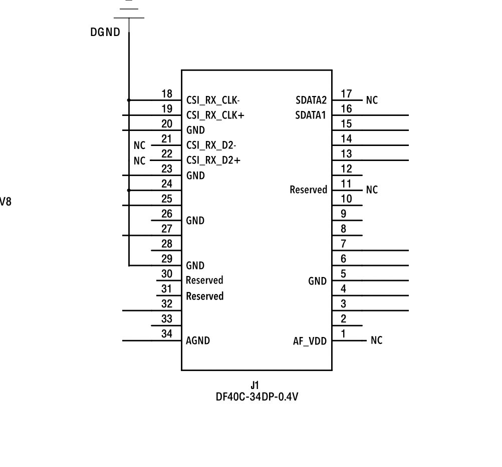

# Camera module breakout board

The aim is to create a batch of 10 breakout PCBs for testing and connecting the camera module via a Raspberry Pi connector.

The board has a 34 pin socket for connecting a 201 camera module.
This is connected and voltage shifted where needed to a Raspberry Pi Zero 22 pin connector and a RPi 15 pin connector for connecting to a RPi compatible dev board.

Additionally there should be a 30 pin IPEX connector for connecting to the UCM Compulab board.

Regular 1/100” header pins are broken out for I2C, I2S and other signal pins. It should be possible to connect with 1v8 and 3v3 signals. Add header pins for power as well.

Note: Perhaps it makes no sense to have a 22 pin connector since the Raspberry Pi standard is 15 pins on the camera module side.
Consider dropping this connector.


## Verification of modules

The aim is to verify and validate the viability of the supplied camera modules. You will get two day time and two night time modules and assorted lenses. I will also send you a dev board.

- Test that the camera registers can be accessed with I2S
- Test that the laser range and ambient light can be accessed with I2S
- Test that camera sensor can be read using CSI2
- Test that microphone can be read using I2S


## Testing lenses

The supplied lenses are of various types, the aim is to evaluate the various lenses on the dimensions of,

- Image quality
- How close an object can be to the camera and remain mostly in focus
- How far away can a 5cm x 5cm toy be in a picture and remain recognizable 
- How far off center can an object or person be and be in view

At the completion of the project you will return the supplied development board, camera modules, lenses and produced test boards.


## Testing Setups

The test board is used to test Camera Modules. Development boards that may be used to test are,

- [I-Pi SMARC IMX8M Plus](https://www.ipi.wiki/products/i-pi-smarcplus-imx8mp)
- [Compulab SB-UCM-iMX8PLUS](https://www.compulab.com/products/carrier-boards/sb-ucmimx8plus-carrier-board/)
- [Raspberry Pi CM 4 IO Board B](https://www.waveshare.com/product/raspberry-pi/boards-kits/compute-module-4-cat/cm4-io-base-acce-b.htm)
- [Tinker Edge R](https://tinker-board.asus.com/product/tinker-edge-r.html) for testing.


## Price / Milestones

Price $1500 plus cost of board production

Milestones
300 Testing board design completed with design files
150 + cost, produce test boards
600 verification of camera modules 
150 testing lenses
300 boards, modules, lenses are returned 


# Connectors

- 1 * RPi compatible [TE Connectivity 15pin 1mm FPC 1-84952-5](https://www.te.com/usa-en/product-1-84952-5.html)
- 1 * [Molex 22PIN 0.5mm pitch 54548-2271](https://www.molex.com/molex/products/part-detail/ffc_fpc_connectors/0545482271)
- 1 * [I-PEX 30PIN 0.4mm pitch 20525-030E-02](https://www.i-pex.com/product/cabline-ca)
- 1 * [Hirose DF40C-34DS-0.4V](https://www.hirose.com/en/product/p/CL0684-4023-0-51) ([Mouser](https://www.mouser.ch/ProductDetail/Hirose-Connector/DF40C-34DS-04V51?qs=vcbW%252B4%252BSTIpg26DsEbj1iQ%3D%3D))


## Pinouts: Hirose DF40 single eye connector 34 pins

**Just to be clear**: All CSI lanes are laid out on one side of the connector with GND between.



:[Camera Module 201 connector](../pinouts/CAMERA_MODULE_CONNECTOR_PINOUT.md)


## NVIDIA FPC 30 pins

:[30 pins I-PEX CSI connector](../pinouts/I-PEX_30_CONNECTOR.md)


## RPI FPC 22 pins

:[22 pins RPi CSI connector](../pinouts/RPI_22_CONNECTOR.md)


## RPI FPC 15 pins

:[15 pins RPi CSI connector](../pinouts/RPI_15_CONNECTOR.md)

[ArduCam description for connector](https://www.arducam.com/raspberry-pi-camera-pinout/).
ArduCam uses FCI connector [SFW15R-2STE1LF](https://www.arducam.com/downloads/SFW15R-2STE1LF.pdf).


|

## Connecting Raspberry Pi to camera module

Using a supported camera module together with a Raspberry Pi is the most straightforward way of adding visual input to a project. The only thing needed is a supported camera module such as the official Raspberry Pi camera module. However, many alternative modules exist: for example, this breakout board with a night-vision camera and infrared LEDs.

Regardless of the chosen camera, the setup process always works similarly, as long as the camera is supported by the Raspberry Pi. First, plug the ribbon connector of the camera module into the connector on the Raspberry Pi. The white connector closer to the USB and Ethernet ports is the one for the camera. The other port, located on the other side of the single-board computer, is meant for connecting a display.


Connect the camera module while the Raspberry Pi is still powered off. Note that the shiny contacts on the ribbon cable should face away from the USB ports. Then, turn the Raspberry Pi on and launch the Raspberry Pi Software Configuration tool by typing the following command:

```bash
sudo raspi-config
```

In the graphical user interface, choose the fifth option in the list:


Then, select the ‘Camera’ option from the list and enable it:


When done, use the tab key in the main menu to select the ‘Finish’ option and then hit the enter key. After a reboot, the Raspberry Pi will be ready to interface with a connected camera module.

Once the computer is finished rebooting, you can check the status of the camera using the following command:

```bash
vcgencmd get_camera
```


If the camera is connected correctly and the Raspberry Pi is configured to use the camera interface, the vcgencmd command should create an output similar to the following image:


You can use the raspistill command to test whether the camera module works as intended:

```bash
raspistill -o image.jpg
```

Note that running this command might take a couple of seconds before it’s done. It should create an image file like this:


#### Utilize a common USB webcam

If buying a new camera module is not feasible for your project, or if a higher resolution, longer cable, or other features are required, it’s possible to connect common USB cameras to the Raspberry Pi and use them instead of a camera module. For that to work, shut down the Raspberry Pi and connect the USB webcam. Then turn the Raspberry Pi back on. The Pi should detect most USB cameras and create a new device.

To test whether the camera works with the Raspberry Pi as intended, you can install a small program named ‘fswebcam’ and create a still image as before:

```bash
sudo apt-get install fswebcam 
fswebcam image.jpg
```
    
Doing so creates a still image in the current folder. Note that it doesn't pose a problem to leave the Raspberry Pi's camera interface enabled when a webcam gets connected via USB. It is also possible to connect multiple USB cameras to the Raspberry Pi and build a home surveillance hub, for example.

Use the following command to take a picture with a specific webcam:

```bash
fswebcam --device /dev/video0 image.jpg
```

This will create a still image with the camera zero and store the result in a file named ‘image.jpg’.

#### Summary

As demonstrated, configuring a Raspberry Pi to interface a connected camera is a straightforward process. Essentially, two common methods exist, and both of them work without much configuration. The first option is to use a Raspberry Pi-compatible camera module. The benefits of this method are the great support, the large variety of different modules, and that most camera-based software for the Raspberry Pi supports the internal camera interface right out of the box. The relatively short cable length of such camera modules can be a disadvantage. USB cameras, on the other hand, usually have a longer cable and reasonable image quality. Support, however, cannot be guaranteed. On a positive note, using this method allows you to connect multiple USB cameras to a single Raspberry Pi, which is especially useful in surveillance applications.


