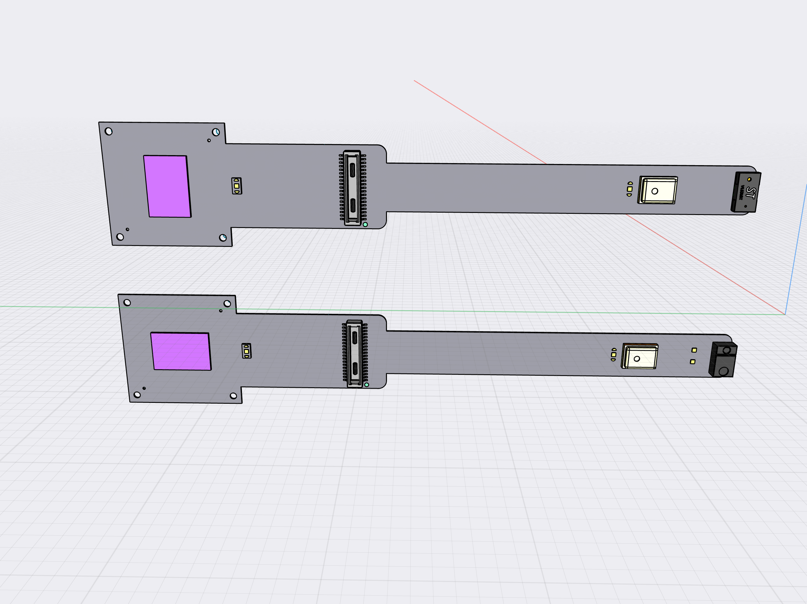
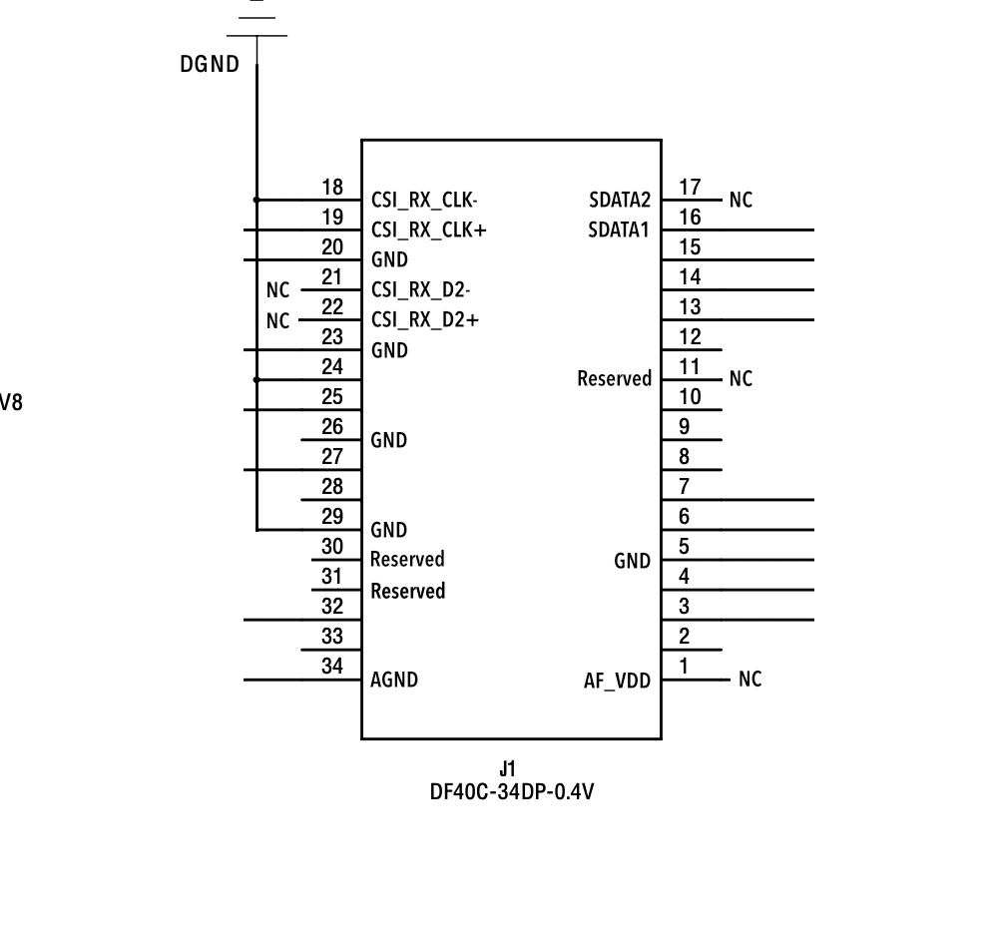

# Camera Module with OV2735

This first production batch will be:

15 pcs of Camera Module ver RGB
15 pcs of Camera Module ver IR

The two version uses the same FPC design with different components mounted.

Version RGB components:

- OV2735 in Portrait slot
- DF40C-34DP-0.4V
- VL53L1
- CMM-4030D-261-I2S-TR

Version IR components:

- OV2735 in Landscape slot
- DF40C-34DP-0.4V
- APDS-9960
- CMM-4030D-261-I2S-TR

A precise drawing of the module is provided. It is essential that the module is shaped and laid out according to the drawing.
A 3D Model is also provided. These should be used for precise reference for placing the components.

### Recent changes

I realised that the misunderstanding on connector layout was the numbering scheme.
It has now been corrected to match the commonly used one.

* Extra ground pins added
* The pin numbers corrected to make connector layout clear
* I2S is 1.8V, the microphone must connect to 1.8V
* No need to use 3.3V in the design

**Just to be clear**: All CSI lanes are laid out on one side of the connector with GND between.

## Bill of Materials

- Omnivision OV2735
- Hirose DF40C-34DP-0.4V B2B Plug (header, standard, non-shielded)
- Broadcom APDS-9960 Proximity Light and Gesture Sensors
- ToF sensor VL53L1
- CUI MEMS microphone CMM-4030D-261-I2S-TR
- Additional resistors and capacitors

## Camera mounting

Two versions of the camera module exists. They look nearly the same. 
They differ in the orientation of the image sensor and type of secondary sensor mounted.

The image sensor is placed centered with mounting holes for an M7 housing and M12 housing in the corners.
To enable different types of housing mounts the FFC edges in the Image Sensor section must not conduct signal, see drawing.

## Time-of-Flight + Ambient sensor

The layout include two additional sensors. Only one will be mounted at a time

VL53L1 will be combined with image sensor oriented in portrait mode going across the FFC in the RGB version.
APDS-9960 will be combined with image sensor oriented in landscape mode going along the FFC in the IR version.

3a. On the RGB version only VL53L1 is mounted, hence connections are: 2.8V, GND, I2C_SDA, I2C_SCL, ATT_INT, ATT_XSHUT. 
I'm assuming that The OV2735 and VL53L1 can be on the same I2C bus.

3b. On the IR version only APDS-9960 is mounted, hence connections are 2.8V, GND, I2C_SDA, I2C_SCL, ATT_INT. I understand LDR, LED A, LED K as for external IR LED. This sensor is just intended for ambient light measurement. 
If additional functionality is needed I would introduce it through revisions to this sensor module.
I'm assuming that The OV2735 and APDS-9960 can be on the same I2C bus.

## Diagram

Drawing & 3D Model bundled with this spec

- Drawing
- Mounting intructions RGB vs IR (in drawing)
- Portrait/Landscape slots pointed out (drawing)
- 3D rendering

Notations printed on the FFC

- Pin 1 Dot by the connector
- Text: "OV2735" between the two image sensor locations
- Text: "Ziloo 201" in empty area between microphone and connector
- Text: "CAM ID" by the I2CID isles
- Text: "MIC SEL" by the MIC SEL isles
- 

## Layout Schematic

- All sensors are connected to either I2S or I2S bus
- ATT_XSHUT connected to VL53L1
- ATT_INT connected to VL53L1 GPIO1 & APDS-9960 INT
- VL53L1 and APDS-9960 uses 2.8V
- Isles added to allow Mic. Select to be soldered to HIGH(1.8V) or LOW(GND)
- Isles added to allow I2CID. Select to be soldered to HIGH(1.8V) or LOW(GND)
- LED connections for APDS-9960 are accessble by pads(soldering isles) near the sensor
- The edges around image sensors must not carry signal to allow punching extra holes for lens alignment

## Pinouts: Hirose DF40 single eye connector 34 pins

:[Camera Module 201 connector](../../pinouts/CAMERA_MODULE_CONNECTOR_PINOUT.md)

## Lenses for testing

We plan to test the following lenses

| Model           | Manufactur. | Res.   | Type     | Mount    | Sensor   | HFoV | Aperture | Focal   | Bk Focal | Optcl ln  | M.O.D  |Dimensions / Weight   | 
|-----------------|-------------|--------|----------|----------|----------|------|----------|---------|----------|-----------|--------|----------------------|
| [CW-BL15620-5MP](./lenses/CW-BL15620-5MP.jpeg) | TREEYE | 5.0MP | Wide | M12x0.5  | 1 / 3" | 185° | F2.0     | 1.56mm  | 4.3mm    | 21.6mm | 0.2m   | Dia. 20mm * 16mm, 6g, $5, 6G | 
| [CW-BL2120-5MP](http://www.cwlens.com/en/pd.jsp?id=341#_pp=0_330_2) | TREEYE      | 5.0MP  | Fisheye  | M12x0.5 | 1 / 2.5" | 160° | F2.0     | 2.1mm   | 6.9mm    | 20.7mm    | 0.2m   | Φ17.5 x 17.5, 8g, $4.2 | 
|                 | AIRFORTH    | ? MP   | Wide     | M8       | 1 / 3"   | 160° |          | 2.1mm   |          |           |        | Racing Drone $3.75 |
| MTV-0368BF127M7 | Lenspro     | 2 MP   | Semi Wide| M7       | 1 / 2.7" | 97°  | F2.8     | 3.68mm  | 2.01mm   |           | 0.3m   | TTL 9.9mm, Φ10x8.6mm, ~9%, FoV 97°/86.5°/50.5° |
| CCL127028PMP    | TOWIN       | 3 MP   | Pinhole  | M12x0.5  | 1 / 2.7" | 108° | F2.4     | 2.8mm   |          |           | 0.2m   |  TTL 12,  F.O.V. 140°(D) |
| CA1308C         | ChuangAn    | MP     | Wide     | M8x0.5   | 1 / 4"   | 115° | F2.4     | 2mm     | 4.10mm   |           |        | 87° *115° *170°  12*L10.57mm |
| CA1300I         | ChuangAn    |        | Wide     | M7*P0.35 | 1 / 2.5" | 115° | F2.4     | 2.92mm  | 5.26mm   |           | 0.1m   | TTL:13.97mm, 71° *115° *145°, 10*L10.33mm, 5G+IR  |
| [FS2328B13M8](./lenses/FS2328B13M8.png)     | Focusafe    | MP     | Wide     | M8*0.5   | 1 / 3"   | 115° | F2.8     | 2.3mm   | 5.09mm   |           |        | Flange back 4.5mm, max image circle 6.4mm |
| HK-8244-1042-1  | Guangtongd. | MP     | Wide     | M12*P0.5 | 1 / 2.7" | 120° | F1.8     | 3.0mm   | 6.04mm   |           |        | Flange back 5.2mm, 6G+IR |
| JSD2157         | JSD         | MP     | Wide     | M12x0.5  | 1 / 2.7" | 148° | F2.0     | 2.35mm  |          |           |        | 6G, TTL 22mm, Lens diameter 17mm |
| JSD1529-A1      | JSD         | MP     | Wide     | M7*P0.35 | 1 / 2.7" | 124° | F2.0     | 2.8mm   | 2.61mm   |           |        | Diameter 10mm, TTL 11.51mm |
| TS-2314T-A10    | TeSoo       | MP     | Fishey   | M7*P0.35 | 1 / 2.3" | 200° | F2.0     | 1.8mm   |          |           |        | Diameter 10mm, TTL 14mm |

* https://www.lensprocctv.com/3-68mm-M7-CCTV-Lens-Low-Distortion-OV2710-p.html
* https://chancctv.en.alibaba.com/product/60534477516-804927292/1_4_2mm_Board_Lens_with_DFOV_170_degree_Miniature_M8_Lens.html
* https://www.alibaba.com/product-detail/Element-6G-IR-aluminum-glass-plastic_60857424830.html?spm=a2700.wholesale.0.0.55ba6f04EWTHa0
* https://www.alibaba.com/product-detail/m12-mount-OV2735-hd-wide-angle_62351098002.html?spm=a2756.order-detail-ta-bn-b.0.0.486a2fc23vZisF
* https://www.alibaba.com/product-detail/m7-lens-camera-F2-0-diagonal_60302931327.html?spm=a2700.wholesale.0.0.2edffc19WUBCbz
* http://www.cwlens.com/en/pd.jsp?id=13#keyword=CW-BL15620-5MP&_pp=0_378
* https://www.alibaba.com/product-detail/JSD2017-cctv-lens-M8-F2-0_62344332185.html?fromMSite=true

