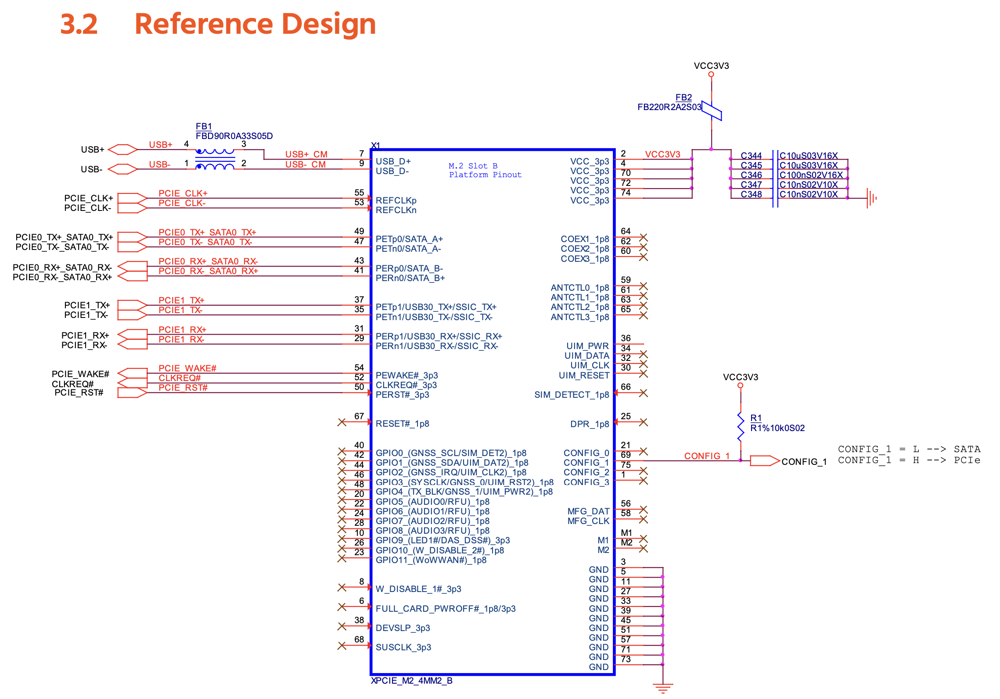
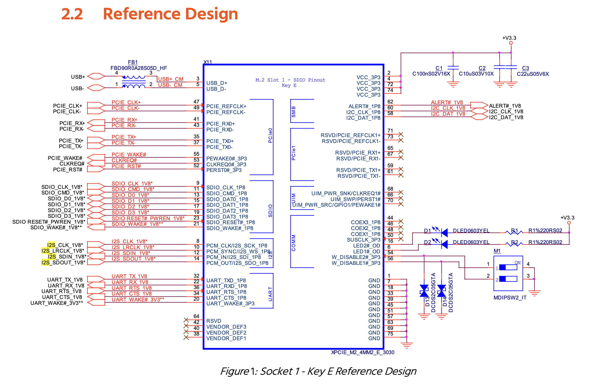

# Ziloo Expansion Connectors

Ziloo has an M.2 type B expansion port for SSD utility cards, and a type E expansion port for Wireless utility cards.
Additional future expation ports are a 40 pin GPIO, uSIM / eSIM, Speakers, Microphones.

## 40 pins GPIO Header

The GPIO header is made to be compatible with RPi expansion hardware. It has fewer GND pins which are mapped to GPIO or receiving pins.

Features:

- Spare GPIOs
- SPI Image Boot
- Power 5V / 3V3 / 1V8 / RTC
- SPI / SAI7 I2S Out
- Stem and System I2C
- UART1 / UART3
- PWM1..3

:[40 pins GPIO Expansion](../pinouts/GPIO_HEADER.md)

## 40 pins Backplate breakout Header (development)

The Backplate breakout is available in place of the SOM connectors to connect directly from development boards to 919.

Features:

- MotionEngine IO
- LED Matrix driver

:[40 pins GPIO Backplate Header](../pinouts/BACK_GPIO_HEADER.md)

## Sound Connector

It is not yet defined if the signal level is 1.8V or 3.3V. It will depend on NVCC_SAI5
The pin layout wraps around aligning 1 and 20 close, but on opposite sides.

Two Connector components used are [DF40HC(3.5)-20DS-0.4V(51)](https://www.hirose.com/en/product/p/CL0684-4188-0-51). [Socket @ Mouser](https://www.mouser.ch/ProductDetail/Hirose-Connector/DF40HC35-20DS-04V51?qs=sGAEpiMZZMtJbfcMcIM8CC3aG3XFbLOWRtCXQ0n%252BY5Y%3D)

:[Sound Connector](../pinouts/SOUND_CONNECTOR.md)

# M.2 Key B Expansion Module

Features:

- 1 Lane PCIe (PExx0)
- USB 3.0 data multiplexed (USB2/Host, PExx1)
- USB 2.0 data multiplexed (USB2/Host)
- GNSS / Stem I2C (I2C3)
- MFG I2C (SYS I2C)
- AUDIO I2S MIC SAI5 4 channels (GPIO5..8 and COEX*)
- SPI (ANTCTL*)
- DAS/DSS broken out with activity LED + expander bit
- Additional signals via 16 bit I/O Expander
- Some are broken out with pads near connector (CONFIG 0/2/3, DPR)
- SIM pins are not connected, reserved for now
- 4 channel I2S stereo input
- 4 channel I2S stereo output

The USB is connected to T-USB (not the M.2 expansions) on boot to support NVMe SSD expansions by default.
The USB data signals from SoM are multiplexed between T-USB Host (USB2) and M.2 Key B based on MUX_USB2_SEL & MUX_USB3_SEL.

Be aware the current pin plan is not final. Input/Ouput such as DIN/DOUT RXD/TXD may be the wrong way around.
It must be verified with reference hardware design/testing.

According to documentation: Type refers to the signal direction:
• Type O means signal is an output from the MPU/MCU to the adapter. 
• Type I means signals is an input to the MPU/MCU from the adapter.

### Control pins mapped by I/O Expander

The system I/O expander controls mPCIe_PERST which resets PCIe.
PCIE_CLKREQ_B is a direct pin on the SoM.
PCIE_WAKE_B is a direct pin on the SoM. 

TODO consider bootup default state of I/O Expanders. USB must not connect M.2 by default

TODO unallocated/GPIO pins from chipsets

A dedicated I/O Expander controls addition pins on Key B.

:[Expansion I/O Expander #2](../pinouts/I2C_EXPANDER_2.md)

:[M.2 Key B Pin allocations](../pinouts/M2_KEY_B_CONNECTOR.md)

### Reference designs

Congatec reference design

Compulab reference design

# M.2 Key E Expansion Module

Ziloo has an M.2 type E expansion port for Wireless/Bluetooth/GSM utility cards.

Features:

- UART2, UART4
- USB2/USB3 OTG data 
- SD1 SDIO 4bit
- PCIe single lane reserved pins
- JTAG + debugging pins reserved (lay out pads)
- Speaker I2S
- Two LEDs next to connector
- SIM pins are not connected, reserved for now

### Control pins mapped by I/O Expander

USB2_SS_SEL is a direct pin on the SoM.

TODO consider bootup default state of I/O Expanders. USB must not connect M.2 by default

TODO unallocated/GPIO pins from chipsets

A dedicated I/O Expander controls addition pins on m.2 connectors. Another I/O Expander allows
the Autonomous MCUs to manipulate m.2 state.

#### Expander #4

:[Expansion I/O Expander #4](../pinouts/I2C_EXPANDER_4.md)

#### Expander #6

:[Expansion I/O Expander #6](../pinouts/I2C_EXPANDER_6.md)

#### Key E pins

:[M.2 Key E Pin allocations](../pinouts/M2_KEY_E_CONNECTOR.md)

### Reference designs

Congatec reference design

## Future Expansion connection

#### UIM / SIM / eSIM

M.2 Connectors have pins reserved for SIM (UIM) cards. A connector or eSIM may be added in the future.

i.MX 8 only provides PCIe x1 so Key M is not relevant. This leaves A, B and E.

- B is good for USB3, Audio, SATA
- E is good for SDIO, UART and PCM

- [ATP M.2 key info page](https://www.atpinc.com/blog/what-is-m.2-M-B-BM-key-socket-3)
- [Congatec AN43](https://www.congatec.com/fileadmin/user_upload/Documents/Application_Notes/AN43_M.2_Pinout_Descriptions_and_Reference_Designs.pdf)
 

