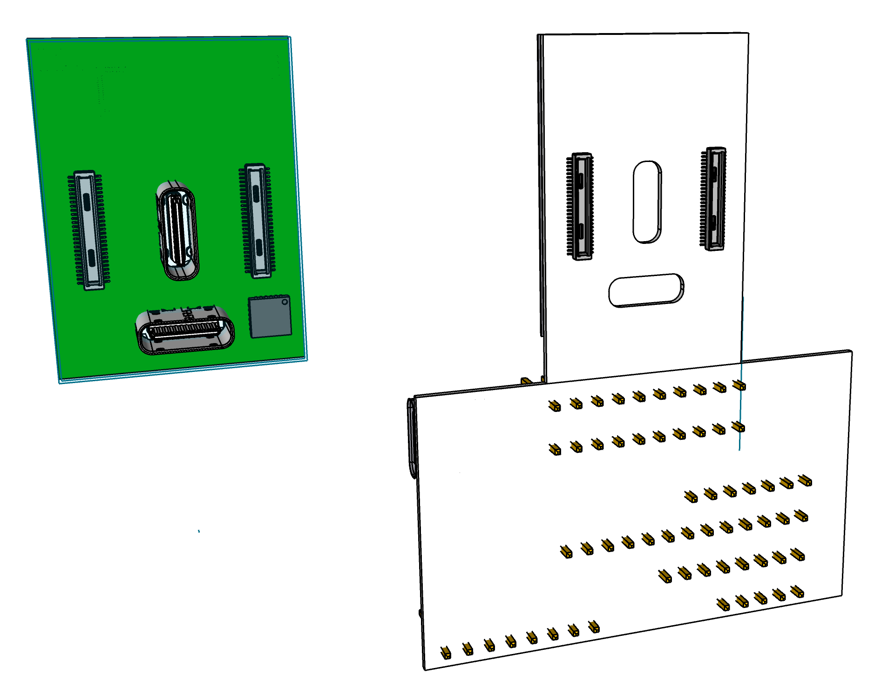

# 801 T-USB daughterboard

The 801 is a bridge board that connects daughter boards. 801 T-USB is one such daughter board.

The T-USB daughterboard has two functions
- Supply the system with power
- Provide data signals in the system over two USB-C connectors

The T-USB board exposes two vertical USB-C sockets and connects to the carrier board through two 50 pin B2B connectors.

To facilitate feature development two additional connectors are added.

### Open points

- Which GPIO receives interrupt
- Mux chips shutdown mode
- Power LED & Indicator LEDs
- Add battery connector with temp. sensor
- Optional connectors debug uart / jtag
- Annotations and Logo on the board
- TEST The Mux pin configurations
- How should PP_HV1 & PP_HV2 / PP1_CABLE PP2_CABLE be wired ?
- Default boot/SEL states connect USB 2.0/3.0 data routing and full power delivery / charging
- Enable VIN_5V/3V3 from PWR_SYS (TBD)
- Attachment signal / VSOM enable
- Detachment signal / Power down

## Core Components

- 2 * [Hirose DF40-50DP-0.4V](https://www.hirose.com/en/product/p/CL0684-4014-0-51) mated height 1.5mm [Mouser](https://www.mouser.ch/ProductDetail/Hirose-Connector/DF40C-50DP-04V51?qs=sGAEpiMZZMthaSLPVp%252B4asSF8eu6nRoehAaVBEWyQ6A%3D)
- 2 * [Hirose USB-C CX80B1-24P](https://www.hirose.com/product/p/CL0480-0625-0-00)
- 1 * [TPS65988](https://www.ti.com/product/TPS65988?keyMatch=TPS65988&tisearch=search-everything&usecase=GPN) Dual Port USB Type-C® and USB PD Controller, Power Switch, and High-Speed Multiplexer. [Mouser](https://www.mouser.ch/ProductDetail/Texas-Instruments/TPS65988DJRSHR?qs=sGAEpiMZZMv0NwlthflBiyrCPYKWtEb9w8lmLVKGFHI%3D)
- 2 * [HD3SS460](https://www.ti.com/product/HD3SS460?keyMatch=HD3SS460&tisearch=search-everything&usecase=GPN) 4 x 6 Channels USB Type-C Alternate Mode MUX. Connected to T-USB Host. [Mouser](https://www.mouser.ch/new/texas-instruments/ti-hd3ss460-switch/). [Dock Eval Kit](https://www.mouser.ch/ProductDetail/Texas-Instruments/USB-CTM-MINIDK-EVM?qs=vcbl%252BK4rRletdX9FWp9J9A%3D%3D)
- 1 * PCA9555 I/O Expander
- 4 * [TS5USBC410 Dual 2:1 USB 2.0 Mux/DeMux Switch](../datasheets/USB/ts5usbc41.pdf). [Mouser](https://www.mouser.ch/ProductDetail/Texas-Instruments/TS5USBC410IYFFR?qs=sGAEpiMZZMutXGli8Ay4kPB6XEQFysSpdNErqZgdEYs%3D)
- 1 * [BQ24250RGER battery charger](https://www.ti.com/product/BQ24250)  [$2 JLCPCB (4x4 mm package)](https://jlcpcb.com/parts/componentSearch?isSearch=true&searchTxt=BQ24250) [Mouser](https://www.mouser.ch/ProductDetail/Texas-Instruments/BQ24250RGER?qs=VqERlb%252BKohfBI76g9iGg8g%3D%3D)

## Dev. Connectors

- 2 * [TE Connectivity 45PIN 0.3MM 571-4-2328724-5 FPC 3-2328724-5](https://www.te.com/usa-en/product-4-2328724-5.html) $0.41

## Alternate Components

- [SuperSpeed MUX PI5USB30213A](https://www.diodes.com/part/view/PI5USB30213A/) may be an option intead of CBTL04083
- [Alternate USB 2.0 Mux/DeMux](https://www.diodes.com/part/view/PI3USB102G/) [Mouser](https://www.mouser.ch/ProductDetail/Diodes-Incorporated/PI3USB102GZLEX?qs=mt7EBqA2jzg7v2qs76v1VQ%3D%3D) [JLCPCB part](https://jlcpcb.com/parts/componentSearch?isSearch=true&searchTxt=DF40C-60DS-0.4V)
- [Alternate 50 pins DF12NC(3.0)-50DS-0.5V(51)](https://www.hirose.com/en/product/p/CL0537-0198-0-51)
- [Multi cell design with BQ25792](https://www.ti.com/product/BQ25792)
- Optional SPI NOR flash 1Mbit 3.3V, 12MHz
- 2 * TPS63030 buck/boost converters (pick cheaper alternative to up/down regulate with enable pin)

## Firmware Drivers

- [TPS65988 Linux](https://github.com/torvalds/linux/tree/1bff7d7e8c487b9b0ceab70b43b781f1d45f55eb/drivers/usb/typec/tipd)
- [BQ2425x Linux](https://github.com/torvalds/linux/blob/master/drivers/power/supply/bq24257_charger.c)

# Data Routing

The basic data routing on the board is prepared for future expansion. There are a lot more connections into the board than are actually used.

Possible future extensions
- USB-C Alt. mode HDMI/DP
- UART over USB 2.0
- I2C over USB 2.0

In the base setup without added logic the board routes USB 3.0/2.0 data through the two USB-C connectors.

### Multiplexing USB

The board has two USB busses 2.0 and 3.0. USB1(supports OTG) and USB2(Host mode only).

USB 3.0 is multiplexed as part of USB-C orientation support and is multiplexed between normal and alternate mode.
With additional hardware the OTG USB 3.0 side can be made to support HDMI/DP in Alt. mode.
The USB-C connector Alt. mode is managed by HD3SS460.

The USB-C connector USB 2.0 signals(A/B 6/7) are managed separately and multiplexed using TS5USBC41. This allows
routing an Extra USB 2.0 signal selectively via the Debug Breakout connector. 

<mark>The default(SEL = low?) state is to connect USB-C 2.0 line to the 50 pin PD Control Connector.</mark>

| SEL  | Connect to         |
|------|--------------------|
| High | m.2                |
| Low  | USB-C 2.0 via 50 pin connector |

# Power Supply

## Power Output vs Input

The board is primarily a USB power sink, it isn't meant to be a significant source of USB power output.
For testing purposes the connectors provide two VIN_5V pins, which are supplied with up to 500 mA from the testing board
by upscaling PWR_SYS to 5V. When connected to the regular bridge board VIN_5V and VIN_3V will not be supplied.

The board itself can be a source of 5V on one port, if it is a sink on the other port. For this purpose a direct connection is drawn from PWR_CHARGE to VIN_5V.

## System Power

The system power is driven by the PD Controller. There is no need to power the board from other connectors than USB-C.

From it 3V3, 2V8, and 1V8 are derived.

- m.2 connectors are based on 3V3 and 1V8
- Sound is based on 3V3 or 1V8
- Cameras are 1V8, 2V8 and 3V3
- HDMI can supply 5V / 50 mA
- HDMI signal level is 5V
- The 6 pin connector has 5V low current

So there are in total 3 uses of 5V

1. HDMI supply and signal (50 mA)
2. VIN_5V supply (100 mA)
3. 6 pin connectors (directly connected with VIN_5V)

VIN_5V is optional and separate from the power on the board. It is supplied from the soldering pad/point.
It is connected to PD Controller and 6 pin connectors.

I suggest that the HDMI 5V is supplied by stepping up VSOM.

I'm trying to understand the voltage diagram. It seems to have a lot of extra regulation.

What is the difference between SYS_PWR and VSOM ?

You have 5-20V_IN going to PA_PP_EXT / PB_PP_EXT and SYS_PWR. It this intended to drive the board?
The board MUST work without power supplied to 5-20V_IN

## Optional PD Controller Flash

The board features a slot for solderign on a 1MBit NOR Flash connected to the SPI pins of the TPS65988 PD Controller.
The flash pins are exposed on one of the 50 pins connectors to enable direct programming and reading via testing board.

## Physical Connection Establishment

When connecting the T-USB module to the Bridge Board VSOM must be supplied only when the module is fully inserted.
This is done by responding to pins on both connectors being shorted by the bridge board side.

- Delayed VSOM enable
- Power down button / physical detect
- CONN_EN pins are powered when the connectors are fully inserted
- Only denable when all CONN_EN get signal
- When detaching a lock is pressed to detach all modules

## Acceptance Criteria on Power

- High voltage USB-C (20V / 12V / 9V) power supplies never produces more than 5V SYS_PWR when connected.
- If one USB port receives power (5V) the other port can deliver power (5V).
- VSOM is 3.45V to 4.4V regardless of charger
- If a Apple Dedicated Charger 5V(1A BC1.2) is connected the board can draw 1A
- If a CDP(5V, 1A) compatible charger is connected the board can draw 1A
- If a CDP(5V, 3A) compatible charger is connected the board can draw 3A

## Combined T-USB control I/O Expander

Expander #3 combines control signals.

:[Combined T-USB control I/O Expander](../pinouts/I2C_EXPANDER_3.md)

# Battery Charging

Battery charging is an optional feature enabled by connecting a LiPO battery cell.

- Switch between trickle charge(0.1C) and fast charge(1.5C).
- Charge strategy timout setting
- Suspend on low power
- Resume on good power

!! I2C must be connected to I2C3, not SYS !!
Or not!! with the PCIe clock being on address 0x68

## Power output from Charging Controller

When operating with single cell Li-Ion batteries, output voltage range can be from 3.0V-4.2V. It is recommended not to operate at minimum battery voltage, to prolong a Li-Ion battery’s life. Please refer to the battery manufacturer’s data sheet or design guide for details.

- VSOM output Main power for board 3.5V - 4.2V 
- Direct power input pads support 4V - 6V

The board will attempt to constantly supply power. Either from a 3.7V LiPO battery, 5V input solder pads, or USB power source.

The system should attempt to detect low power and suspend or power down before 
reaching VSOM 3.45V.

## Measuring battery voltage

https://blog.ampow.com/lipo-voltage-chart/

The battery charger will deliver a voltage close to 4.0V under normal charging conditions.
It will deliver a steady 3.5V level during precharge during the ~120 s.

Drawing charger + PD = VSOM

## Wireless power input

Trickle charging over secondary connection on BQ24165

## Managed charging

- [BQ24250RGER](https://www.ti.com/product/BQ24250)   $2 JLCPCB (4x4 mm packages)
- [BQ25253](https://www.ti.com/product/BQ24253)  $5 JLCPCB (2.4x2.4 mm package)

BQ24250
1-cell, 2-A, I2C controlled buck battery charger with 1uA in SYSOFF mode and TS disable function

Connect battery via GND, TEMP (TS), PACK+ (BAT)

Add LED to indicate charging is connected to STAT.

Charge current ISET resistor 500mA / 1A / 2A (4 resistors in parallel?)

#### Max input current limit

Short ILIM to GND for default 2A input current(IN) limit.
EN2 = Low
EN1 = High

EN1 could be driven by extender to enable switching between 0.5A and 2A.

R_ILIM = 270 / I_IC

Does this mean that 4 resistors of 540 ohm in parallel with breakable soldering points would allow adjusting the board to a specific battery?

#### Acceptance Criteria on Power With Battery

- If power is connected to USB the battery can charge
- If no power is connected the system is battery powered

# 801 T-USB Connector Pinouts

## 50 pin B2B connectors

:[DF40 50 pin connectors](../pinouts/T-USB_50_PINS_CONNECTORS.md)

## USB-C connectors arranged in a T

Two USB-C connectors are arranged in a T shape and the normal way to use it is with a combined connector
attached. This means that the wires will normally be connected in a particular orientation. The system
takes advantage of this by detecting when both USBs are connected in the normal arrangement.

The pins are individually connected to chipsets in order to allow multiplexing based on the situation.

:[T-USB Connector Mapping](../pinouts/T-USB_WITH_ALT_CONNECTOR_PINOUT.md)

## T-USB alt mode connectors

These connectors(only on the 909 model) enables experimentation with alternate modes and directional pins.

Host ALT

:[45 pins T-USB Host alt mode connector](../pinouts/T-USB_HOST_ALT_CONNECTOR.md)

OTG ALT

:[45 pins T-USB OTG alt mode connector](../pinouts/T-USB_OTG_ALT_CONNECTOR.md)

## Soldering Pads

A number of connections should be broken out on the board as soldering pads (no through hole)

| Pin       | Function                |
|-----------|-------------------------|
| VSOM      | Output or Input         |
| VCC_RTC   | Power input RTC battery |
| PP_HV1    | PD Controller power     |   
| PP_HV2    | PD Controller power     |   
| VIN_5V    | PD Controller System 5V for PP1_CABLE, PP2_CABLE |
| VIN_3V3   | PD Controller System 3.3V |
| GND       |                         |

