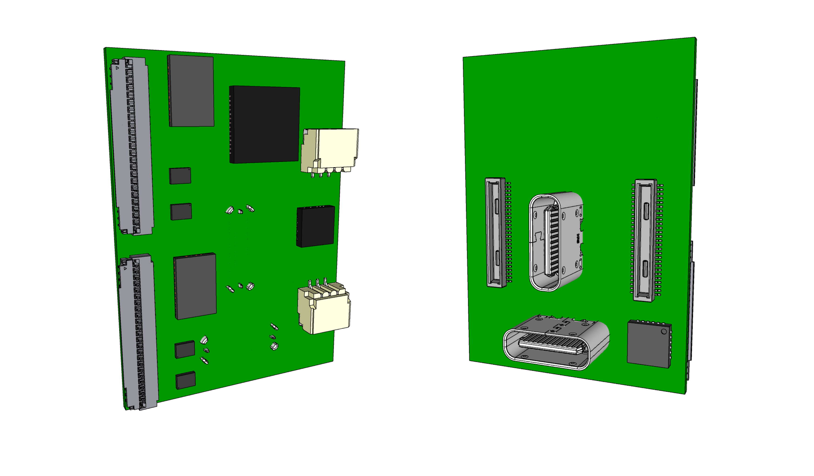
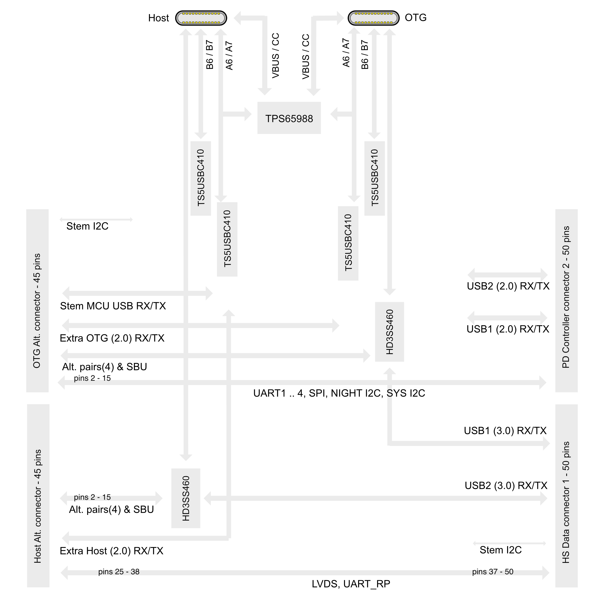

# 801 T-USB daughterboard

The 801 is a bridge board that connects daughter boards. 801 T-USB is one such daughter board.

The T-USB daughterboard has three functions
- Supply the system with power
- Provide data signals in the system over two USB-C connectors
- Manage autonomous system functions and waking state with an attached MCU.

The T-USB board exposes two vertical USB-C sockets and connects to the carrier board through two 50 pin B2B connectors.
Two 45 pin debug connectors provides options to experiment with USB-C Alt. mode and connect a Stem MCU for Autonomous functions.

To facilitate feature development two additional connectors are added.

### Open points

- connectors for the two buttons; Lock and detach
- Which GPIO receives interrupt
- Mux chips shutdown mode
- Power LED & Indicator LEDs
- Add battery connector with temp. sensor JESDA?
- Optional connectors debug uart / jtag
- Annotations and Logo on the board
- TEST The Mux pin configurations
- How should PP_HV1 & PP_HV2 / PP1_CABLE PP2_CABLE be wired ?
- Default boot/SEL states connect USB 2.0/3.0 data routing and full power delivery / charging
- Enable VIN_5V/3V3 from PWR_SYS (TBD)
- Attachment signal / VSOM enable
- Detachment signal / Power down
- Trickle charging wireless coil over secondary connection on BQ24165, can this be supported on BQ24250 ?
- Reset button for RP, TPS, LiPo charger.

## Core Components

- 2 * [Hirose DF40-50DP-0.4V](https://www.hirose.com/en/product/p/CL0684-4014-0-51) mated height 1.5mm [Mouser](https://www.mouser.ch/ProductDetail/Hirose-Connector/DF40C-50DP-04V51?qs=sGAEpiMZZMthaSLPVp%252B4asSF8eu6nRoehAaVBEWyQ6A%3D)
- 2 * [Hirose USB-C CX80B1-24P](https://www.hirose.com/product/p/CL0480-0625-0-00)
- 1 * [TPS65988](https://www.ti.com/product/TPS65988?keyMatch=TPS65988&tisearch=search-everything&usecase=GPN) Dual Port USB Type-C® and USB PD Controller, Power Switch, and High-Speed Multiplexer. [Mouser](https://www.mouser.ch/ProductDetail/Texas-Instruments/TPS65988DJRSHR?qs=sGAEpiMZZMv0NwlthflBiyrCPYKWtEb9w8lmLVKGFHI%3D)
- 2 * [HD3SS460](https://www.ti.com/product/HD3SS460?keyMatch=HD3SS460&tisearch=search-everything&usecase=GPN) 4 x 6 Channels USB Type-C Alternate Mode MUX. Connected to T-USB Host. [Mouser](https://www.mouser.ch/new/texas-instruments/ti-hd3ss460-switch/). [Dock Eval Kit](https://www.mouser.ch/ProductDetail/Texas-Instruments/USB-CTM-MINIDK-EVM?qs=vcbl%252BK4rRletdX9FWp9J9A%3D%3D)
- 1 * [PCA9555 I/O Expander HVQFN24 package](https://www.nxp.com/part/PCA9555D) $1.74/1pcs $0.64/1000pcs
- 4 * [TS5USBC410 Dual 2:1 USB 2.0 Mux/DeMux Switch](../datasheets/USB/ts5usbc41.pdf). [Mouser](https://www.mouser.ch/ProductDetail/Texas-Instruments/TS5USBC410IYFFR?qs=sGAEpiMZZMutXGli8Ay4kPB6XEQFysSpdNErqZgdEYs%3D)
- 1 * [BQ24250RGER battery charger](https://www.ti.com/product/BQ24250)  [$2 JLCPCB (4x4 mm package)](https://jlcpcb.com/parts/componentSearch?isSearch=true&searchTxt=BQ24250) [Mouser](https://www.mouser.ch/ProductDetail/Texas-Instruments/BQ24250RGER?qs=VqERlb%252BKohfBI76g9iGg8g%3D%3D)
- 2 * [3 pin JST SH socket SM03B-SRSS-TB](https://www.jst-mfg.com/product/detail_e.php?series=231) - [JLCPCB](https://jlcpcb.com/parts/componentSearch?isSearch=true&searchTxt=SM03B-SRSS-TB) - [Farnell](https://ch.farnell.com/jst-japan-solderless-terminals/sm03b-srss-tb-lf-sn/stecker-90-3kont/dp/1679118?CMP=GRHB-SF-OEM) (Matched by JST PHR-3)

## Dev. Connectors

- 2 * [TE Connectivity 45PIN 0.3MM 571-4-2328724-5 FPC 3-2328724-5](https://www.te.com/usa-en/product-4-2328724-5.html) $0.41

## Alternate Components

- [SuperSpeed MUX PI5USB30213A](https://www.diodes.com/part/view/PI5USB30213A/) may be an option intead of CBTL04083
- [Alternate USB 2.0 Mux/DeMux](https://www.diodes.com/part/view/PI3USB102G/) [Mouser](https://www.mouser.ch/ProductDetail/Diodes-Incorporated/PI3USB102GZLEX?qs=mt7EBqA2jzg7v2qs76v1VQ%3D%3D) [JLCPCB part](https://jlcpcb.com/parts/componentSearch?isSearch=true&searchTxt=DF40C-60DS-0.4V)
- [Alternate 50 pins DF12NC(3.0)-50DS-0.5V(51)](https://www.hirose.com/en/product/p/CL0537-0198-0-51)
- [Multi cell design with BQ25792](https://www.ti.com/product/BQ25792)
- Optional SPI NOR flash 1Mbit 3.3V, 12MHz
- 2 * TPS63030 buck/boost converters (pick cheaper alternative to up/down regulate with enable pin)
- [BQ25253](https://www.ti.com/product/BQ24253)  $5 JLCPCB (2.4x2.4 mm package)
- [ANX7688 USB-C HDMI bridge](https://www.analogix.com/en/products/convertersbridges/anx7688) replacing HD3SS460 for Host USB 3.0 Alt Mode. [ANX7688 on PinePhone](https://xnux.eu/devices/feature/anx7688.html). [Pinephone HDMI hot-plug-detection HW bug](https://xnux.eu/log/#045).
- [Panasonic AXT534124 socket/receptacle]() - [Mouser](https://www.mouser.ch/ProductDetail/Panasonic-Industrial-Devices/AXT534124/?qs=2rFUEsTwVNxdSFw7IuWdSA==)
- [BM29B-6DP/2-0.35V(51) 6 pin Board to Board power connector](https://www.mouser.ch/ProductDetail/Hirose-Connector/BM29B-6DP-2-0.35V51?qs=Cb2nCFKsA8rUbAFx2SRDGg%3D%3D)

## Firmware Drivers

- [TPS65988 Linux](https://github.com/torvalds/linux/tree/1bff7d7e8c487b9b0ceab70b43b781f1d45f55eb/drivers/usb/typec/tipd)
- [BQ2425x Linux](https://github.com/torvalds/linux/blob/master/drivers/power/supply/bq24257_charger.c)
- [MC6470 Linux](https://github.com/mcubemems/mCube_mc6470_mc7030_mcu_driver)

# Data Routing

The basic data routing on the board is prepared for future expansion. There are a lot more connections into the board than are actually used.

Possible future extensions
- USB-C Alt. mode HDMI/DP
- UART over USB 2.0
- I2C over USB 2.0

In the base setup without added logic the board routes USB 3.0/2.0 data through the two USB-C connectors.

### Board

66 mm x 24 mm

The two 50 pin connectors are placed with a gap of 16 mm between their midpoint.
These two connectors are vertically centered on the center of the vertical USB-C connector.

The two 45 pin data breakouts are placed on one edge with a 2 mm gap.

Components on the underside can be max 0.5mm thick. They can be placed above the horizontal USB-C.

### Multiplexing USB

The board has two types USB busses 2.0 and 3.0 for both of the USB-C connectors.
One off-board source are USB from the bridge board the module attaches to.
The Bridge boards supplies USB1(supports OTG) and USB2(Host mode only).

USB 3.0 is multiplexed as part of USB-C orientation support and is multiplexed between normal and alternate mode.
With additional hardware the OTG USB 3.0 side can be made to support HDMI/DP in Alt. mode.
The USB-C connector Alt. mode is managed by HD3SS460. The wiring is done very much like the diagram at
page 1 of the datasheet.

Each of the two USB-C connector USB 2.0 signals(A/B 6/7) are managed separately and multiplexed using TS5USBC41. 
This allows routing Stem MCU USB 2.0, System Module(OTG or Host) USB 2.0 and Extra USB 2.0(Alt Breakout connector) signals selectively via a 4 pins on a single USB-C connector. 

The switching is done using nXA_SEL and nXB_SEL, where I assume that the default state is low.
Mux A switches between the Stem MCU USB 2.0 signals and the System Module USB 2.0 signals.
Mux B switches between the output of Mux A and the Extra USB 2.0 from the Alt Breakout connector.

The default for Mux A is Stem MCU.
The default for Mux B is Mux A.

# Power Supply

## Power Output vs Input

The board is primarily a USB power sink, it isn't meant to be a significant source of USB power output.
For testing purposes the connectors provide two VIN_5V pins, which are supplied with up to 500 mA from the testing board
by upscaling PWR_SYS to 5V. When connected to the regular bridge board VIN_5V and VIN_3V will not be supplied.

The board itself can be a source of 5V on one port, if it is a sink on the other port. For this purpose a direct connection is drawn from PWR_CHARGE to VIN_5V.

## System Power

The system power is driven by the Battery Charger, while the charging power comes from the PD Controller. 

:[Power Module Connection](../refs/POWER_MODULE_CONNECT.md)

[?] connectors for the two buttons

## Acceptance Criteria on Power

- High voltage USB-C (20V / 12V / 9V) power supplies never produces more than 5V SYS_PWR when connected.
- If one USB port receives power (5V) the other port can deliver power (5V).
- VSOM is 3.45V to 4.4V regardless of charger
- If a Apple Dedicated Charger 5V(1A BC1.2) is connected the board can draw 1A
- If a CDP(5V, 1A) compatible charger is connected the board can draw 1A
- If a CDP(5V, 3A) compatible charger is connected the board can draw 3A

## Combined T-USB control I/O Expander

Expander #3 combines control signals.

:[Combined T-USB control I/O Expander](../pinouts/I2C_EXPANDER_3.md)

## I2C adressing

:[Stem I2C addresses](../pinouts/STEM_I2C_ADDRESSES.md)

:[SYS I2C addresses](../pinouts/SYS_I2C_ADDRESSES.md)

The Night I2C bus is just connected between 45 pin ALT_CONNECTOR and the 50 pin connector.

# Battery Charging

Battery charging is an optional feature enabled by connecting a LiPO battery cell.

- Switch between trickle charge(0.1C) and fast charge(1.5C).
- Charge strategy timout setting
- Suspend on low power
- Resume on good power

In reference board design the PCIe clock is configured to use I2C address 0x68 which is needed by the BQ24250RGER.
On the Ziloo Bridge board the PCIe clock circuit has been reconfigured.

## Power output from Charging Controller

When operating with single cell Li-Ion batteries, output voltage range can be from 3.0V-4.2V. It is recommended not to operate at minimum battery voltage, to prolong a Li-Ion battery’s life. Please refer to the battery manufacturer’s data sheet or design guide for details.

- VSOM output Main power for board 3.5V - 4.2V 
- Direct power input pads support 4V - 6V

The board will attempt to constantly supply power. Either from a 3.7V LiPO battery, 5V input solder pads, or USB power source.

The system should attempt to detect low power and suspend or power down before 
reaching VSOM 3.45V.

## Measuring battery voltage

https://blog.ampow.com/lipo-voltage-chart/

The battery charger will deliver a voltage close to 4.0V under normal charging conditions.
It will deliver a steady 3.5V level during precharge during the ~120 s.

Drawing charger + PD = VSOM

## Managed charging

The bq24250 device has two modes of operation: 1) I2C mode, and 2) standalone mode. In I2C mode, the host adjusts the charge parameters and monitors the status of the charger operation. In standalone mode, the external resistor sets the input-current limit, and charge current limit. Standalone mode also serves as the default settings when a DCP adapter is present. It enters host mode while the I2C registers are accessed and the watchdog timer has not expired (if enabled). The battery is charged in four phases: trickle charge, pre-charge, constant current and constant voltage. In all charge phases, an internal control loop monitors the IC junction temperature and reduces the charge current if the internal temperature threshold is exceeded.

#### Max input current limit

The circuit will be in I2C mode rather than standalone so perhaps the programming with a resistor isn't important.
The documentation seems to indicate that it's used as a fallback.

Short ILIM to GND for default 2A input current(IN) limit.
EN2 = Low
EN1 = High

EN1 could be driven by extender to enable switching between 0.5A and 2A.

R_ILIM = 270 / I_IC

Does this mean that 4 resistors of 540 ohm in parallel with breakable soldering points would allow adjusting the board to a specific battery?
Charge current ISET resistor 500mA / 1A / 2A (4 resistors in parallel?)

#### Acceptance Criteria on Power With Battery

- If power is connected to USB the battery can charge
- If no power is connected the system is battery powered

# 801 T-USB Connector Pinouts

## 3 pin Power Enable Connector

The connector must be oriented along the board to allow packing of battery and board.

| Pin          |                                                                  |
|--------------|------------------------------------------------------------------|
| VSOM_LOCK    | When raised high it signals the backplate is locked in           |
| VSOM         | General board power                                              |
| SHUTDOWN_BTN | When raised it signals a request to runtime modules to shut down |

## 3 pin Battery Connector

Connect battery via GND, TEMP (TS), PACK+ (BAT). This is done over a 3 pin JST H 1mm pitch socket.
The connector must be oriented along the board to allow packing of battery and board.

| Pin          |                                                  |
|--------------|--------------------------------------------------|
| GND          | Ground Black  |
| TS           | TEMP  White   |
| BAT          | PACK+ Red     |

## 50 pin B2B connectors

:[DF40 50 pin connectors](../pinouts/T-USB_50_PINS_CONNECTORS.md)

## USB-C connectors arranged in a T

Two USB-C connectors are arranged in a T shape and the normal way to use it is with a combined connector
attached. This means that the wires will normally be connected in a particular orientation. The system
takes advantage of this by detecting when both USBs are connected in the normal arrangement.

The pins are individually connected to chipsets in order to allow multiplexing based on the situation.

:[T-USB Connector Mapping](../pinouts/T-USB_WITH_ALT_CONNECTOR_PINOUT.md)

## T-USB alt mode connectors

These connectors(only on the development model) enables experimentation with alternate modes and directional pins.

Host ALT

:[45 pins T-USB Host alt mode connector](../pinouts/T-USB_HOST_ALT_CONNECTOR.md)

OTG ALT

:[45 pins T-USB OTG alt mode connector](../pinouts/T-USB_OTG_ALT_CONNECTOR.md)

## Soldering Pads

A number of connections should be broken out on the board as soldering pads (no through hole)

| Pin       | Function                |
|-----------|-------------------------|
| VSOM      | Output or Input         |
| VCC_RTC   | Power input RTC battery |
| PP_HV1    | PD Controller power     |   
| PP_HV2    | PD Controller power     |   
| VIN_5V    | PD Controller System 5V for PP1_CABLE, PP2_CABLE |
| VIN_3V3   | PD Controller System 3.3V |
| GND       |                         |

