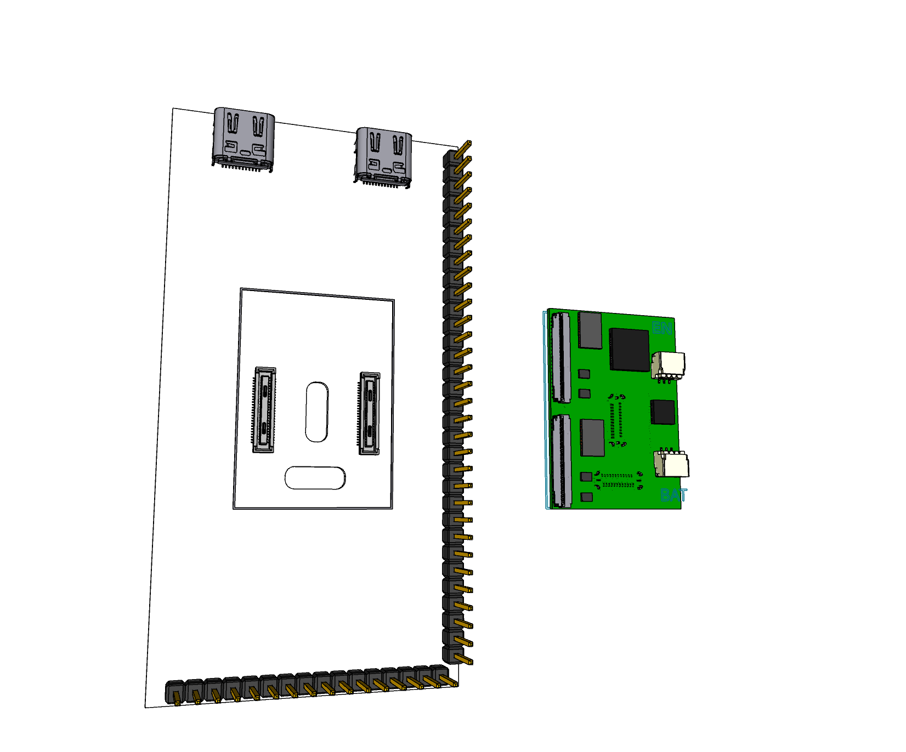
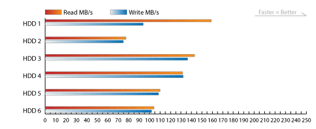
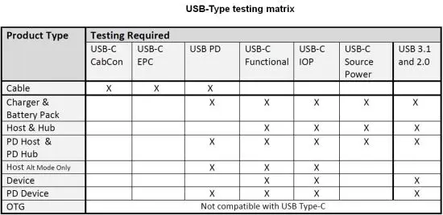
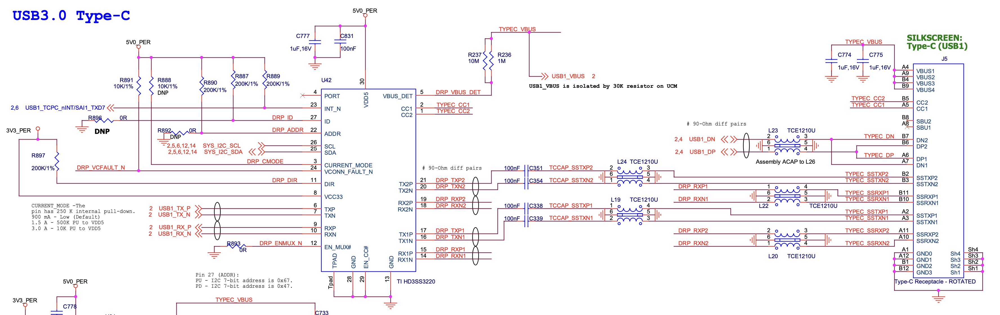
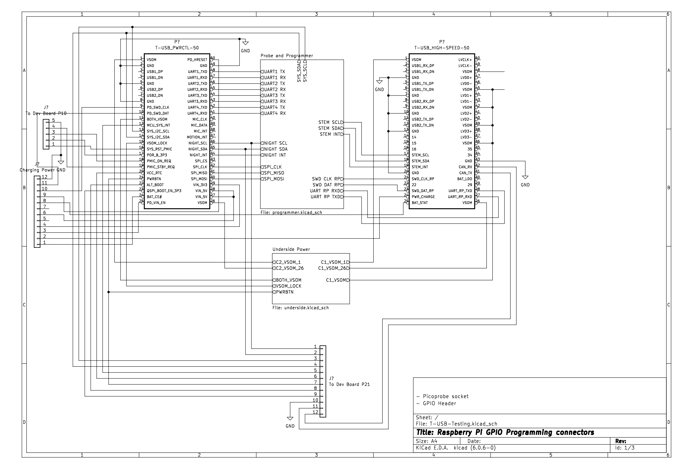

# 801 T-USB testing board

This testing board hosts the 801 T-USB daughter board.

The 801 is a bridge board that connects daughter boards. 801 T-USB is one such daughter board.

The T-USB daughterboard has three functions
- Supply the system with power
- Provide data signals in the system over two USB-C connectors
- Manage autonomous system functions and waking state

The T-USB board exposes two vertical USB-C sockets and connects to the carrier board through two 50 pin B2B connectors.
These are routed ultimately through two USB-C connectors on the testing board.

The testing board can also be used to test the bridge board. For this purpose there are two plugs on the underside that connect
directly to the sockets on the upperside apart from the VSOM pins.

## Board Components

- 2 * [Hirose DF40HC(2.5)-50DS-0.4V(51)](https://www.hirose.com/en/product/p/CL0684-4101-2-51) mated height 2.5mm [Mouser](https://www.mouser.ch/ProductDetail/Hirose-Connector/DF40HC2.5-50DS-0.4V51?qs=3aug5cyrIbcx5nfCL76SaA%3D%3D)
- 2 * [Hirose DF40-50DP-0.4V](https://www.hirose.com/en/product/p/CL0684-4014-0-51) mated height 1.5mm [Mouser](https://www.mouser.ch/ProductDetail/Hirose-Connector/DF40C-50DP-04V51?qs=sGAEpiMZZMthaSLPVp%252B4asSF8eu6nRoehAaVBEWyQ6A%3D)
- 2 * [HD3SS3220  10-Gbps USB 3.1 Type-C 2:1 mux with DRP Controller](https://www.ti.com/product/HD3SS3220) [Mouser](https://www.mouser.ch/ProductDetail/Texas-Instruments/HD3SS3220IRNHR?qs=sGAEpiMZZMsyYdr3R27aV4Thfeh8oIeSp2btOUhwC5A%3D)
- 2 * USB-C connectors [DX07S024JA1R1300](https://www.jae.com/en/connectors/series/detail/product/id=66508) or [DX07S024JJ2R1300](https://www.mouser.ch/ProductDetail/JAE-Electronics/DX07S024JJ2R1300?qs=odmYgEirbwyfyaz1Tta0cQ%3D%3D) - [Mouser](https://www.mouser.ch/ProductDetail/JAE-Electronics/DX07S024JA1R1300?qs=sGAEpiMZZMulM8LPOQ%252BykzSQWeMShX%2FG9%2F%2FCSxm4Z%2Fy5DDnrKAaL8g%3D%3D) 
- 1 * [TSM-110-01-L-DV 2*10 pin Header](https://www.samtec.com/products/tsm-110-01-l-dv)
- 2 * [Samtec TSW-120-14-T-S Header 20 pin](https://www.samtec.com/products/tsw-120-12-t-s) 
- 3 * [Samtec TSW-116-14-T-S Header 16 pin](https://www.samtec.com/products/tsw-116-14-t-s) - [Mouser](https://www.mouser.ch/ProductDetail/Samtec/TSW-116-14-T-S?qs=iT52DjcXudt%2FVnGGDYuHrA%3D%3D)

The Samtec single row headers are for reference, but alternate header pins can be soldered on later.

### Open notes

Step up voltage 3.5V -> 5V

Testing staged power and data enable when plugging in the module.

Chip enable when plugged in. 100ms delay.

# Testing with the board

## Testing cases 

* Routing UART over breakout connectors
* VSOM load test
* Interrupt triggering
* Requesting system standby
* Detecting system standby
* Triggering system reset
* Detecting system reset
* Powering dev board from T-USB power output
* Simulating CONN_EN signal
* High voltage USB-C (20V / 12V / 9V) power supplies never produces more than 5V SYS_PWR when connected.
* If one USB port receives power (5V) the other port can deliver power (5V).
* VSOM is 3.45V to 4.4V regardless of charger
* If a Apple Dedicated Charger 5V(1A BC1.2) is connected the board can draw 1A
* If a CDP(5V, 1A) compatible charger is connected the board can draw 1A
* If a CDP(5V, 3A) compatible charger is connected the board can draw 3A
* If power is connected to USB the battery can charge
* If no power is connected the system is battery powered
* USB 3.0 data signal can be passed through from T-USB OTG to testing board OTG, and reverse min. 250MB/sec
* USB 3.0 data signal can be passed through from T-USB Host to testing board Host, and reverse min. 250MB/sec
* USB 2.0 data signal can be passed through from T-USB OTG to testing board OTG, and reverse min. 35MB/sec
* USB 2.0 data signal can be passed through from T-USB Host to testing board Host, and reverse min. 35MB/sec
* Power and Data works through T-USB ports with 300 cm cable length.
* USB signal jitter within accepted range (see USB 3.0 Electrical Compliance Methodology)

Sample USB 3.0 data rates

USB Testing Matrix

Ideal testing equipment for USB 3.0 are [Loopback Plugs](https://www.passmark.com/products/usb3loopback/index.php).

Testing articles,

- [What’s new in USB Power Delivery 3.0](https://www.testandmeasurementtips.com/whats-new-in-usb-power-delivery-3-0-faq/)
- [A first look at USB 3.1 performance](https://techreport.com/review/27906/a-first-look-at-usb-3-1-performance/)
- [Here's how fast USB 3.1 is in the real world](https://www.techspot.com/news/59982-here-how-fast-usb-31-real-world.html)

## LEDs

LEDs will test specific situations and test cases

- Battery STAT (BAT_STAT - BAT_LDO), see battery charger spec
- Battery power good (PWR_CHARGE above 4.3V), see battery charger spec
- VSOM power on any of the regular VSOM pins (upper 36..48)
- VSOM voltage on regular VSOM pins are >4.5V
- VCC_RTC provides power (rated at ~2V)
- Power on Reset POR_B_3P3
- System powered on, PMIC_ON_REQ raised high
- System powering down, PMIC_STBY_REQ raised high
- VSOM_LOCK powered (upper)
- Each of the VSOM corners 1, 1, 26, 26 (upper) supplies power

POR_B_3P3, PMIC_ON_REQ and PMIC_STBY_REQ would potentially only be raised high for a very short interval.
I suppose a capacitor can be added to ensure that the LED is powered long enough for it to be visible.

# Connecting the Board

### Signals passed to USB-C connectors

The T-USB board connects to two separate USB 2.0+3.0 signal sources via the 50 pin connectors. In order to test the T-USB board the testing board has supply the equivalent signals it should be possible to connect the two sets of signals via two USB-C connectors. Since USB-C is polarity ambivalent a HD3SS3220 chip is added between each of the USB-C connectors and the 50 pin connectors.

An example of connecting USB 2+3 signals to USB-C via a HD3SS3220 can be seen here.

The USB 2/3 data lines are connected to the 50 pin connectors on both the upperside and underside of the PCB.

Here are the 50 pin connector pins routed to USB-C connectors via the HD3SS3220:

#### Connector 1 high-speed data

| Pin | Code             | Type     | Details                              | Voltage |
|-----|------------------|----------|--------------------------------------|---------|
| 2   | USB1_RX_DP       | USB      | USB1 RX D+                           |         |
| 3   | USB1_RX_DN       | USB      | USB1 RX D-                           |         |
| 4   | GND              | Power    | Ground                               |         |
| 5   | USB1_TX_DP       | USB      | USB1 TX D+                           |         |
| 6   | USB1_TX_DN       | USB      | USB1 TX D-                           |         |
| 7   | GND              | Power    | Ground                               |         |
| 8   | USB1_RX_DP       | USB      | USB2 RX D+                           |         |
| 9   | USB1_RX_DN       | USB      | USB2 RX D-                           |         |
| 10  | GND              | Power    | Ground                               |         |
| 11  | USB1_TX_DP       | USB      | USB2 TX D+                           |         |
| 12  | USB1_TX_DN       | USB      | USB2 TX D-                           |         |
| 13  | GND              | Power    | Ground                               |         |

#### Connector 2 PD controller

| Pin | Code         | Type     | Details                              | Voltage | Misc    |
|-----|--------------|----------|--------------------------------------|---------|---------|
| 3   | USB1_DP      | USB      | USB1 D+                              |         |         |
| 4   | USB1_DN      | USB      | USB1 D-                              |         |         |
| 5   | GND          | Power    | Ground                               |         |         |
| 6   | USB2_DP      | USB      | USB2 D+                              |         |         |
| 7   | USB2_DN      | USB      | USB2 D-                              |         |         |
| 8   | GND          | Power    | Ground                               |         |         |

 

## Underside 50 pin plugs VSOM connection header

This header breaks out the power pins from the underside 50 pin connectors. 
It allows connecting or disconnecting power pins selectively to the same pin on the upperside connector.
These pins on the 50 pin connectors are not connected to the upperside directly.
This connector sits next to the Upperside VSOM connection header to allow easy 1-to-1 connection.
C1 refers to Connector 1 high-speed data.

Under Power (10 pins)

| Pin | 50 Conn | Code         | Type     | Details                              | Voltage      | Misc    |
|-----|---------|--------------|----------|--------------------------------------|--------------|---------|
| 1   | 1       | C1_VSOM_1    | Enable   | Corner VSOM pin on C1                | 3.45V - 4.5V |         |
| 2   | 1       | C2_VSOM_1    | Enable   | Corner VSOM pin                      | 3.45V - 4.5V |         |
| 3   | 26      | C1_VSOM_26   | Enable   | Corner VSOM pin on C1                | 3.45V - 4.5V |         |
| 4   | 26      | C2_VSOM_26   | Enable   | Corner VSOM pin                      | 3.45V - 4.5V |         |
| 5   | 11      | BOTH_VSOM    | Enable   | Signal from bridge board that VSOM is connected on both sides   | 3.45V - 4.5V ?        |   |
| 6   | 15      | VSOM_LOCK    | Power    | Main power for board, if mechanical lock shorted    | 3.45V - 4.5V        | Mech. lock |
| 7   | 21      | PWRBTN       | Boot     | Power button trigger                 |              |         |
| 8   | 48      | C1_VSOM      | Power    | C1 power (36, 39, 42, 45)            | 3.45V - 4.5V |
| 9   | 49      | GND          | Power    | Ground                               |              |
| 10  | 49      | GND          | Power    | Ground                               |              |

## Upperside 50 pin sockets VSOM connection

This header breaks out the power pins from the upperside 50 pin connectors. 
It allows connecting or disconnecting power pins selectively to the same pin on the underside connector.
These pins on the 50 pin connectors are not connected to the underside directly.
The breakout enables testing partial insertion of the sockets. 
If pins are not bridged between the upperside and underside connectors, the power is not passed between the under- and uppperside.
C1 refers to Connector 1 high-speed data.

Upper Power (10 pins)

| Pin | 50 Conn | Code         | Type     | Details                              | Voltage      | Misc    |
|-----|---------|--------------|----------|--------------------------------------|--------------|---------|
| 1   | 1       | C1_VSOM_1    | Enable   | Corner VSOM pin on C1                | 3.45V - 4.5V |   |
| 2   | 1       | C2_VSOM_1    | Enable   | Corner VSOM pin                      | 3.45V - 4.5V |   |
| 3   | 26      | C1_VSOM_26   | Enable   | Corner VSOM pin on C1                | 3.45V - 4.5V |    |
| 4   | 26      | C2_VSOM_26   | Enable   | Corner VSOM pin                      | 3.45V - 4.5V |    |
| 5   | 11      | BOTH_VSOM    | Enable   | Signal from bridge board that VSOM is connected on both sides   | 3.45V - 4.5V ?        |   |
| 6   | 15      | VSOM_LOCK    | Power    | Main power for board, if mechanical lock shorted    | 3.45V - 4.5V        | Mech. lock |
| 7   | 21      | PWRBTN       | Boot     | Power button trigger                 |              |   |
| 8   | 48      | C1_VSOM      | Power    | C1 power (36, 39, 42, 45)            | 3.45V - 4.5V |
| 9   | 49      | GND          | Power    | Ground                               |              |
| 10  | 49      | GND          | Power    | Ground                               |              |

## Signals for two 50 pin connectors from dev board (9 + 10 + 5 pins)

50 pins for PD Controller and Data -> Dev Board P20 (11 pins)

| Pin | 50 Conn | Code       | Type     | Details                              | Voltage |  Misc    |
|-----|---------|------------|----------|--------------------------------------|---------|---------|
| 1   | 48      | UART1_TXD  | UART     | P1.72 UART1 Tx                       |         | P20.9   |
| 2   | 47      | UART1_RXD  | UART     | P1.19 UART1 Rx                       |         | P20.11  |
| 3   | 46      | UART2_TXD  | UART     | UART2 Tx                             |         | P20.1   |
| 4   | 45      | UART2_RXD  | UART     | UART2 Rx                             |         | P20.3   |
| 5   | 44      | UART3_TXD  | UART     | P1.61 UART3 Tx                       |         | P20.2   |
| 6   | 43      | UART3_RXD  | UART     | P1.21 UART3 Rx                       |         | P20.4   |
| 7   | 42      | UART4_TXD  | UART     | UART4 Tx                             |         | P20.8   |
| 8   | 41      | UART4_RXD  | UART     | UART4 Rx                             |         | P20.10  |
| 9   | 17      | I2C3_SCL   | I2C      | STEM SCL                             |         | P20.33  |
| 10  | 18      | I2C3_SDA   | I2C      | STEM SDA                             |         | P20.34  |
| 11  |         | GND        | Power    | Ground                               |         |        |

50 pins for PD Controller / Data -> Dev Board P21 + direct connects (12 pins)

| Pin | 50 Conn | Code           | Type     | Details                              | Voltage |  Misc      |      |
|-----|---------|----------------|----------|--------------------------------------|---------|------------|------|
| 1   | 36      | NIGHT SCL      | I2C      | I2C6 SCL                             |         | P21.2      | GP19 I2C1.   |
| 2   | 35      | NIGHT SDA      | I2C      | I2C6 SDA                             |         | P21.4      | GP18 I2C1.   |
| 3   | 18      | SYS I2C SCL    | I2C      |                                      |         | P21.7      | GP15 I2C1.  |
| 4   | 19      | SYS I2C SDA    | I2C      |                                      |         | P21.5      | GP14 I2C1.  |
| 5   | 12      | MCU_SYS_INT    | IRQ      | Interrupt signal (GPIO4_IO19)        |         | P20.20  P2.67   |
| 6   | 20      | VCC_RTC        | Power    | Low power mode supply                | 1.8V    | RTC connector  |
| 7   | 21      | PWRBTN         | Boot     | Power button trigger                 |         | Direct on power button  |
| 8   | 22      | ALT_BOOT       | Boot     | Alternate boot                       |         | Direct on alt boot button           |
| 9   | 23      |QSPI_BOOT_EN_3P3| Boot     | SPI boot                             |         | P21.18     |
| 10  |         | GND            | Power    | Ground                               |         |            |
| 11  | 32      | CAN_RX         |          | CAN1_RX                              |         | P21.12     |
| 12  | 31      | CAN_TX         |          | CAN1_TX                              |         | P21.14     |

50 pins for PD Controller -> Dev Board P10 (5 pins)

| Pin | 50 Conn |Code           | Type     | Details                              | Voltage |  Misc    |
|-----|---------|----------------|----------|--------------------------------------|---------|---------|
| 1   | 16      | SYS_RST_PMIC   | Reset    | SoM PMIC reset input pin. Internally pulled up with LDO1 power rail. Once low, PMIC resets |  | P10.9   |
| 2   | 17      | POR_B_3P3      | Reset    | Power On reset from SoM PMIC |    | P10.7 |
| 3   | 18      | PMIC_ON_REQ    | Reset    | PMIC ON signal sent to SoM from T-USB. When raised high, the SoM starts power on sequence. |     | P10.5   |
| 4   | 19      | PMIC_STBY_REQ  | Reset    | Standby mode input from T-USB to SoM. When high, SoM enters STANDBY mode. |     | P10.3  |
| 5   |         | GND            | Power    | Ground                               |         |        |

## Raspberry Pi GPIO header

A GPIO header connector is placed on the testing board to allow adding a RPi for testing/programming and chaining other boards over SDIO/SPI/I2C busses.

The pinout,

:[GPIO programmer](../testing/RPI_GPIO_HEADER.md)

## Raspberry Pi Pico Socket

A socket is added for adding a RPi Pico which will be running Picoprobe debugging firmware

The pinout,

:[Picoprobe pinout](../pinouts/RP2040_PIN_MAPPING.md)

## Breakout of Experimental Charging Pins

From 50 pins for PD Controller / Data -> Charging power (12 pins)

| Pin | 50 Conn | Code         | Type     | Details                              | Voltage |  Misc    |
|-----|---------|--------------|----------|--------------------------------------|---------|---------|
| 1   | 24      | BAT_CE#      | Charger  | Charge Enable Active-Low Input. Connect to a high logic level to place the battery charger in standby mode. | | |    
| 2   | 24      | PWR_CHARGE   | Power    | Internal charging power              |         |
| 3   | 25      | PD_VIN_EN    |          | Enable VIN_5V/3V3 from PWR_SYS (TBD) |         |    |
| 4   | 29      | VIN_3V3      |          | Supply for TPS64988 circuitry and I/O. Current 50 mA |   3.3V        |
| 5   | 34      | SPI_3V3      | Power    | Power to the flash chip. Bridge connects to VIN_3V3      | 3.3V    |
| 6   | 28      | VIN_5V       | Power    | System 5V power source (PPHV1, PPHV2, PP1_CABLE, PP2_CABLE). 500 mA. | 5V      |
| 7   |         |              |          |                                      |         |
| 8   | 25      | BAT_STAT     | Battery  | Internal charging status for testing |         |
| 9   | 50      | PD_HRESET    | PD       | PD Controller HRESET (High)          |         |         |
| 10  | 9       | PD_SWD_CLK   | PD       | Debugging PD Controller              |         |
| 11  | 9       | PD_SWD_DAT   | PD       | Debugging PD Controller              |         |
| 12  |         | GND          | Power    | Ground                               |         |

## Signals **NOT** broken out from 50 pin connectors

These signal pins are however connected between the upperside and underside.

| Pin | Code       | Type     | Details                              | Voltage |
|-----|------------|----------|--------------------------------------|---------|
| 50  | LVCLK+     | LVDS     | LVDS CLK+                            |         |
| 49  | LVCLK-     | LVDS     | LVDS CLK-                            |         |
| 47  | LVD0+      | LVDS     | LVDS D0+                             |         |
| 46  | LVD0-      | LVDS     | LVDS D0-                             |         |
| 44  | LVD1+      | LVDS     | LVDS D1+                             |         |
| 43  | LVD1-      | LVDS     | LVDS D1-                             |         |
| 41  | LVD2+      | LVDS     | LVDS D2+                             |         |
| 40  | LVD2-      | LVDS     | LVDS D2-                             |         |
| 38  | LVD3+      | LVDS     | LVDS D3+                             |         |
| 37  | LVD3-      | LVDS     | LVDS D3-                             |         |

