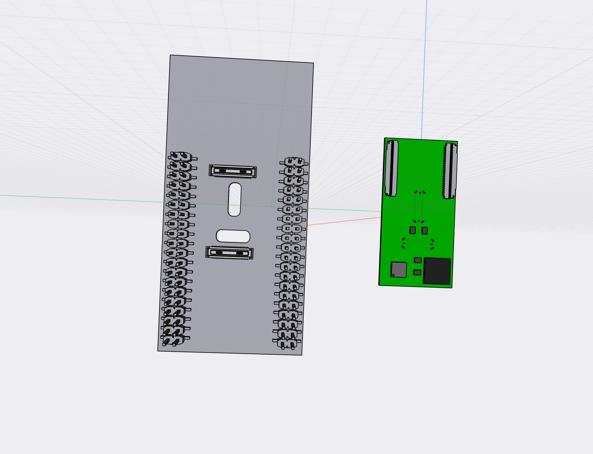

# 801 T-USB testing board

The 801 is a bridge board that connects daughter boards. 801 T-USB is one such daughter board.

The T-USB daughterboard has two functions
- Supply the system with power
- Provide data signals in the system over two USB-C connectors

The T-USB board exposes two vertical USB-C sockets and connects to the carrier board through two 50 pin B2B connectors.

To facilitate feature development two additional connectors are added.

### Testing board cases 

* Routing UART over breakout connectors
* VSOM load test
* Interrupt triggering
* Requesting system standby
* Detecting system standby
* Triggering system reset
* Detecting system reset
* Powering dev board from T-USB power output

## Dev. Connectors

- 1 * MicroHDMI (suggested Molex 46765-1301) [Mouser](https://www.mouser.ch/ProductDetail/Molex/46765-1301?qs=sGAEpiMZZMt1iCLsaqcCFmQhPEZFSo0wUGorAW08d1I%3D) [Molex](https://www.molex.com/molex/products/part-detail/io_connectors/0467651301)
- 3 * [TE Connectivity 45PIN 0.3MM 571-4-2328724-5 FPC 3-2328724-5](https://www.te.com/usa-en/product-4-2328724-5.html) $0.41
ProductDetail/Hirose-Connector/DF40C-34DS-04V51?qs=vcbW%252B4%252BSTIpg26DsEbj1iQ%3D%3D))
- <mark>4 *</marked> [6 pin Molex 5044490607](https://www.molex.com/molex/products/part-detail/pcb_headers/5044490607)
- 2 * HD3SS3220

## Other Components

Connectors placed on the board are,

- 1 * TSM-120-01-F-DV Samtec 2*20 pins surface mounted .100 (Smiley model) [Mouser](https://www.mouser.ch/ProductDetail/Samtec/TSM-120-01-F-DV?qs=rU5fayqh%252BE2gtcIirjF3kA%3D%3D)

Step up voltage 3.5V -> 5V

Testing staged power and data enable when plugging in the module.

Chip enable when plugged in. 100ms delay.

## Signals passed to USB-C connectors

The signals from the USB-C connectors are routed through a Ti HD3SS3220 to handle polarity of the plug.

| Pin | Code             | Type     | Details                              | Voltage |
|-----|------------------|----------|--------------------------------------|---------|
| 2   | USB1_RX_DP       | USB      | USB1 RX D+                           |         |
| 3   | USB1_RX_DN       | USB      | USB1 RX D-                           |         |
| 4   | GND              | Power    | Ground                               |         |
| 5   | USB1_TX_DP       | USB      | USB1 TX D+                           |         |
| 6   | USB1_TX_DN       | USB      | USB1 TX D-                           |         |
| 7   | GND              | Power    | Ground                               |         |
| 8   | USB1_RX_DP       | USB      | USB2 RX D+                           |         |
| 9   | USB1_RX_DN       | USB      | USB2 RX D-                           |         |
| 10  | GND              | Power    | Ground                               |         |
| 11  | USB1_TX_DP       | USB      | USB2 TX D+                           |         |
| 12  | USB1_TX_DN       | USB      | USB2 TX D-                           |         |
| 13  | GND              | Power    | Ground                               |         |
| 14  | GND              | Power    | Ground                               |         |         
| 15  | USB1_DP          | USB      | USB1 D+                              |         |         
| 16  | USB1_DN          | USB      | USB1 D-                              |         |         
| 17  | GND              | Power    | Ground                               |         |         
| 18  | USB2_DP          | USB      | USB2 D+                              |         |         
| 19  | USB2_DN          | USB      | USB2 D-                              |         |         
| 20  | GND              | Power    | Ground                               |         |         

## Signals for two 50 pin connectors from dev board

50 pins for PD Controller -> Dev Board P20

| Pin | Code       | Type     | Details                              | Voltage |  Misc    |
|-----|------------|----------|--------------------------------------|---------|---------|
| 48  | UART1_TXD  | UART     | P1.72 UART1 Tx                       |         | P20.9   |
| 47  | UART1_RXD  | UART     | P1.19 UART1 Rx                       |         | P20.11  |
| 46  | UART2_TXD  | UART     | UART2 Tx                             |         | P20.1   |
| 45  | UART2_RXD  | UART     | UART2 Rx                             |         | P20.3   |
| 44  | UART3_TXD  | UART     | P1.61 UART3 Tx                       |         | P20.2   |
| 43  | UART3_RXD  | UART     | P1.21 UART3 Rx                       |         | P20.4   |
| 42  | UART4_TXD  | UART     | UART4 Tx                             |         | P20.8   |
| 41  | UART4_RXD  | UART     | UART4 Rx                             |         | P20.10  |
| 38  | I2C3 SCL   | I2C      | Stem SCL                             |         | P21.2 ? |
| 37  | I2C3 SDA   | I2C      | Stem SDA                             |         | P21.4 ? |
| 13  | EX_OH_nINT | IRQ      | Interrupt signal (GPIO1_IO0)         |         | P20.12  |
| 14  | EX_T_nINT  | IRQ      | Interrupt signal (GPIO1_IO1).        |         | P20.14  |
|     | GND        | Power    | Ground                               |         |        |

50 pins for PD Controller -> Dev Board P21 + direct connects

| Pin | Code           | Type     | Details                              | Voltage |  Misc    |
|-----|----------------|----------|--------------------------------------|---------|---------|
| 40  | I2C SCL    | I2C      | P1.99 SYS SCL                        |         | P21.7   |
| 39  | I2C SDA    | I2C      | P1.97 SYS SDA                        |         | P21.5   |
| 12  | EX0_nINT       | IRQ      | Interrupt signal (GPIO4_IO19)        |         | P21.30  |
| 20  | VCC_RTC        | Power    | Low power mode supply                |         |   |
| 21  | PWRBTN         | Boot     | Power button trigger                 |         |   |
| 22  | ALT_BOOT       | Boot     | Alternate boot                       |         |   |
| 23  |QSPI_BOOT_EN_3P3| Boot     | SPI boot                             |         |  P21.18   |
|     | GND        | Power    | Ground                               |         |        |

50 pins for PD Controller -> Dev Board P10

| Pin | Code           | Type     | Details                              | Voltage |  Misc    |
|-----|----------------|----------|--------------------------------------|---------|---------|
| 16  | SYS_RST_PMIC   | Reset    | PMIC reset input pin. Internally pulled up with LDO1 power rail. Once low, PMIC performs reset. |         | P10.9   |
| 17  | POR_B_3P3      | Reset    | Power On reset output pin. Open drain output requiring external pull up resistor. |    | P10.7 |
| 18  | PMIC_ON_REQ    | Reset    | PMIC ON input from Application processor. When high, the device starts power on sequence. |     | P10.5   |
| 19  | PMIC_STBY_REQ  | Reset    | Standby mode input from Application processor. When high, device enters STANDBY mode. |     | P10.3  |
|     | GND        | Power    | Ground                               |         |        |

Header with 26 pins

## Breakout of Charging Signals

From 50 pins for PD Controller

| Pin | Code       | Type     | Details                              | Voltage |  Misc    |
|-----|------------|----------|--------------------------------------|---------|---------|
| 9   | SWD_CLK      | Debug    | PD Controller GPIO12                 |         |         |
| 10  | SWD_DAT      | Debug    | PD Controller GPIO13                 |         |         |
| 33  | SPI_CS       | PD     | Programming/External flash directly  | 3.3V    |
| 32  | SPI_CLK      | PD     | Programming/External flash directly  | 3.3V    |
| 31  | SPI_MISO     | PD     | Programming/External flash directly  | 3.3V    |
| 30  | SPI_MOSI     | PD     | Programming/External flash directly  | 3.3V    |
| 24  | BAT_CE#      | Charger  |  Charge Enable Active-Low Input. Connect CE to a high logic level to place the battery charger in standby mode.  |         |    |
| 25  | PD_VIN_EN    |          | Enable VIN_5V/3V3 from PWR_SYS (TBD) |         |    |
|     | GND          | Power    | Ground                               |         |
| 35  | VIN_3V3          |          | Supply for TPS64988 circuitry and I/O. Current 50 mA |   3.3V        |
| 34  | SPI_3V3          | Power    | Power to the flash chip. Bridge connects to VIN_3V3      | 3.3V    |
| 28  | VIN_5V     | Power    | System 5V power source (PPHV1, PPHV2, PP1_CABLE, PP2_CABLE). 500 mA. | 5V      |
| 29  | VSOM         | Power    | Main power for board 3.45V - 4.5V    |         |         |
| 50  | VSOM       | Power    | Main power for board 3.45V - 4.5V    |         |
| 49  | GND        | Power    | Ground                               |         |
| 49  | GND        | Power    | Ground                               |         |

Header with 12 pins

## Breakout of Power and Enable Pins

These pins are from both 50 pins connectors

| Pin | Code         | Type     | Details                              | Voltage | Misc    |
|-----|--------------|----------|--------------------------------------|---------|---------|
| 1   | CONN_EN      | Enable | Signal + / GND to inform the T-USB board of being connected   |         |   |
| 1   | CONN_EN      | Enable | Signal + / GND to inform the T-USB board of being connected   |         |   |
| 26  | CONN_EN      | Enable | Signal + / GND to inform the T-USB board of being connected   |         |    |
| 26  | CONN_EN      | Enable | Signal + / GND to inform the T-USB board of being connected   |         |    |
| 11  | VSOM         | Power    | Main power for board 3.45V - 4.5V    |         |         |
| 49  | GND        | Power    | Ground                               |         |

Header with 13 pins

## Signals **NOT** connected on 50 pin connectors

| Pin | Code       | Type     | Details                              | Voltage |
|-----|------------|----------|--------------------------------------|---------|
| 50  | LVCLK+     | LVDS     | LVDS CLK+                            |         |
| 49  | LVCLK-     | LVDS     | LVDS CLK-                            |         |
| 47  | LVD0+      | LVDS     | LVDS D0+                             |         |
| 46  | LVD0-      | LVDS     | LVDS D0-                             |         |
| 44  | LVD1+      | LVDS     | LVDS D1+                             |         |
| 43  | LVD1-      | LVDS     | LVDS D1-                             |         |
| 41  | LVD2+      | LVDS     | LVDS D2+                             |         |
| 40  | LVD2-      | LVDS     | LVDS D2-                             |         |
| 38  | LVD3+      | LVDS     | LVDS D3+                             |         |
| 37  | LVD3-      | LVDS     | LVDS D3-                             |         |

## Yet to plan ...

One side

| 14  | T_USB_O_ALT_EN   | AltMode  | Exposed EX3                          |         |
| 15  | T_USB_O_ALT_POL  | AltMode  | Exposed EX3                          |         |
| 16  | T_USB_O_ALT_AMSEL| AltMode  | Exposed EX3                          |         |
| 17  | T_USB_H_ALT_EN   | AltMode  | Exposed EX3                          |         |
| 18  | T_USB_H_ALT_POL  | AltMode  | Exposed EX3                          |         |
| 19  | T_USB_H_ALT_AMSEL| AltMode  | Exposed EX3                          |         |
| 20  | GND              | Power    | Ground                               |         |
| 21  |                  |          |                                    |         |
| 23  |                  |          |                                    |         |
| 24  |                  |          |                                    |         |

TODO remove EX3 exposure

