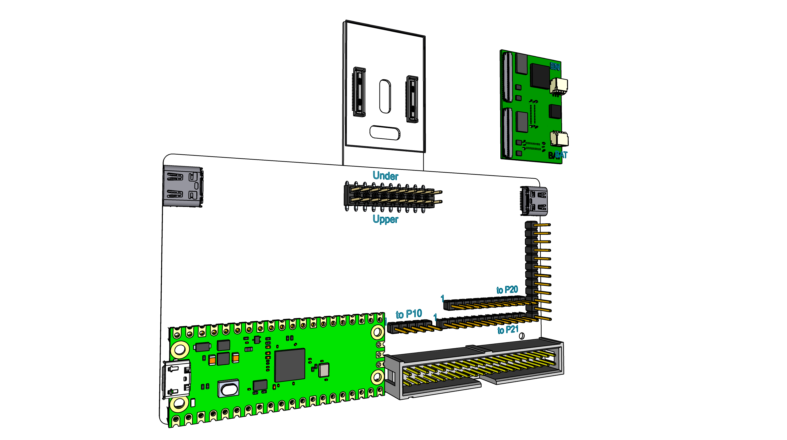

# 801 T-USB testing board

This testing board hosts the 801 T-USB daughter board.

The 801 is a bridge board that connects daughter boards. 801 T-USB is one such daughter board.

The T-USB daughterboard has two functions
- Supply the system with power
- Provide data signals in the system over two USB-C connectors

The T-USB board exposes two vertical USB-C sockets and connects to the carrier board through two 50 pin B2B connectors.
These are routed ultimately through two USB-C connectors on testing board

## Board Components

- 2 * [Hirose DF40-50DS-0.4V](https://www.hirose.com/en/product/p/CL0684-4009-0-51) mated height 1.5mm [Mouser](https://www.mouser.ch/ProductDetail/Hirose-Connector/DF40C-50DS-04V51?qs=sGAEpiMZZMthaSLPVp%252B4asSF8eu6nRoehAaVBEWyQ6A%3D) - [JLCPCB socket](https://jlcpcb.com/parts/componentSearch?isSearch=true&searchTxt=DF40C-50DS-0.4V)
- 2 * [HD3SS3220  10-Gbps USB 3.1 Type-C 2:1 mux with DRP Controller](https://www.ti.com/product/HD3SS3220) [Mouser](https://www.mouser.ch/ProductDetail/Texas-Instruments/HD3SS3220IRNHR?qs=sGAEpiMZZMsyYdr3R27aV4Thfeh8oIeSp2btOUhwC5A%3D)
- 2 * USB-C connectors [DX07S024JA1R1300](https://www.jae.com/en/connectors/series/detail/product/id=66508) or [DX07S024JJ2R1300](https://www.mouser.ch/ProductDetail/JAE-Electronics/DX07S024JJ2R1300?qs=odmYgEirbwyfyaz1Tta0cQ%3D%3D) - [Mouser](https://www.mouser.ch/ProductDetail/JAE-Electronics/DX07S024JA1R1300?qs=sGAEpiMZZMulM8LPOQ%252BykzSQWeMShX%2FG9%2F%2FCSxm4Z%2Fy5DDnrKAaL8g%3D%3D) - 
- 3 * [Samtec TSW-116-14-T-S Header 16 pin](https://www.samtec.com/products/tsw-116-14-t-s) - [Mouser](https://www.mouser.ch/ProductDetail/Samtec/TSW-116-14-T-S?qs=iT52DjcXudt%2FVnGGDYuHrA%3D%3D)

### Open notes

Step up voltage 3.5V -> 5V

Testing staged power and data enable when plugging in the module.

Chip enable when plugged in. 100ms delay.

# Testing with the board

## Testing cases 

* Routing UART over breakout connectors
* VSOM load test
* Interrupt triggering
* Requesting system standby
* Detecting system standby
* Triggering system reset
* Detecting system reset
* Powering dev board from T-USB power output
* Simulating CONN_EN signal
* High voltage USB-C (20V / 12V / 9V) power supplies never produces more than 5V SYS_PWR when connected.
* If one USB port receives power (5V) the other port can deliver power (5V).
* VSOM is 3.45V to 4.4V regardless of charger
* If a Apple Dedicated Charger 5V(1A BC1.2) is connected the board can draw 1A
* If a CDP(5V, 1A) compatible charger is connected the board can draw 1A
* If a CDP(5V, 3A) compatible charger is connected the board can draw 3A
* If power is connected to USB the battery can charge
* If no power is connected the system is battery powered
* USB 3.0 data signal can be passed through from T-USB OTG to testing board OTG, and reverse min. 250MB/sec
* USB 3.0 data signal can be passed through from T-USB Host to testing board Host, and reverse min. 250MB/sec
* USB 2.0 data signal can be passed through from T-USB OTG to testing board OTG, and reverse min. 35MB/sec
* USB 2.0 data signal can be passed through from T-USB Host to testing board Host, and reverse min. 35MB/sec
* Power and Data works through T-USB ports with 300 cm cable length.
* USB signal jitter within accepted range (see USB 3.0 Electrical Compliance Methodology)

Sample USB 3.0 data rates

USB Testing Matrix

Ideal testing equipment for USB 3.0 are [Loopback Plugs](https://www.passmark.com/products/usb3loopback/index.php).

Testing articles,

- [What’s new in USB Power Delivery 3.0](https://www.testandmeasurementtips.com/whats-new-in-usb-power-delivery-3-0-faq/)
- [A first look at USB 3.1 performance](https://techreport.com/review/27906/a-first-look-at-usb-3-1-performance/)
- [Here's how fast USB 3.1 is in the real world](https://www.techspot.com/news/59982-here-how-fast-usb-31-real-world.html)

## DIP switches

To test cases a bank of 8 DIP switches allow enabling features

* 4 * CONN_EN high/low/disconnected
* BAT_CE# - Disable or disconnected
* PD_VIN_EN - Enabled or disconnected
* SPI_3V3 - Enable power to SPI memory, connect to LDO_3V3

## LEDs

LEDs will test specific situations and test cases

- Battery STAT (BAT_STAT - BAT_LDO)
- Battery power good (PWR_CHARGE above 4.3V)
- VSOM power on
- VSOM voltage >4.5V
- VCC_RTC power on
- Power on Reset POR_B_3P3
- System reset mode
- System powering down

# Connecting the Board

## Signals passed to USB-C connectors

The signals from the USB-C connectors are routed through a Ti HD3SS3220 to handle polarity of the plug.

| Pin | Code             | Type     | Details                              | Voltage |
|-----|------------------|----------|--------------------------------------|---------|
| 2   | USB1_RX_DP       | USB      | USB1 RX D+                           |         |
| 3   | USB1_RX_DN       | USB      | USB1 RX D-                           |         |
| 4   | GND              | Power    | Ground                               |         |
| 5   | USB1_TX_DP       | USB      | USB1 TX D+                           |         |
| 6   | USB1_TX_DN       | USB      | USB1 TX D-                           |         |
| 7   | GND              | Power    | Ground                               |         |
| 8   | USB1_RX_DP       | USB      | USB2 RX D+                           |         |
| 9   | USB1_RX_DN       | USB      | USB2 RX D-                           |         |
| 10  | GND              | Power    | Ground                               |         |
| 11  | USB1_TX_DP       | USB      | USB2 TX D+                           |         |
| 12  | USB1_TX_DN       | USB      | USB2 TX D-                           |         |
| 13  | GND              | Power    | Ground                               |         |
| 14  | GND              | Power    | Ground                               |         |         
| 15  | USB1_DP          | USB      | USB1 D+                              |         |         
| 16  | USB1_DN          | USB      | USB1 D-                              |         |         
| 17  | GND              | Power    | Ground                               |         |         
| 18  | USB2_DP          | USB      | USB2 D+                              |         |         
| 19  | USB2_DN          | USB      | USB2 D-                              |         |         
| 20  | GND              | Power    | Ground                               |         |         

## Signals for two 50 pin connectors from dev board (32 pins)

50 pins for PD Controller -> Dev Board P20

| Pin | Code       | Type     | Details                              | Voltage |  Misc    |
|-----|------------|----------|--------------------------------------|---------|---------|
| 48  | UART1_TXD  | UART     | P1.72 UART1 Tx                       |         | P20.9   |
| 47  | UART1_RXD  | UART     | P1.19 UART1 Rx                       |         | P20.11  |
| 46  | UART2_TXD  | UART     | UART2 Tx                             |         | P20.1   |
| 45  | UART2_RXD  | UART     | UART2 Rx                             |         | P20.3   |
| 44  | UART3_TXD  | UART     | P1.61 UART3 Tx                       |         | P20.2   |
| 43  | UART3_RXD  | UART     | P1.21 UART3 Rx                       |         | P20.4   |
| 42  | UART4_TXD  | UART     | UART4 Tx                             |         | P20.8   |
| 41  | UART4_RXD  | UART     | UART4 Rx                             |         | P20.10  |
| 38  | I2C3 SCL   | I2C      | Stem SCL                             |         | P21.2 ? |
| 37  | I2C3 SDA   | I2C      | Stem SDA                             |         | P21.4 ? |
| 13  | EX_OH_nINT | IRQ      | Interrupt signal (GPIO1_IO0)         |         | P20.12  |
| 14  | EX_T_nINT  | IRQ      | Interrupt signal (GPIO1_IO1).        |         | P20.14  |
|     | GND        | Power    | Ground                               |         |        |

50 pins for PD Controller -> Dev Board P21 + direct connects

| Pin | Code           | Type     | Details                              | Voltage |  Misc    |
|-----|----------------|----------|--------------------------------------|---------|---------|
| 40  | I2C SCL        | I2C      | P1.99 SYS SCL                        |         | P21.7   |
| 39  | I2C SDA        | I2C      | P1.97 SYS SDA                        |         | P21.5   |
| 12  | EX0_nINT       | IRQ      | Interrupt signal (GPIO4_IO19)        |         | P21.30  |
| 20  | VCC_RTC        | Power    | Low power mode supply                |         |   |
| 21  | PWRBTN         | Boot     | Power button trigger                 |         |   |
| 22  | ALT_BOOT       | Boot     | Alternate boot                       |         |   |
| 23  |QSPI_BOOT_EN_3P3| Boot     | SPI boot                             |         |  P21.18   |
|     | GND            | Power    | Ground                               |         |        |

50 pins for PD Controller -> Dev Board P10

| Pin | Code           | Type     | Details                              | Voltage |  Misc    |
|-----|----------------|----------|--------------------------------------|---------|---------|
| 16  | SYS_RST_PMIC   | Reset    | PMIC reset input pin. Internally pulled up with LDO1 power rail. Once low, PMIC performs reset. |         | P10.9   |
| 17  | POR_B_3P3      | Reset    | Power On reset output pin. Open drain output requiring external pull up resistor. |    | P10.7 |
| 18  | PMIC_ON_REQ    | Reset    | PMIC ON input from Application processor. When high, the device starts power on sequence. |     | P10.5   |
| 19  | PMIC_STBY_REQ  | Reset    | Standby mode input from Application processor. When high, device enters STANDBY mode. |     | P10.3  |
|     | GND        | Power    | Ground                               |         |        |

These pins are from both 50 pins connectors reflecting the connector insertion corner pins

| Pin | Code         | Type     | Details                              | Voltage | Misc    |
|-----|--------------|----------|--------------------------------------|---------|---------|
| 1   | CONN_EN      | Enable | Signal + / GND to inform the T-USB board of being connected   |         |   |
| 1   | CONN_EN      | Enable | Signal + / GND to inform the T-USB board of being connected   |         |   |
| 26  | CONN_EN      | Enable | Signal + / GND to inform the T-USB board of being connected   |         |    |
| 26  | CONN_EN      | Enable | Signal + / GND to inform the T-USB board of being connected   |         |    |
| 11  | VSOM         | Power    | Main power for board 3.45V - 4.5V    |         |         |
| 49  | GND        | Power    | Ground                               |         |

## Breakout of Charging Signals

From 50 pins for PD Controller as a 16 pins header

| Pin | Code         | Type     | Details                              | Voltage |  Misc    |
|-----|--------------|----------|--------------------------------------|---------|---------|
| 9   | SWD_CLK      | Debug    | PD Controller GPIO12                 |         |         |
| 10  | SWD_DAT      | Debug    | PD Controller GPIO13                 |         |         |
| 33  | SPI_CS       | PD       | Programming/External flash directly  | 3.3V    |
| 32  | SPI_CLK      | PD       | Programming/External flash directly  | 3.3V    |
| 31  | SPI_MISO     | PD       | Programming/External flash directly  | 3.3V    |
| 30  | SPI_MOSI     | PD       | Programming/External flash directly  | 3.3V    |
| 24  | BAT_CE#      | Charger  | Charge Enable Active-Low Input. Connect to a high logic level to place the battery charger in standby mode. | | |    
| 24  | PWR_CHARGE   | Power    | Internal charging power              |         |
| 25  | PD_VIN_EN    |          | Enable VIN_5V/3V3 from PWR_SYS (TBD) |         |    |
| 29  | VIN_3V3      |          | Supply for TPS64988 circuitry and I/O. Current 50 mA |   3.3V        |
| 34  | SPI_3V3      | Power    | Power to the flash chip. Bridge connects to VIN_3V3      | 3.3V    |
| 28  | VIN_5V       | Power    | System 5V power source (PPHV1, PPHV2, PP1_CABLE, PP2_CABLE). 500 mA. | 5V      |
| 29  | VSOM         | Power    | Main power for board 3.45V - 4.5V    |         |         |
| 50  | VSOM         | Power    | Main power for board 3.45V - 4.5V    |         |
| 49  | GND          | Power    | Ground                               |         |
| 49  | GND          | Power    | Ground                               |         |

## Signals **NOT** connected on 50 pin connectors

| Pin | Code       | Type     | Details                              | Voltage |
|-----|------------|----------|--------------------------------------|---------|
| 50  | LVCLK+     | LVDS     | LVDS CLK+                            |         |
| 49  | LVCLK-     | LVDS     | LVDS CLK-                            |         |
| 47  | LVD0+      | LVDS     | LVDS D0+                             |         |
| 46  | LVD0-      | LVDS     | LVDS D0-                             |         |
| 44  | LVD1+      | LVDS     | LVDS D1+                             |         |
| 43  | LVD1-      | LVDS     | LVDS D1-                             |         |
| 41  | LVD2+      | LVDS     | LVDS D2+                             |         |
| 40  | LVD2-      | LVDS     | LVDS D2-                             |         |
| 38  | LVD3+      | LVDS     | LVDS D3+                             |         |
| 37  | LVD3-      | LVDS     | LVDS D3-                             |         |

## Yet to plan ...

One side

| 14  | T_USB_O_ALT_EN   | AltMode  | Exposed EX3                          |         |
| 15  | T_USB_O_ALT_POL  | AltMode  | Exposed EX3                          |         |
| 16  | T_USB_O_ALT_AMSEL| AltMode  | Exposed EX3                          |         |
| 17  | T_USB_H_ALT_EN   | AltMode  | Exposed EX3                          |         |
| 18  | T_USB_H_ALT_POL  | AltMode  | Exposed EX3                          |         |
| 19  | T_USB_H_ALT_AMSEL| AltMode  | Exposed EX3                          |         |
| 20  | GND              | Power    | Ground                               |         |
| 21  |                  |          |                                    |         |
| 23  |                  |          |                                    |         |
| 24  |                  |          |                                    |         |

TODO remove EX3 exposure

