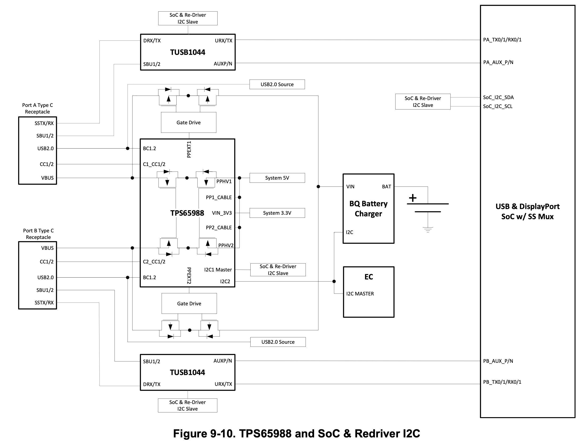
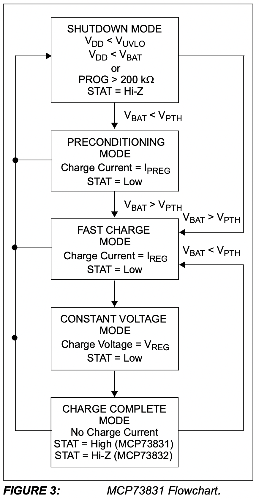
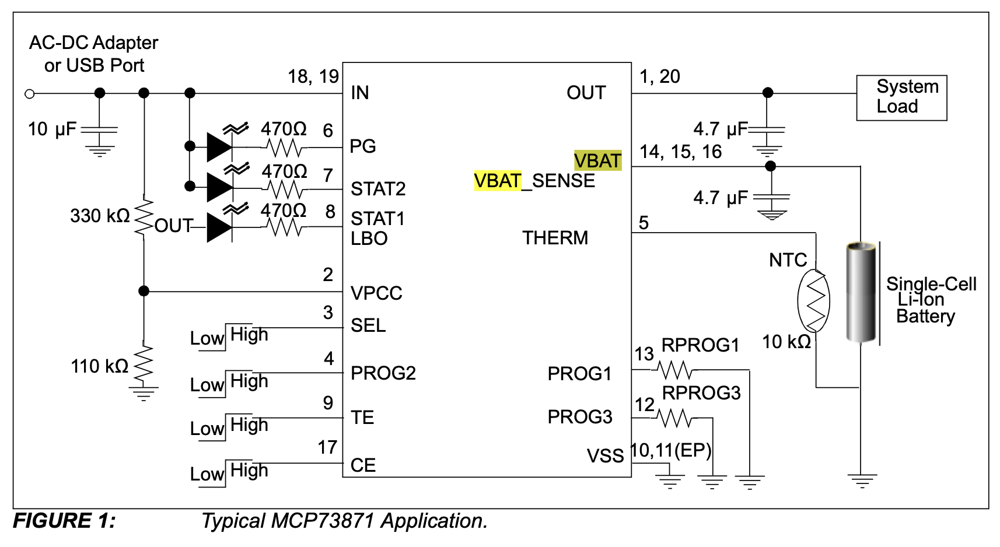

# 801 T-USB daughterboard

The T-USB daughterboard has two functions
- Supply the system with power
- Provide data signals in the system over two USB-C connectors

The T-USB board exposes two vertical USB-C sockets and connects to the carrier board through two 50 pin B2B connectors.

In addition to this board a matching **testing/breakout board must be designed**.

## USB PD Controller with TPS65988

### Handling USB Connector

The two USB ports may power the board. The powering is negotiated and handled by by TPS65988 (in future TPS65994AE).
They also deliver data lanes which are multiplexed between the two USB busses on the i.MX8 module, m.2 connectors and T-USB alt connectors. This allows further development of alt mode connectivity.

Power regulators receive power from USB connectors and supply the board with power.

If one USB port delivers power to the board, the other one can consume power.

See I/O expanders for control pins connected to PD Controller.

### Power supply TI chipset

Dual Port USB Type-C® and USB PD Controller with Integrated Source and Sink Power Path Supporting USB3 and Alternate Mode

The TPS65988 is a highly integrated stand-alone Dual Port USB Type-C and Power Delivery (PD) controller providing cable plug and orientation detection for a single USB Type-C connector. Upon cable detection, the TPS65988 communicates on the CC wire using the USB PD protocol. When cable detection and USB PD negotiation are complete, the TPS65988 enables the appropriate power path and configures alternate mode settings for external multiplexers. The TPS65988 integrates fully managed power paths with robust protection for a complete USB-C PD solution. The TPS65988 also enables the appropriate power path and configures alternate mode settings for external multiplexers.

Further information is found in the TPS65988 datasheet including reference implementation advice. The documents also include layout diagrams for the reference board.
See 11.3 Stack-Up and Design Rules for advice on using 8-layer stacku-up PCB.

A minimal version of this setup should be placed on the 909 to handle power. I.E. No TUSB1044

The I2C Port 1 is connected to the SYS I2C. I2C Port 2 is for I2C3 stem.
The I2C Port 3 is for Peripherals which so far are not identified.
The I2C Port 1 & 2 interrupts are connected to I/O Expander Zero. (EX0.3 EX0.4)

The 45 pin debug connector and T-USB alt connectors can be used to test the chipset and USB devices attached.

## Battery Charging with MCP73871

- Simultaneously Power the System and
Charge the Li-Ion Battery
- Voltage Proportional Current Control (VPCC)
ensures system load has priority over Li-Ion
battery charge current
- Low-Loss Power-Path Management with
Ideal Diode Operation

Charging Management
• Automatic Recharge
• Automatic End-of-Charge Control
• Battery Cell Temperature Monitor (regulated charged based on)
• Undervoltage Lockout (UVLO)

• Complete Linear Charge Management Controller
- Integrated Pass Transistors
- Integrated Current Sense
- Integrated Reverse Discharge Protection
- Selectable Input Power Sources: USB Port or
AC-DC Wall Adapter
• Preset High Accuracy Charge Voltage Options:
- 4.10V, 4.20V, 4.35V or 4.40V
- ±0.5% Regulation Tolerance
• Constant Current/Constant Voltage (CC/CV)
Operation with Thermal Regulation
• Maximum 1.8A Total Input Current Control
• Resistor Programmable Fast Charge Current
Control: 50 mA to 1A
• Resistor Programmable Termination Set Point
• Selectable USB Input Current Control
- Absolute Maximum: 100 mA (L)/500 mA (H)
• Safety Timer With Timer Enable/Disable Control
• 0.1C Preconditioning for Deeply Depleted Cells
• Low Battery Status Indicator (LBO)
• Power Good Status Indicator (PG)
• Charge Status and Fault Condition Indicators

## USB Data Routing

# Battery Charging

- Switch between trickle charge(0.1C) and fast charge(1.5C).
- Charge strategy timout setting
- Suspend on low power
- Resume on good power

## Power output from Charging Controller

When operating with single cell Li-Ion batteries, output voltage range can be from 3.0V-4.2V. It is recommended not to operate at minimum battery voltage, to prolong a Li-Ion battery’s life. Please refer to the battery manufacturer’s data sheet or design guide for details.

- VSOM output Main power for board 3.5V - 4.2V 
- Direct power input pads support 4V - 6V

The board will attempt to constantly supply power. Either from a 3.7V LiPO battery, 5V input solder pads, or USB power source.

The system should attempt to detect low power and suspend or power down before 
reaching VSOM 3.45V.

## Wireless power input

Trickle charging over secondary connection on BQ24165

## Managed charging

[BQ24250](https://www.ti.com/product/BQ24250)   $2 JLCPCB (4x4 mm packages)
[BQ25253](https://www.ti.com/product/BQ24253)  $5 JLCPCB (2.4x2.4 mm package)

bq2425x 2A Single-Input 2IC, Stand-Alone Switched-Mode Li-Ion Battery Charger With Power-Path Management

[BQ24165]()  [Mouser BQ24165RGET](https://www.mouser.ch/ProductDetail/Texas-Instruments/BQ24165RGET?qs=sGAEpiMZZMt1iCLsaqcCFmvmlE5K9qq28M%252BEliZU1c4%3D)
Single cell
System load
I2C control interface
Charge current 2.5A
USB VBUS input
Temp
Power good and charging signals
CE1 / CE2 triggers

[BQ25882](https://www.ti.com/product/BQ25882)
I2C 2 cell 2A Boost battery charger for USB input in a WCSP package with Power Path
Delivers too high voltage 7V

[BQ25600]
[Mouser](https://www.mouser.ch/ProductDetail/Texas-Instruments/BQ25600YFFR?qs=sGAEpiMZZMv0NwlthflBi2Bt%252B4a%252B3ziicLPGTO1X%2F64%3D)
 JLPCB $1.5

## A typical implementation

## Thermistor

Which thermistor should be used?

TDK docs lists modesl
- Type M703
- Type S861
- Type G1551
