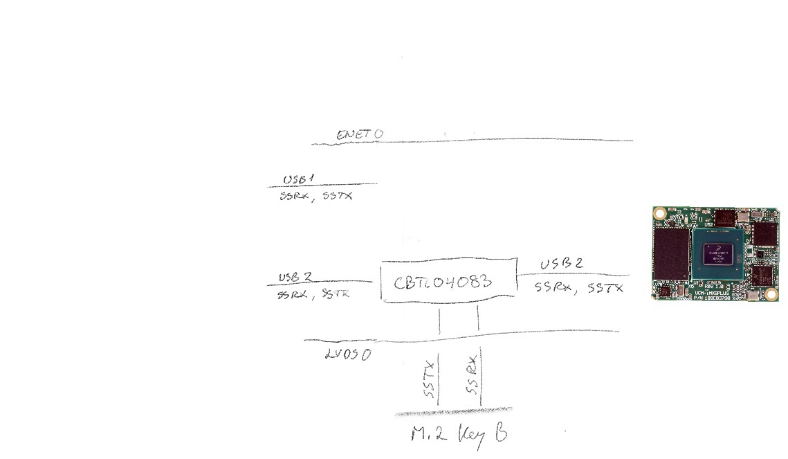
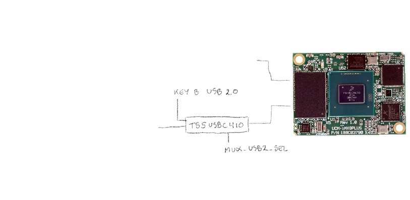

The T-USB module connects two USB-C connectors to the board via multiplexers and a Power Delivery Controller.
USB Data is routed over the 50 pins data connector as well as the M.2 Expansion connector.
The Host USB connection is multiplexed between thw two.

### T-USB connector 3.0 data mapping

Two USB 2.0/3.0 connections are provided by the T-USB module.
T-USB module 50 pin connectors supply/consume:

* USB1 v2 / v3 data
* USB2 v2 / v3 data
* LVDS data pairs
* UART 1/2/3/4
* I2C SYS/3
* GPIO4_IO19, GPIO1_IO0, GPIO1_IO1
* SYS_RST_PMIC / POR_B_3P3 / PMIC_ON_REQ / PMIC_STBY_REQ / PWRBTN / ALT_BOOT / QSPI_BOOT_EN_3P3
* VCC_RTC 

T-USB module 50 pin connectors not connected:

* SPI
* SWD

### Multiplexing USB

The i.MX8 has two USB busses. USB1(supports OTG) and USB2(Host mode only).

The USB 3.0 superspeed Host/USB2 from the SoM are multiplexed using CBTL04083 and controlled by MUX_USB3_SEL pins.

The USB 2.0 Host/USB2 from the SoM are multiplexed using TS5USBC41 and controlled by MUX_USB2_SEL pins.
The USB-C connector USB 2.0 signals(A/B 6/7) are managed separately and multiplexed using TS5USBC41. This allows
routing an Extra USB 2.0 signal selectively via the Debug Breakout connector.

| SEL  | Connect to         |
|------|--------------------|
| High | m.2                |
| Low  | T-USB              |

