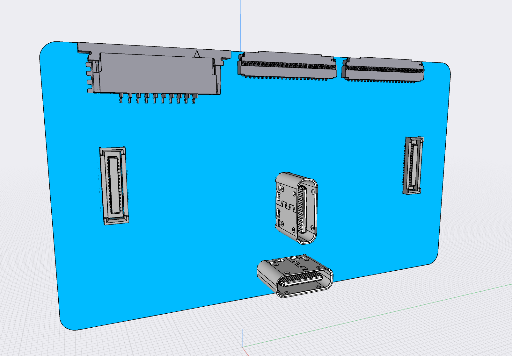

# Bridge Board 909

The 909 is a Bridge Board version made for testing and experiementation with the Ziloo attachments without attaching
the i.MX8 board. The setup enables connecting a Compulab SB-UCM-iMX8PLUS development board.
Alternately a board like Raspberry Pi can be connected to test components via development connectors.
Not all the 909 connectors will be mounted on the 801 production bridge board that mounts the i.MX8 board.

TODO
- CSI connector pin orientation
- Check if the 22 pin connectors can be bidirectional
- Extras pinouts I2S I2C
- Desiding Soldering isles
- Signal pin voltage 1.8 / 3.3
- 

## USB Power

If one of the USB-C connectors supplies power it is managed by the USB PD Controller circuit and routed to 
the 10-pin Power Connnector as VIN.
The bridge board is powered via 5V and 3V3 from the 10-pin Power connector. 
The power connector sends the power from USB-C connectors away from the board
to be used and sent back as regulated voltages. 
The regulated 3V3 is downregulated to supply camera modules.
The regulated 5V is used to supply attached USB devices that do not themselves provide power.

#### Power supply TI chipset

TPS65982 USB Type-C® and USB PD Controller, Power Switch, and High-Speed Multiplexer

The TPS65982 device is a stand-alone USB Type-C and Power Delivery (PD) controller providing cable- plug and orientation detection at the USB Type- C connector. Upon cable detection, the TPS65982 device communicates on the CC wire using the USB PD protocol. After successful USB PD negotiation is complete, the TPS65982 enables the appropriate power path and configures alternate mode settings for internal and (optional) external multiplexers.

A minimal version of this setup should be placed on the 909 to handle power. I.E. No TUSB1044

#### Handling USB Connectors

The two USB ports may power the board. The powering is negotiated and handled by by TPS65988 (in future TPS65994AE).
They also deliver data lanes

Power regulators receive power from USB connectors and supply the 12V & 5V power for development carrier board.
The USB-C connectors can power the carrier board 12V by upregulating, which would be done on the In-Between board.

## Connectors

Connectors placed on the board are,

- 2 * [Molex 22PIN 0.5mm pitch 54548-2271](https://www.molex.com/molex/products/part-detail/ffc_fpc_connectors/0545482271)
- 2 * [I-PEX 30PIN 0.4mm pitch 20525-030E-02](https://www.i-pex.com/product/cabline-ca)
- 2 * [Hirose USB-C CX80B1-24P](https://www.hirose.com/product/p/CL0480-0625-0-00)
- 2 * [TE Connectivity 45PIN 0.3MM 571-4-2328724-5 FPC 3-2328724-5](https://www.te.com/usa-en/product-4-2328724-5.html) $0.41
- 2 * [Hirose DF40C-34DS-0.4V](https://www.hirose.com/en/product/p/CL0684-4024-3-51) ([Mouser](https://www.mouser.ch/ProductDetail/Hirose-Connector/DF40C-34DS-04V51?qs=vcbW%252B4%252BSTIpg26DsEbj1iQ%3D%3D))
- 1 * [TE 10PIN 1mm pitch power 84952-0](https://www.te.com/usa-en/product-84952-0.html)

The two 100 pin Hirose connectors are not mounted but are in 3D design for reference. It will connect the MCU board on the 801.

### Wiring the connectors within the board

The 22 pin connectors are connected directly to the equivalent lines on the 30 pins.
The CSI lanes on 34 pins connector is connected directly to the equivalent lines on the 30 pins.
This assumes that a camera is connected to either a 34 pins connector or a 22 pins connector, not both.

  
The data lines from the two USB-C connectors are connected to the equivalent lines on the T-USB direct connector.
The Power pins on USB-C connectors go to the TPS65988 as well as VIN on 10 pins Connector.
TPS65988 is fed 5V and 3V3 from the 10 pins Connector.

GND connected from everywhere as normal.

If power isn't connected over the USB-C plugs, and is power is not supplied by the 10-pin Power connector,
the camera modules should be powered over the MIPI CSI connectors.
In this case it should be possible to use either the 22 pin connectors or the 30 pin connectors for inputting
the signal and power. This means that the 22 pin connectors can be used to input or output MIPI CSI lanes.

### Soldering isles

Soldering iles allows the board connections to be tweaked by,

- Connecting I2C busses together
- Connecting I2S busses to alternate DATAx pins. 

### Conencting the SB-UCM-iMX8PLUS carrier board

For further details see [Product Page](https://www.compulab.com/products/carrier-boards/sb-ucmimx8plus-carrier-board/#diagram).

- 2 * I-PEX connector directly between the two
- 2 * 45 pins connected to Inbetween-board
- 10 pins power connector to 101 Inbetween-board
- USB-C connector to model 101 Inbetween-board
- USB-A connector to model 101 Inbetween-board
- HDMI female to Inbetween-board

101 board breaks up 45 pins to be bridged to Misc connector
and USB-C connectors

In revision B the Host connector is alternately used to carry HDMI instead of connecting to 
Bluetooth/Wifi connectivity.

(801 Board will have V_SYS power input of 3.6V - 4.4V potentially from battery)

## USB-C to USB-C connector mapping

Two USB-C connectors are arranged in a T shape and the normal way to use it is with a combined connector
attached. This means that the wires will normally be connected in a particular orientation. The system
takes advantage of this by detecting when both USBs are connected in the normal arrangement.

:[T-USB Connector Mapping](../pinouts/T-USB_CONNECTOR_PINOUT.md)

## Board Power 10 pins Connector

:[10 pins Board Power Connector](../pinouts/BOARD_POWER_CONNECTOR.md)

## T-USB direct connector

This connector(only on the 909 model) enables experimentation with alternate modes and directional pins.

:[45 pins T-USB direct connector](../pinouts/T-USB_DIRECT_CONNECTOR.md)

### Extras connector

:[45 pins Extras connector](../pinouts/EXTRAS_CONNECTOR.md)

### HDMI connector mapping (future rev B)

The HDMI signal from the i.MX8 board is mapped to USB-C. While providing HDMI Ziloo cannot be connected
to

### USB4 support (future rev C)

* Use Texas Instruments TPS65994AD to route thunderbolt

USB Interface IC Dual port USB Type-C and USB PD controller with integrated source power switches 48-VQFN -40 to 125

[Temporary stop for Thunderbolt 4 and USB 4 on Intel’s Tiger Lake?](https://www.igorslab.de/en/goes-with-intel-for-tiger-lake-and-thunderbolt-4-bald-the-lights-out-what-chip-shortage-really-means-exclusively/)

### RPI FPC 22 pins

Raspberry Pi connectors

- 1-7342485-5  TE Connectivity  15 pins vertical Pi Board A/B
- 54548-2271   Molex 22 pins  Right angle Pi Zero & Compute module
- SFW15R-2STE1LF  Amphenol FCI 15 pins Right angle Camera Module

| Pin | Code       | Type     | Details                              | Voltage |
|-----|------------|----------|--------------------------------------|---------|
| 1   |	GND        | Power    | Ground                               |      |
| 2   |	CAM_D0_N   | Data     | MIPI Data Lane 0 Negative            |      |
| 3   |	CAM_D0_P   | Data     | MIPI Data Lane 0 Positive            |      |
| 4   |	GND        | Power    | Ground                               |      |
| 5   |	CAM_D1_N   | Data     | MIPI Data Lane 1 Negative            |      |
| 6   |	CAM_D1_P   | Data     | MIPI Data Lane 1 Positive            |      |
| 7   |	GND        | Power    | Ground                               |      |
| 8   |	CAM_CK_N   | Data     | MIPI Clock Lane Negative             |      |
| 9   |	CAM_CK_P   | Data     | MIPI Clock Lane Positive             |      |
| 10  |	GND        | Power    | Ground                               |      |
| 11  |	CAM_D2_N   | Data     | MIPI Data Lane 2 Negative            |      |
| 12  |	CAM_D2_P   | Data     | MIPI Data Lane 2 Positive            |      |
| 13  |	GND        | Power    | Ground                               |      |
| 14  |	CAM_D3_N   | Data     | MIPI Data Lane 3 Negative            |      |
| 15  |	CAM_D3_P   | Data     | MIPI Data Lane 3 Positive            |      |
| 16  |	GND        | Power    | Ground                               |      |
| 17  |	CAM_IO0    | Power    | Power Enable                         |      |
| 18  |	CAM_IO1    | LED      | LED Indicator                        |      |
| 19  |	GND        | Power    | Ground                               |      |
| 20  |	SCL        | I2C      | I2C SCL                              |      |
| 21  |	SDA        | I2C      | SCCB serial Interface data IO        |      |                           
| 22  |	VCC        | Power    | 3.3V Power Supply                    |      |

### NVIDIA FPC 30 pins

The connector is an [I-PEX type 20525-030E-02](https://www.i-pex.com/product/cabline-ca) with 0.4mm pitch & 30 pins.
Data pins are 1.8V level.

| Pin | Code       | Details                              |
|-----|------------|--------------------------------------|
| 1   | CAM_3V3	   | 3.3V Power Input                     |
| 2   | CAM_3V3    |                                      |
| 3   | CAM_1V8	   | 1.8V Power Input                     |
| 4   | GND        |                   |
| 5   | GND        |                   |
| 6   | PWR DWN    |                   |
| 7   | I2C SCL    |                   |
| 8   | I2C SDA    |                   |
| 9   | GND        |                   |
| 10  | CSI D2-    |                   |
| 11  | CSI D2+    |                   |
| 12  | TRIGGER    |                   |
| 13  | MCLK       |                   |
| 14  | Reserved   |                   |
| 15  | CSI D1-    |                   |
| 16  | CSI D1+    |                   |
| 17  | GND        |                   |
| 18  | GND        |                   |
| 19  | CSI D0-    |                   |
| 20  | CSI D0+    |                   |
| 21  | RESET      |                   |
| 22  | GND        |                   |
| 23  | Reserved   |                   |
| 24  | CSI CLK-   |                   |
| 25  | CSI CLK+   |                   |
| 26  | GND        |                   |
| 27  | CSI D3-    |                   |
| 28  | CSI D3+    |                   |
| 29  | Flash      |                   |
| 30  | Reserved   |                   |

Refs
- https://www.leopardimaging.com/product/accessories/cables/faw-1233-03/
- https://www.mouser.com/datasheet/2/233/LI-TX1-CB-6CAM_datasheet-1395894.pdf
- https://connecttech.com/ftp/pdf/ASG006_Spacely.pdf
- https://www.i-pex.com/product/cabline-ca

### Ziloo Camera Module 34 pin connector

**Just to be clear**: All CSI lanes are laid out on one side of the connector with GND between.

:[Camera Module 201 connector](../pinouts/CAMERA_MODULE_CONNECTOR_PINOUT.md)

