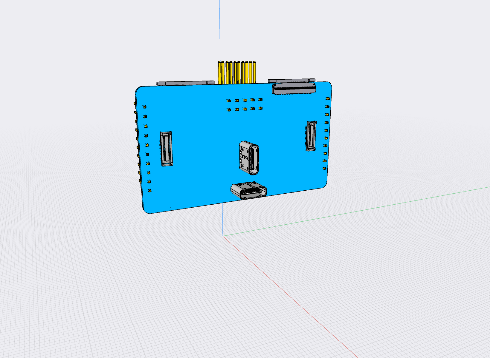

# Upwork task

The 909 has several different systems coming together. It receives power and data over USB. It receives sensor inputs over camera module connectors.
The camera modules are custom multi-sensor modules based on OV2735.
It connects to a powerful i.MX 8 MCU module and it allows extension using an m.2 module.

The 909 is made for experimentation. It will be used to,

- Connecting 201 Camera Modules to the Carrier Board
- Connecting Raspberry Pi 15/22 pin modules to the Carrier Board
- Accessing the 201 Camera Modules from a Raspberry Pi
- Testing USB-C data transmission over Host & OTG connectors
- Testing charging via USB-C power cables from various sources (Dedicated Power, Mixed and Old chargers)
- Testing HDMI alternate mode over USB-C Host connector

The 909 essentially provides two parts,

1) Input connectors for 2 cameras linked to output connectors connected to the i.MX 8 development board.
   The cameras are powered by the development board connections.
2) 2 USB-C connectors are managed by a USB PD Controller circuit and breaks out relevant power & data pins.
   These pins are then mapped to 2 USB ports on the i.MX 8 development board.

The essential BOM of the 909 Bridge Board is,

- Texas Instruments TPS65988
- 2 * [Molex 22PIN 0.5mm pitch 54548-2271](https://www.molex.com/molex/products/part-detail/ffc_fpc_connectors/0545482271)
- 2 * [I-PEX 30PIN 0.4mm pitch 20525-030E-02](https://www.i-pex.com/product/cabline-ca)
- 2 * [Hirose USB-C CX80B1-24P](https://www.hirose.com/product/p/CL0480-0625-0-00)
- 1 * [TE Connectivity 45PIN 0.3MM 571-4-2328724-5 FPC 3-2328724-5](https://www.te.com/usa-en/product-4-2328724-5.html) $0.41
- 2 * [Hirose DF40C-34DS-0.4V](https://www.hirose.com/en/product/p/CL0684-4023-0-51) ([Mouser](https://www.mouser.ch/ProductDetail/Hirose-Connector/DF40C-34DS-04V51?qs=vcbW%252B4%252BSTIpg26DsEbj1iQ%3D%3D))

## Your task

1) Given a detailed spec; Identify if there are further open questions about the design of given the goals.
2) Make a diagram
3) Design board layout
4) Receive test batch of boards + Camera Module samples
5) Verify power delivery from chargers with the listed levels
6) Test that Camera module CSI connectivity over 30 pin connectors

USB Power levels to test

- Dedicated Charger 5V, 500mA
- Apple Dedicated Charger 5V, 1A BC1.2
- Power & Data CDP 5V, 1A
- Power & Data CDP 5V, 3A
- Power & Data CDP 9V, 1A
- Power & Data CDP 15V, 1A

## Milestones:

1) Make a diagram, draft layout and BOM for the board. $500                       
2) Acquire the Compulab development board yourself & I send you two camera modules. 
     You adjust the Yocto setup to include support for OV2735. $700
3) Finish the board design for test batch production. $300
4) With the modules received, and the produced tetch batch you test to which extent the setup captures camera input.
   You combine breakout boards to connect Bridge and Compulab boards.
   Test basic connectivity to I2C sensores and Microphone on the camera modules.
   Test supplying USB power supply levels and current.
   Report results and send the hardware(incl. Compulab dev board) back to me. $500
