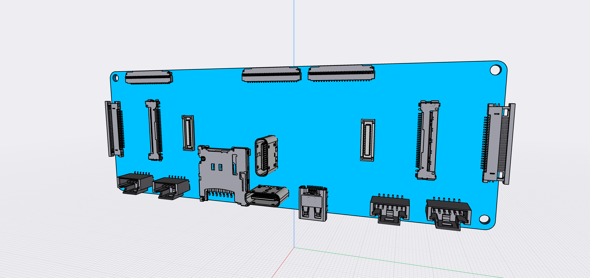
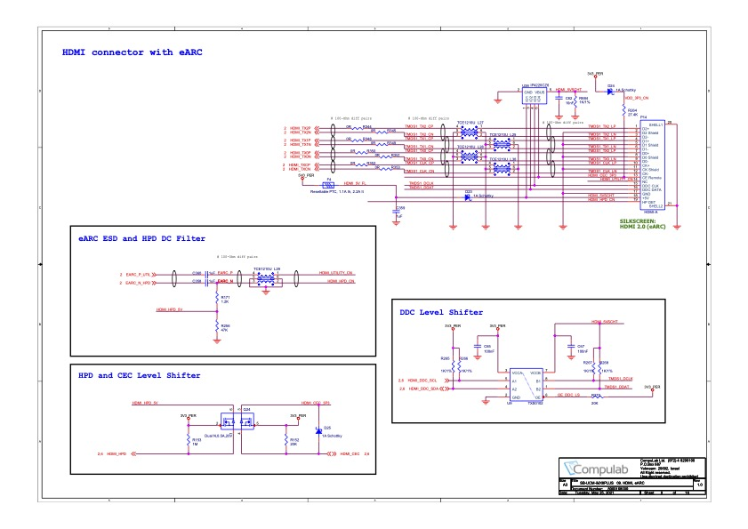
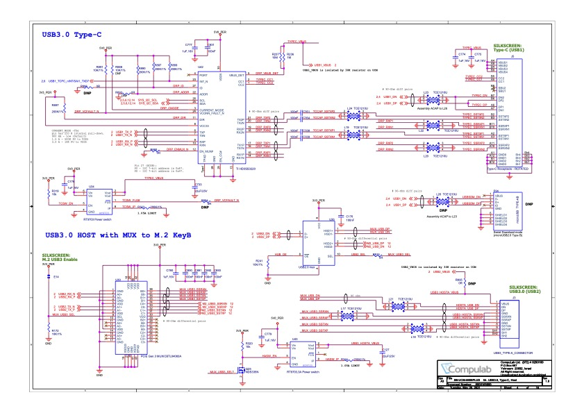

# Bridge Board 909b

The 909b is a Bridge Board version made for testing and experiementation with the Ziloo attachments without attaching
the SB-UCM i.MX8 board or directly attaching it. 
The setup enables connecting a [Compulab SB-UCM-iMX8PLUS](https://www.compulab.com/products/carrier-boards/sb-ucmimx8plus-carrier-board/), [DART-MX8M-PLUS Evaluation Kit](https://www.variscite.com/product/system-on-module-som/cortex-a53-krait/dart-mx8m-plus-nxp-i-mx-8m-plus/#evaluation-kit) or 
[I-Pi SMARC IMX8M Plus](https://www.ipi.wiki/products/i-pi-smarcplus-imx8mp) development board.
Not all the 909 connectors will be mounted on the 801 production bridge board that mounts the i.MX8 board.

The board provides two key features: Dual USB connectivity for Webcam, 
Internet, Display & Power + MIPI CSI Stereo Camera.
Alt. Mode, HDMI and extra MIPI CSI connectors are not intended for the production board.

Of note in design,

- Some of the UCM-iMX8M-Plus carrier board interface pins are multifunctional. Up to 4 functions (ALT modes) are accessible through each multifunctional pin.
- All of the UCM-iMX8M-Plus digital interfaces operate at 3.3V voltage levels unless noted otherwise.
- RGMII ENET1 signals operate at 1.8V voltage level
- SD/SDIO port #2 can be configured to operate at 3.3V or 1.8V voltage levels. Voltage level is controlled by SoC pin GPIO1_IO04.

### Open points

- Plan I2C addresses and which bus is used
- Stem I2C compress GPIO iMX and others, also on I2C3
- Correctly crossing RX/TX signal lines
- Can PD Controller control other chipsets or is it just I2C slave?
- Ensure all pins are connected to GPIO Expander
- Should there be Boot origin switches like EVK? (4 bits? EVK)
- Power LED & Indicator LEDs for M.2 expansions
- Adding second m.2 connector with mounting screw holder glued on
- Second stage designing a 909 Smiley Board
- Adding connectors SCCB, GPIO
- Samtec connector pin 1, and soldering isles
- Optional connectors debug uart / jtag
- Connection option for Varscite board instead of Compulab
- RTC battery connector 
- Annotations and Logo on the board
- Mux X pairs
- TEST The Mux pin configurations

## Core Components

- [SB-UCM-iMX8PLUS](https://www.compulab.com/products/computer-on-modules/ucm-imx8m-plus-nxp-i-mx-8m-plus-som-system-on-module-computer/) System-on-Module
- 2 * [Hirose DF40HC(3.0)-100DS-0.4V](https://www.hirose.com/en/product/p/CL0684-4151-0-51) mated height 3.0mm
- M.2 key B connector H4.20mm [Amphenol ICC 10128793001RLF](https://www.amphenol-icc.com/pci-express-10128793001rlf.html)
- M.2 key E connector H4.20mm [Amphenol ICC 10128794001RLF](https://www.amphenol-icc.com/pci-express-10128794001rlf.html)
- 2 * [Hirose DF40C-34DS-0.4V](https://www.hirose.com/en/product/p/CL0684-4023-0-51) ([Mouser](https://www.mouser.ch/)
- 2 * [Hirose USB-C CX80B1-24P](https://www.hirose.com/product/p/CL0480-0625-0-00)
- 1 * microSD card slot (suggested Molex 5031821852) push-push, compact. [Mouser](https://www.mouser.ch/ProductDetail/Molex/503182-1852?qs=s7UCm7gO1bZmpyAhCKZ26g%3D%3D), [Molex](https://www.molex.com/molex/products/part-detail/memory_card_socket/5031821852)
- 1 * [TPS65988](https://www.ti.com/product/TPS65988?keyMatch=TPS65988&tisearch=search-everything&usecase=GPN) Dual Port USB Type-C® and USB PD Controller, Power Switch, and High-Speed Multiplexer. [Mouser](https://www.mouser.ch/ProductDetail/Texas-Instruments/TPS65988DJRSHR?qs=sGAEpiMZZMv0NwlthflBiyrCPYKWtEb9w8lmLVKGFHI%3D)
- 2 * [HD3SS3220  10-Gbps USB 3.1 Type-C 2:1 mux with DRP Controller](https://www.ti.com/product/HD3SS3220) [Mouser](https://www.mouser.ch/ProductDetail/Texas-Instruments/HD3SS3220IRNHR?qs=sGAEpiMZZMsyYdr3R27aV4Thfeh8oIeSp2btOUhwC5A%3D)
- 2 * [HD3SS460](https://www.ti.com/product/HD3SS460?keyMatch=HD3SS460&tisearch=search-everything&usecase=GPN) 4 x 6 Channels USB Type-C Alternate Mode MUX. Connected to T-USB Host. [Mouser](https://www.mouser.ch/new/texas-instruments/ti-hd3ss460-switch/). [Dock Eval Kit](https://www.mouser.ch/ProductDetail/Texas-Instruments/USB-CTM-MINIDK-EVM?qs=vcbl%252BK4rRletdX9FWp9J9A%3D%3D)
- 2 * push buttons (RESET / POWER)
- 3 * PCA9555 I/O Expander
- 6 * [TS5USBC410 Dual 2:1 USB 2.0 Mux/DeMux Switch](../datasheets/USB/ts5usbc41.pdf). [Mouser](https://www.mouser.ch/ProductDetail/Texas-Instruments/TS5USBC410IYFFR?qs=sGAEpiMZZMutXGli8Ay4kPB6XEQFysSpdNErqZgdEYs%3D)
- 

## Dev. Connectors

- 1 * MicroHDMI (suggested Molex 46765-1301) [Mouser](https://www.mouser.ch/ProductDetail/Molex/46765-1301?qs=sGAEpiMZZMt1iCLsaqcCFmQhPEZFSo0wUGorAW08d1I%3D) [Molex](https://www.molex.com/molex/products/part-detail/io_connectors/0467651301)
- 2 * [Molex 22PIN 0.5mm pitch 54548-2271](https://www.molex.com/molex/products/part-detail/ffc_fpc_connectors/0545482271)
- 2 * [I-PEX 30PIN 0.4mm pitch 20525-030E-02](https://www.i-pex.com/product/cabline-ca)
- 3 * [TE Connectivity 45PIN 0.3MM 571-4-2328724-5 FPC 3-2328724-5](https://www.te.com/usa-en/product-4-2328724-5.html) $0.41
ProductDetail/Hirose-Connector/DF40C-34DS-04V51?qs=vcbW%252B4%252BSTIpg26DsEbj1iQ%3D%3D))
- 5 * [6 pin Molex 5044490607](https://www.molex.com/molex/products/part-detail/pcb_headers/5044490607)

## Other Components

Connectors placed on the board are,

- 1 * 24C08 Carrier-board EEPROM. [Mouser](https://www.mouser.ch/ProductDetail/STMicroelectronics/M24C08-FMN6TP?qs=sGAEpiMZZMtXHE36kCvv38ceEodIXDQNqtU0Mm03QrY%3D)
- 1 * TSM-120-01-F-DV Samtec 2*20 pins surface mounted .100 (Smiley model) [Mouser](https://www.mouser.ch/ProductDetail/Samtec/TSM-120-01-F-DV?qs=rU5fayqh%252BE2gtcIirjF3kA%3D%3D)
- 2 * 6 pins header CSI breakout 200-TSM10601FSV [Mouser](https://www.mouser.ch/ProductDetail/Samtec/TSM-106-01-F-SV?qs=FESYatJ8odKC4DfTpvD7ng%3D%3D)
- 2 * 5 pins I2C SCCB 504449-0507 [Mouser](https://www.mouser.ch/ProductDetail/Molex/504449-0507?qs=%2Fha2pyFadujhksfO9WeSi1QsiN7z8iM%252B1RdltVI1xWyyDvXT9mlhvA%3D%3D)

Connectors for SB-UCM-iMX8PLUS, M.2 Key B, M.2 Key E.
The SB-UCM-iMX8PLUS is the center of the board and receives all signals.

# Power supply, CSI, I2S & I2C

The USB-C connectors can supply power, as can the 30 pins and 22 pins CSI connectors.
The 34 pins connector outputs CSI, I2S, I2C, Power and control pins.
The 6 pins connector ouputs I2S/I2C and Power.
Voltages needed are 5V, 3V3, 2V8, 1V8. 2V8 is only needed for the camera module.

In the specific case of CSI connectors being used without an i.MX8 module attached, the CSI input connectors must
supply power, if no USB connector does.

Pads on the board must be provided for attaching RTC battery.

If no connected USB plug connected provides power, the board would have to be a power source. 
Pads on the board must be provided for 5-20V PP_HV1/PP_HV2 directly connected to the PD Controller.

According to the UCM-IMX8PLUS Referene Guide the Supply Voltage is 3.45V to 4.4V. 
This fits with charging/discharging of a LiPO battery which will be supported in the future.
While 5V is relevant for power supply via USB, the board has no need 

### Handling USB Connector (PD Controller)

The two USB ports may power the board. The powering is negotiated and handled by by TPS65988 (in future TPS65994AE).
They also deliver data lanes which are multiplexed between the two USB busses on the i.MX8 module, m.2 connectors and T-USB alt connectors. This allows further development of alt mode connectivity.

Power regulators receive power from USB connectors and supply the board with power.

If one USB port delivers power to the board, the other one can consume power.

See I/O expanders for control pins connected to PD Controller.

### Power supply TI chipset

Dual Port USB Type-C® and USB PD Controller with Integrated Source and Sink Power Path Supporting USB3 and Alternate Mode

The TPS65988 is a highly integrated stand-alone Dual Port USB Type-C and Power Delivery (PD) controller providing cable plug and orientation detection for a single USB Type-C connector. Upon cable detection, the TPS65988 communicates on the CC wire using the USB PD protocol. When cable detection and USB PD negotiation are complete, the TPS65988 enables the appropriate power path and configures alternate mode settings for external multiplexers. The TPS65988 integrates fully managed power paths with robust protection for a complete USB-C PD solution. The TPS65988 also enables the appropriate power path and configures alternate mode settings for external multiplexers.

Further information is found in the TPS65988 datasheet including reference implementation advice. The documents also include layout diagrams for the reference board.
See 11.3 Stack-Up and Design Rules for advice on using 8-layer stacku-up PCB.

A minimal version of this setup should be placed on the 909 to handle power. I.E. No TUSB1044

The I2C Port 1 is connected to the SYS I2C. I2C Port 2 is for I2C3 stem.
The I2C Port 3 is for Peripherals which so far are not identified.
The I2C Port 1 & 2 interrupts are connected to I/O Expander Zero. (EX0.3 EX0.4)

The 45 pin debug connector and T-USB alt connectors can be used to test the chipset and USB devices attached.

### CSI connectors

The CSI connectors data lanes are connected directly together for each side. It is only possible 
to connect a left and a right camera module at a time.

30 pin CSI connectors are intended to be used without a daughter board and instead a separate i.MX8 development board is used.
The 22 pin connectors are connected directly to the equivalent lines on the 30 pins, and a likewise meant for an external development board or for testing alternate camera modules.
The CSI lanes on 34 pins connector is connected directly to the equivalent lines on the 30 pins.
This assumes that a camera is connected to either a 34 pins connector or a 22 pins connector, not both.
If a i.MX8 daughter board is used rather than development board the CSI lines from the daughter board must
be connected to the 34 pin camera module connectors.
i.MX8 CSI1 is used for left module, CSI2 is used for right module.

The two 34 pin CSI connectors are wired to run in sync via the STROBE pin.

If power isn't connected over the USB-C plugs, the camera modules should be powered over the MIPI CSI connectors.
In this case it should be possible to use either the 22 pin connectors or the 30 pin connectors for inputting
the signal and power. This means that the 22 pin connectors can be used to input or output MIPI CSI lanes.

### I2C / I2S connectors

The I2C/I2S connectors sends the power from USB-C connectors away from the board as regulated 5V and 3V3.
 
:[6 pins I2C I2S Connector](../pinouts/PW_I2C_I2S_CONNECTOR.md)

For the two camera modules the SCCB signals are broken out with a six pin connector, in the corner, next to the CSI connectors.
INT is connected to ATT_INT.
The signal level for SCCB is 1.8V.

The microphone signals from the 34 pins connectors are broken out in the 6 pins connector next to the left camera connector.
The signal level for Microphone I2S connector is 1.8V.

Next to the right camera connector the SAI3 OUT SPEAKER is broken out as a 6 pins connector.

#### Microphone I2S (SAI5)

The microphone I2S mapping is done by using AL2 mode for the SAI3 pads to get SAI5 signals.
[Multiplexed Signal Pins](./ucm-imx8plus_multifunctional.pdf).
The microphones on the 6 pins and 34 pins connector use SAI5_RX_DATA0.

| Misc pin | SoM pin | i.MX pad      | Functionality     | ALT       |
|----------|---------|---------------|-------------------|-----------|-------
| 11       | P1.26   |  SAI3_TXD     |  SAI5_RX_DATA3    | ALT2      | 
| 17       | P1.28   |  SAI3_RXD     |  SAI5_RX_DATA0    | ALT2      | Extras 
| 15       | P1.30   |  SAI3_MCLK    |  SAI5_MCLK        | ALT2      | Extras 
| 19       | P1.32   |  SAI3_RXC     |  SAI5_RXC         | ALT2      | Extras
| 23       | P1.34   |  SAI3_RXFS    |  SAI5_RX_SYNC     | ALT2      | Extras 
| 13       | P1.36   |  SAI3_TXC     |  SAI5_RX_DATA2    | ALT2      | 
| 21       | P1.38   |  SAI3_TXFS    |  SAI5_RX_DATA1    | ALT2      | 

#### Speaker I2S (SAI2)

CAN1 and CAN2 are mapped as SAI2 and brought out as speaker 6 pins connector.
[Multiplexed Signal Pins](./ucm-imx8plus_multifunctional.pdf).

| Misc pin | SoM pin | i.MX pad              | Functionality     | ALT       |
|----------|---------|-----------------------|-------------------|-----------|-------
| 8        | P1.33   | SAI2_TXD0 ~~CAN2_TX~~ | SAI2_TXD0         |      | 
| 10       | P1.49   | SAI2_MCLK ~~CAN2_RX~~ | SAI2_MCLK         |      | 
| 12       | P1.51   | SAI2_TXC ~~CAN1_RX~~  | SAI2_TXC          |      | 
| 14       | P1.53   | SAI2_RXC ~~CAN1_TX~~  | SAI2_RXC          |      | 

### I/O Expanders

:[SYS I2C GPIO Expander 0](../pinouts/I2C_EXPANDER_0.md)

:[SYS I2C addresses](../pinouts/SYS_I2C_ADDRESSES.md)

### Connecting the SB-UCM-iMX8PLUS SoM

The daughter board clicks into the two Hirose 100pin board-to-board connectors.

For further details see [Product Page](https://www.compulab.com/products/computer-on-modules/ucm-imx8m-plus-nxp-i-mx-8m-plus-som-system-on-module-computer/).

The CSI1 & CSI2 are wired from the 100pin connectors to relevant CSI connectors.
The CSI1 lanes are connected to Left CSI.
The CSI2 lanes are connected to Right CSI.
The USB1 and USB2 data will be connected to multiplexers
The 45 pins Debug connector will break out many additional signal lines

- 2 * Hirose 100 pin connectors are used to connect the SoM daughter board

### Booting 

The board can boot from eMMC / SD or USB.

The board has push buttons for POWER and RESET.

The board has a power LED

# MicroSD, MicroHDMI, M.2 key B & Debug Breakout

The MicroHDMI connector is connected to the HTMI_TX*, HDMI_DDC_*, HDMI_CEC, HDMI_HPD pins from the i.MX8 module.

The MicroSD connector is connected to SD2_DATA*, SD2_CLK, SD2_CMD, SD2_nCD on the i.MX8 module.

### M.2 Key B

See end of document for pinouts and EXPANSION document for more information.

Note that some pins are connected to I/O Expander 2 meant for USB2 and Key B.

### Debugging Breakout connector

See end of this document for pinouts.

# T-USB Data and M.2 Key E Expansion

Data is routed primarily over the two USB-C connectors, but it is also available over Breakout connectors
as well as the two M.2 Expansion connectors.

### T-USB connector 3.0 data mapping

Two USB-C connectors are arranged in a T shape and the normal way to use it is with a combined connector
attached. This means that the wires will normally be connected in a particular orientation. The system
takes advantage of this by detecting when both USBs are connected in the normal arrangement.

The USB-C signal lines from the T-USB connector is managed by the Multiplexing chipsets around the PD Controller.
The USB-C signal lines for the OTG connector in T-USB come from USB1(OTG cabable 2.0 & 3.0).
The SBU1/SBU2 are connected to AUX-/AUX+ pins on the T-USB OTG alt connector. 
The USB 3.0 superspeed data pairs and SBU1/SBU2 are passed from USB-C connectors to HD3SS460.

The Host USB-C connector is similarily connected.
The HD3SS460 chips are controlled over I2C by the MCU using SYS I2C.
The HD3SS3220 chips are controlled over I2C by the MCU using SYS I2C.

One side of the RX/TX pins are carried to  the T-USB alt connector, and not connected to USB1 signals.
(Should the side be muxed?)

:[T-USB Connector Mapping](../pinouts/T-USB_WITH_ALT_CONNECTOR_PINOUT.md)

### Multiplexing USB

The i.MX8 has two USB busses. USB1(supports OTG) and USB2(Host mode only).

The USB 3.0 superspeed USB1/USB2 from the SoM are multiplexed using HD3SS3220 and controlled by MUX_USB3_SEL pins.
The USB-C connector Alt. mode is managed by HD3SS460.

The USB 2.0 USB1/USB2 from the SoM are multiplexed using TS5USBC41 and controlled by MUX_USB2_SEL pins.
The USB-C connector USB 2.0 signals(A/B 6/7) are managed separately and multiplexed using TS5USBC41. This allows
routing an Extra USB 2.0 signal selectively via the Debug Breakout connector.

### Key E

See end of document for pinouts and EXPANSION document for more information.

### I2C EEPROM

Add an EEPROM like 24C08 present on the UCM carrier board.

## Wiring and Connecting

The board can be used in different ways

1) Adding a daughterboard, two OV2735 camera modules and connecting a USB cable with power.
2) Adding a daughterboard, two RPi camera modules and connecting a USB cable with power.
3) Use the board to connect two OV2735 camera modules to Compulab SB-UCM-iMX8PLUS
4) Use the board to connect two OV2735 camera modules to I-Pi SMARC IMX8M Plus

Signal voltage level 

- 201 Camera Module uses 1.8V signals
- IMX477 sensor uses 1.8V for signals
- Does RPi cam module level shift the signals?
- UMC iMX8PLUS module uses 3.3V for signals by default
- UMC iMX8PLUS module RGMII ENET1 signals operate at 1.8V voltage level
- iMX8M plus is documented to use VDD_MIPI_1P8 power group for CSI1 & CSI2
- iMX8M plis is documented to use VDD_HDMI_1P8 power group for HDMI
- NVCC_SAI1_SAI5 power group?
- What will the I2C 5+6 power group be?
- USB 1 & 2 uses VDD_USB_3P3 power group
- Signal voltage PD Controller?

Required distances/location

- Camera module distance 70mm
- USB-C connectors cannot be moved
- Board size can only be increased to save cost
- Holes in the corners should be the regular sort for mounting.
- 

### I/O Expanders

:[SYS I2C GPIO Expander 0](../pinouts/I2C_EXPANDER_0.md)
I/O Expander like Compulab Carrier Board

:[SYS I2C GPIO Expander 1](../pinouts/I2C_EXPANDER_1.md)

:[SYS I2C GPIO Expander 2](../pinouts/I2C_EXPANDER_2.md)

:[SYS I2C addresses](../pinouts/SYS_I2C_ADDRESSES.md)

### I2S (SAI5) 4 channel microphone input mapping

One lane goes to the 34 pins camera connectors

The full 4 lanes are available on the debug connector and M.2 Key B.

### 8.1 Carrier Board Design Guidelines

APPLICATION NOTES from  UCM-iMX8M-Plus Reference guide.

- Ensure that all V_SOM and GND power pins are connected.
- Major power rails - V_SOM and GND must be implemented by planes, rather than traces. Using at least two planes is essential to ensure the system signal quality because the planes provide a current return path for all interface signals.
- It is recommended to put several 10/100uF capacitors between V_SOM and GND near the mating connectors.
- Except for a power connection, no other connection is mandatory for UCM-iMX8M-Plus operation. All power-up circuitry and all required pullups/pulldowns are available onboard UCM-iMX8M-Plus.
- If for some reason you decide to place an external pullup or pulldown resistor on a certain signal (for example - on the GPIOs), first check the documentation of that signal provided in this manual. Certain signals have on-board pullup/pulldown resistors required for proper initialization. Overriding their values by external components will disable board operation. For details please refer to section Error! Reference source not found..
- You must be familiar with signal interconnection design rules. There are many sensitive groups of signals. For example:
- PCIe, Ethernet, USB and more signals must be routed in differential pairs and by a controlled impedance trace.
- Audio input must be decoupled from possible sources of carrier board noise.
- The following interfaces should meet the differential impedance requirements with
manufacturer tolerance of 10%:
- USB2.0: DP/DM signals require 90 ohm differential impedance.
- All single-ended signals require 50 ohm impedance.
- PCIe TX/RX data pairs and PCIe clocks require 85 ohm differential impedance.
- Ethernet, MIPI-CSI and MIPI-DSI signals require 100 ohm differential impedance.
- The carrier board interface connectors provide 3mm mating height. Bear in mind that there are components on the bottom side of UCM-iMX8M-Plus. It is not recommended to place any components underneath the UCM-iMX8M-Plus module.
- Refer to the SB-UCMIMX8PLUS carrier board reference design schematics.
- It is recommended to send the schematics of the custom carrier board to Compulab
support team for review.

V_SOM is recommended between 3.45 and 4.4 volt, typical 3.7

for more information see [UCM i.MX8 PLUS Reference Guide](../datasheets/i.MX8/ucm-imx8plus_reference-guide_2021-11-02.pdf)

### Connecting the SB-UCM-iMX8PLUS carrier board

For further details see [Product Page](https://www.compulab.com/products/carrier-boards/sb-ucmimx8plus-carrier-board/#diagram).

- 2 * I-PEX connector directly between UCM carrier board and bridge board
- 45 pins connected to Inbetween breakout boards
- 10 pins power connector to Inbetween breakout boards
- USB-C connector to Inbetween breakout boards
- USB-A connector to Inbetween breakout boards
- HDMI female to Inbetween breakout boards

# 909b Connector Pinouts

## Debugging Breakout connector

:[Debugging Breakout connector](../pinouts/DEBUG_BREAKOUT_CONNECTOR_PINOUT.md)

## T-USB alt mode connectors

These connectors(only on the 909 model) enables experimentation with alternate modes and directional pins.

Host ALT

:[45 pins T-USB Host alt mode connector](../pinouts/T-USB_HOST_ALT_CONNECTOR.md)

OTG ALT

:[45 pins T-USB OTG alt mode connector](../pinouts/T-USB_OTG_ALT_CONNECTOR.md)

## M.2 Expansion Slots 

:[67 pins M.2 connectors](../EXPANSION.md)

## RPI FPC 22 pins

:[22 pins RPi CSI connector](../pinouts/RPI_22_CONNECTOR.md)

## NVIDIA FPC 30 pins

:[30 pins I-PEX CSI connector](../pinouts/I-PEX_30_CONNECTOR.md)

## Ziloo Camera Module 34 pin connector

**Just to be clear**: All CSI lanes are laid out on one side of the connector with GND between.

:[Camera Module 201 connector](../pinouts/CAMERA_MODULE_CONNECTOR_PINOUT.md)

