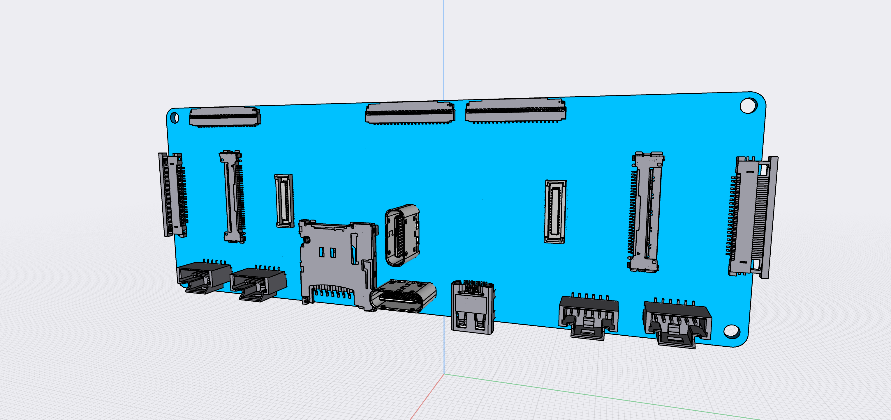

# Upwork task

The 909b has several different systems coming together. 
It receives power and data over USB. It receives sensor inputs over camera module connectors.
The camera modules are custom multi-sensor modules based on OV2735.
It connects to a powerful i.MX 8 MCU module and it allows extension using two m.2 modules.

The 909b is made for experimentation. It will be used to,

- Connecting 201 Camera Modules to the Carrier Board
- Connecting Raspberry Pi 15/22 pin modules to the Carrier Board
- Accessing the 201 Camera Modules from a i.MX8 Plus development boards
- Testing USB-C data transmission over Host & OTG connectors
- Testing power via USB-C power cables from various sources (Dedicated Power, Mixed and Old chargers)
- Testing Displayport/Ethernet alternate mode over USB-C Host connector
- Booting i.MX8 Plus daughter board with Linux Application for Machine Vision
- Testing m.2 Wifi/BT/SSD boards

The 909b essentially provides three parts,

1) Input connectors for 2 cameras linked to output connectors connected to the i.MX 8 development board.
   The cameras are powered by the development board connections.
2) 2 USB-C connectors are managed by a USB PD Controller circuit and breaks out relevant power & data pins.
   These pins are then mapped to USB ports on the i.MX 8 module and USB on m.2 connectors.
3) Connectors for i.MX8 daughter board an m.2 extension boards

The essential BOM of the 909b Bridge Board is,

- 1 * Compulab SB-UCM-iMX8PLUS mcu module
- Texas Instruments TPS65988 PD Controller
- 1 * HD3SS460 4 x 6 Channels USB Type-CTMAlternate Mode MUX. Connected to T-USB Host
- 2 * [Molex 22PIN 0.5mm pitch 54548-2271](https://www.molex.com/molex/products/part-detail/ffc_fpc_connectors/0545482271)
- 2 * [Hirose USB-C CX80B1-24P](https://www.hirose.com/product/p/CL0480-0625-0-00)
- 1 * [TE Connectivity 45PIN 0.3MM 571-4-2328724-5 FPC 3-2328724-5](https://www.te.com/usa-en/product-4-2328724-5.html) $0.41
- 2 * [Hirose DF40C-34DS-0.4V](https://www.hirose.com/en/product/p/CL0684-4023-0-51) ([Mouser](https://www.mouser.ch/ProductDetail/Hirose-Connector/DF40C-34DS-04V51?qs=vcbW%252B4%252BSTIpg26DsEbj1iQ%3D%3D))
- 2 * [Hirose DF40HC(3.0)-100DS-0.4V](https://www.hirose.com/en/product/p/CL0684-4151-0-51) mated height 3.0mm

## Your task

4) Receive test batch of boards + Camera Module samples
5) Verify power delivery from USB chargers with the listed levels
6) Test that Camera module CSI connectivity over 30 pin connectors
7) Verify CSI signals to 34 pins / 22 pins connectors
8) Verify the board boots (Should work as Linux PC with HTML/Keyboard/Mouse connected)
9) Verify boot to USB/SD/eMMC
10) Verify that small m.2 modules can be fitted

USB Power levels to test

- Dedicated Charger 5V, 500mA
- Apple Dedicated Charger 5V, 1A BC1.2
- Power & Data CDP 5V, 1A
- Power & Data CDP 5V, 3A
- Power & Data CDP 9V, 1A
- Power & Data CDP 15V, 1A

## Milestones:

### Power diagram

- T-USB power supply
- PD Controller
- Power breakout connector
- Power Regulators

### CSI & I2S Connectivity

- 30 pin connectors
- 34 pin connectors
- 22 pin connectors
- CSI to SoM lanes
- SCCB to I2C5 & I2C6 with connectors
- I2S stereo microphone connection
- I2S breakout connector
- Power CSI connectors

### Initial diagram for USB, SoC Module

- Connections from T-USB connectors to PD Controller & Power Breakout
- Connections from T-USB connectors to Alt Mode chips
- Connections from SoM to multiplexers on to T-USB connectors/M.2 connectors
- Connections from T-USB / Alt Mode chips / SoM to Alt Mode breakout connectors

- M.2 connectors to SoM

### Initial diagram, draft layout and BOM - $800

1) Given a detailed spec; Identify if there are further open questions about the design of given the goals.
2) Review the choice of component and suggest alternative if needed.
3) Make a diagram for Power over USB, PD Controller, Power breakout connector
4) Make a diagram for CSI connectors, I2S breakout, CSI power, 34 pin I2S
4) Ensure addressing of I2C busses and devices.
5) Design board layout with Eagle or Altium
6) Get production quotes with JLCPCB etc. for 10pc, 100pcs, 1000pcs (assembled and basic)
7) Adjust designs for price efficiency.
8) Document changes to make the board production cheaper

### Order development board - $500

Acquire the Compulab development board yourself for testing.
I will cover the cost and you will send me the board at end of project

 & I send you two camera modules.

3) Finish the board design for test batch production. $500
4) With the modules received, and the produced sample batch you test to which extent the setup captures camera input.
   You combine breakout boards to connect Bridge and Compulab boards.
   Test basic connectivity to I2C sensores and Microphone on the camera modules.
   Test supplying USB power supply levels and current.
   Report results and send the hardware(incl. Compulab dev board) back to me. $1000

Deliver all design files & send the hardware including test setup
