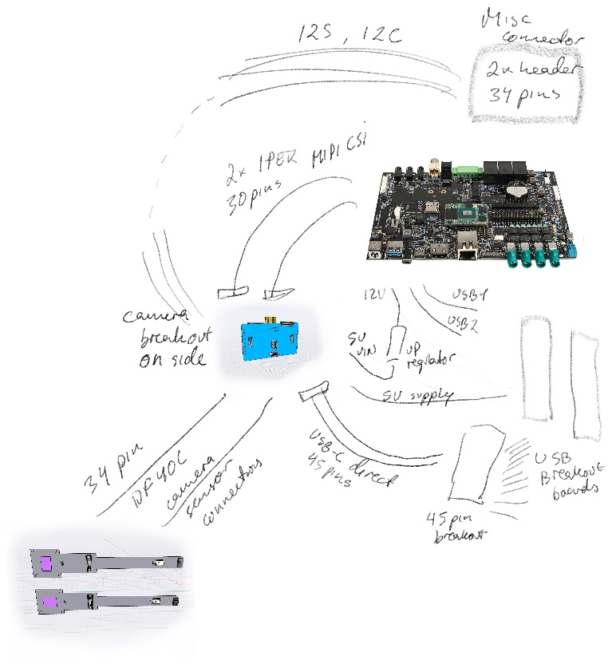

# Upwork task

The 909b has several different systems coming together. 
It receives power and data over USB. It receives sensor inputs over camera module connectors.
The camera modules are custom multi-sensor modules based on OV2735.
It connects to a powerful [i.MX 8 SoM](https://www.compulab.com/products/computer-on-modules/ucm-imx8m-plus-nxp-i-mx-8m-plus-som-system-on-module-computer/) and it allows extension using two m.2 modules.

The 909b is made for experimentation. It will be used to,

- Connecting 201 Camera Modules to the Carrier Board
- Connecting Raspberry Pi 15/22 pin modules to the Carrier Board
- Accessing the 201 Camera Modules from a i.MX8 Plus development boards like [Compulab](https://www.compulab.com/products/carrier-boards/sb-ucmimx8plus-carrier-board/), [I-Pi](https://www.ipi.wiki/products/i-pi-smarcplus-imx8mp) or [Varscite](https://www.variscite.com/product/system-on-module-som/cortex-a53-krait/dart-mx8m-plus-nxp-i-mx-8m-plus/#evaluation-kit).
- Testing USB-C data transmission over Host & OTG connectors
- Testing power via USB-C power cables from various sources (Dedicated Power, Mixed and Old chargers)
- Testing Displayport/Ethernet alternate mode over USB-C Host connector
- Booting [i.MX8 Plus SoM]() with Linux Application for Machine Vision
- Testing m.2 Wifi/BT/SSD boards

The 909b essentially provides three parts,

1) Input connectors for 2 cameras linked to output connectors connected to the i.MX 8 development board.
   The cameras are powered by the development board connections.
2) 2 USB-C connectors are managed by a USB PD Controller circuit and breaks out relevant power & data pins.
   These pins are then mapped to USB ports on the i.MX 8 module and USB on m.2 connectors.
3) Connectors for i.MX8 SoM and m.2 extension boards

The essential BOM of the 909b Bridge Board is,

- 1 * Compulab SB-UCM-iMX8PLUS SoM
- Texas Instruments TPS65988 PD Controller
- 2 * HD3SS460 4 x 6 Channels USB Type-CTMAlternate Mode MUX. Connected to T-USB Host
- 2 * [Molex 22PIN 0.5mm pitch 54548-2271](https://www.molex.com/molex/products/part-detail/ffc_fpc_connectors/0545482271)
- 2 * [Hirose USB-C CX80B1-24P](https://www.hirose.com/product/p/CL0480-0625-0-00)
- 1 * [TE Connectivity 45PIN 0.3MM 571-4-2328724-5 FPC 3-2328724-5](https://www.te.com/usa-en/product-4-2328724-5.html) $0.41
- 2 * [Hirose DF40C-34DS-0.4V](https://www.hirose.com/en/product/p/CL0684-4023-0-51) ([Mouser](https://www.mouser.ch/ProductDetail/Hirose-Connector/DF40C-34DS-04V51?qs=vcbW%252B4%252BSTIpg26DsEbj1iQ%3D%3D))
- 2 * [Hirose DF40HC(3.0)-100DS-0.4V](https://www.hirose.com/en/product/p/CL0684-4151-0-51) mated height 3.0mm

## Milestones:

The project is broken down in milestones to ensure a correct design.

### Power supply, CSI, I2S & I2C  $750

Do an initial board diagram and layout and order the Development board from compulab.com
 with Eagle or Altium.

- Confirmation of BoM
- T-USB power supply
- PD Controller
- Power Regulators
- Power LED, Power and Reset buttons
- Pads for connecting RTC battery
- Pads for drawing out VIN+GND to external battery unit, or providing it back.
- 30 pin CSI connectors
- 34 pin CSI connectors
- 22 pin CSI connectors
- CSI to SoM lanes
- SCCB to I2C5 & I2C6 with connectors (6 pins)
- I2S stereo microphone connection (6 pins)
- I2S breakout connector (6 pins)
- Multi-directional power between CSI connectors
- Powering the SoM
- Plan signal voltage used for [i.MX 8 SoM](https://www.compulab.com/products/computer-on-modules/ucm-imx8m-plus-nxp-i-mx-8m-plus-som-system-on-module-computer/) pins.
- I2C to GPIO expander(s) and their signal levels
- Level shifters

Deliverables:

- Diagrams + Board layout design files
- Given a detailed spec; Identify if there are further open questions about the design of given the goals.
- Review the choice of component and suggest alternative if needed.
- Confirmation of BoM
- Collect PCB price estimates from 
- Get production quotes with JLCPCB etc. for 10pc, 100pcs, 1000pcs (assembled and basic)

### Order development board - $500

Acquire the Compulab development board yourself for testing.
I will cover the cost and you will send me the board at end of project

I send you two camera modules.

### Diagram for MicroSD, MicroHDMI, M.2 key B & Debug Breakout - $250

Do an additional board diagram and layout for additional components
 with Eagle or Altium.

- MicroSD connector like on the Compulab carrier board
- Micro HDMI connector like on the Compulab carrier board
- The M.2 key B like on the Compulab carrier board
- PCIe clock generator
- 45 pins Debug Breakout Connector
- Plan signal levels for connectors

Deliverables:

- Diagrams + Board layout design files
- Confirmation of BoM

### Diagram for T-USB, M.2 Key E - $800

Do an additional board diagram and layout for additional components
 with Eagle or Altium.

- USB data lines connecting SoM, M.2, USB-C
- Multiplex USB2 between KeyB and Host
- M.2 Key E connectivity
- Multiplex USB1 between KeyE and OTG
- Sharing signals between the two M.2 connectors
- Alt Mode circuitry for OTG connector ([Ti ref impl](./datasheets/USB/Alt%20mode%20mux%20hd3ss460.pdf))
- OTG Alt mode connector with 4 Alt pairs and Ethernet pairs
- Alt Mode circuitry for Host connector ([Ti ref impl](./datasheets/USB/Alt%20mode%20mux%20hd3ss460.pdf))
- Host Alt mode connector with 4 Alt pairs and LVDS0 pairs
- I2C EEPROM
- Ensure I2C addresses of the various chips

Deliverables:

- Diagrams + Board layout design files
- Confirmation of BoM
- Allocated addressing of I2C busses and devices.

### Test initial Batch $800

Once the initial batch of PCBs have been produced do some basic tests.
You should have the development board and 201 camera modules

- Test CSI connectors route signals and power
- Test USB connectors can power the board
- Test SoM can boot with HDMI, Mouse and Keyboard
- Test that the development board can be connected via 30 pin CSI connectors
- Test dual Rpi 22 pins camera connections -> 909b -> development board 
- Verify boot to USB/SD/eMMC
- Verify that small m.2 modules can be fitted
- Verify power delivery from USB chargers with the listed levels
- Document test process and findings

USB Power levels to test

- Dedicated Charger 5V, 500mA
- Apple Dedicated Charger 5V, 1A BC1.2
- Power & Data CDP 5V, 1A
- Power & Data CDP 5V, 3A
- Power & Data CDP 9V, 1A
- Power & Data CDP 15V, 1A

Deliverables:

- Report results and send the hardware(incl. Compulab dev board) back to me.
- All design files & send the hardware including test setup

### Revise Designs $500

Based on Initial Batch testing and review with Product Owner revise the board diagram and design

- Create list of alternative chips cheching with JLPCB and PCBWay
- Update chosen components based on currently available
- Create updated diagram and board layout designs

Deliverables:

- Revised design files
- Alternate component BoM
