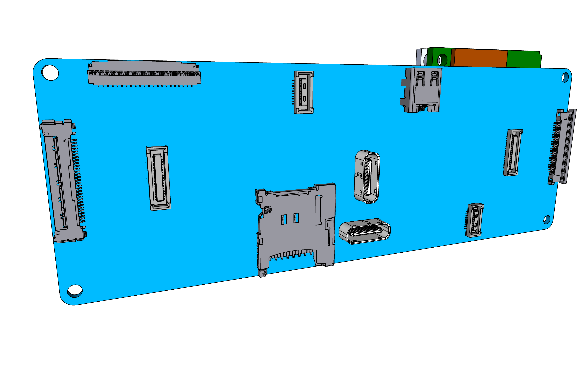
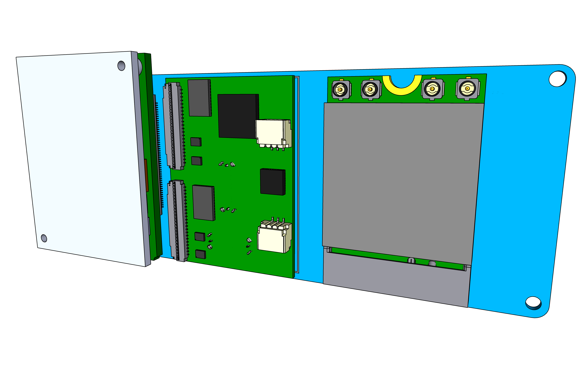
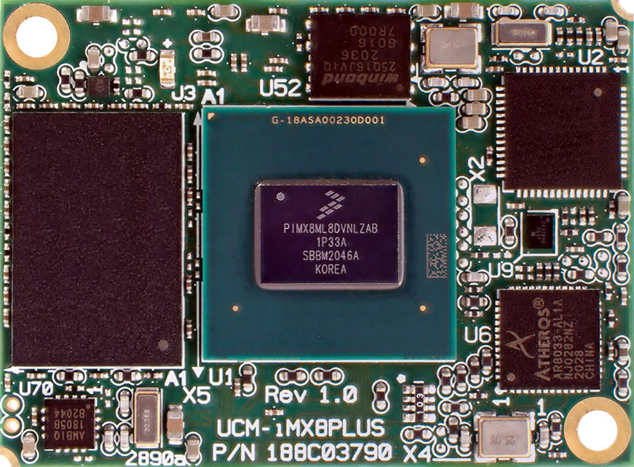
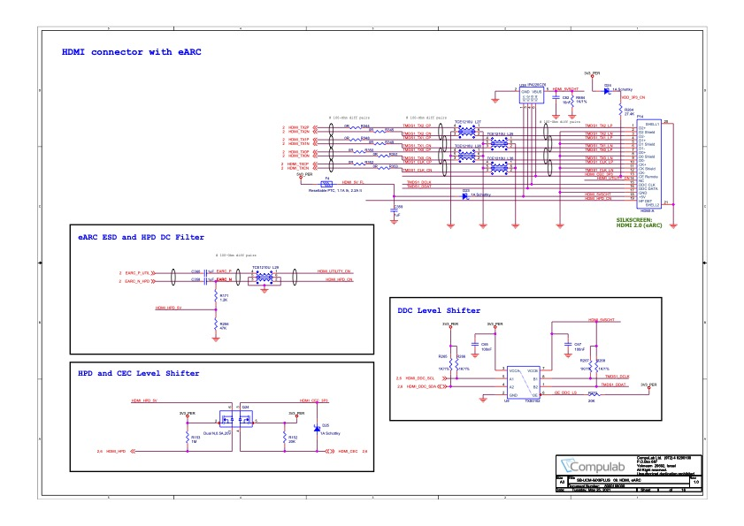
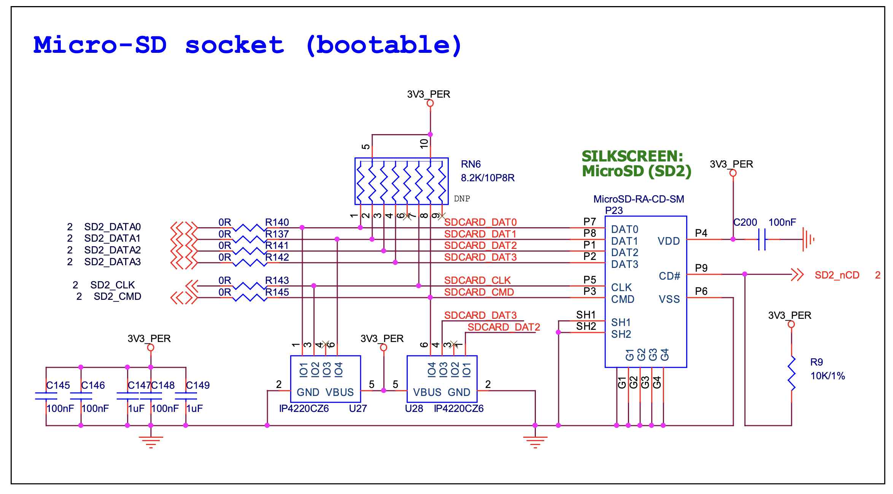

# Bridge Board 909c

The 909c is a Bridge Board version made for testing and experiementation with the Ziloo attachments without attaching
the SB-UCM i.MX8 board or directly attaching it. 
The setup enables connecting a [Compulab SB-UCM-iMX8PLUS](https://www.compulab.com/products/carrier-boards/sb-ucmimx8plus-carrier-board/), [DART-MX8M-PLUS Evaluation Kit](https://www.variscite.com/product/system-on-module-som/cortex-a53-krait/dart-mx8m-plus-nxp-i-mx-8m-plus/#evaluation-kit) or 
[I-Pi SMARC IMX8M Plus](https://www.ipi.wiki/products/i-pi-smarcplus-imx8mp) development board.
Not all the 909 connectors will be mounted on the 801 production bridge board that mounts the i.MX8 board.

Of note in design,

- Some of the UCM-iMX8M-Plus carrier board interface pins are multifunctional. Up to 4 functions (ALT modes) are accessible through each multifunctional pin.
- All of the UCM-iMX8M-Plus digital interfaces operate at 3.3V voltage levels unless noted otherwise.
- RGMII ENET1 signals operate at 1.8V voltage level
- SD/SDIO port #2 can be configured to operate at 3.3V or 1.8V voltage levels. Voltage level is controlled by SoC pin GPIO1_IO04.

### Open points

- B2B sound/I2C connectors
- Mux chips shutdown mode
- Should there be Boot origin switches like EVK? (4 bits? EVK)
- Annotations and Logo on the board
- TEST The Mux pin configurations

## <mark>Difference from revision B</mark>

- The PD Controller is no longer on the bridge board
- The Power module connects to the bridge board to provide dual USB-C
- Two 50 pin connectors take high speed and low speed signals to USB-C connectors
- Two 20 pin sound connectors
- Only 1 alternative CSI connector for each side
- I2S Mic removed from debug connector, CAN1/CAN2 added.
- No soldering pads
- No Alt USB breakouts on bridge board
- No Alt mode on bridge board
- No I2C breakouts on bridge board
- No 45 pin Alt Mode Connectors
- Only m.2 Key B (no Key E)
- Pulled parts out in BRIDGE_BOARD_CAMERA, BRIDGE_BOARD_SOUND, BRIDGE_BOARD_M2_KEY_B documents.

## Core Components

- [SB-UCM-iMX8PLUS](https://www.compulab.com/products/computer-on-modules/ucm-imx8m-plus-nxp-i-mx-8m-plus-som-system-on-module-computer/) System-on-Module
- 2 * [Hirose DF40HC(3.0)-100DS-0.4V](https://www.hirose.com/en/product/p/CL0684-4151-0-51) mated height 3.0mm
- 2 * [Hirose DF40-50DS-0.4V](https://www.hirose.com/en/product/p/CL0684-4009-0-51) mated height 1.5mm [Mouser](https://www.mouser.ch/ProductDetail/Hirose-Connector/DF40C-50DS-04V51?qs=sGAEpiMZZMthaSLPVp%252B4asSF8eu6nRoehAaVBEWyQ6A%3D) - [JLCPCB socket](https://jlcpcb.com/parts/componentSearch?isSearch=true&searchTxt=DF40C-50DS-0.4V)
- M.2 key B connector H4.20mm [Amphenol ICC 10128793001RLF](https://www.amphenol-icc.com/pci-express-10128793001rlf.html)
- 2 * [Hirose DF40C-34DS-0.4V](https://www.hirose.com/en/product/p/CL0684-4023-0-51) ([Mouser](https://www.mouser.ch/)
- 1 * microSD card slot (suggested Molex 5031821852) push-push, compact. [Mouser](https://www.mouser.ch/ProductDetail/Molex/503182-1852?qs=s7UCm7gO1bZmpyAhCKZ26g%3D%3D), [Molex](https://www.molex.com/molex/products/part-detail/memory_card_socket/5031821852)
- 1 * [CBTL04083 Multiplexer Switch ICs 3.3V CH 2:1](https://www.nxp.com/part/CBTL04083ABS#/) - [Mouser](https://www.mouser.ch/ProductDetail/NXP-Semiconductors/CBTL04083ABS518?qs=sGAEpiMZZMtRgJo%2FZ%2FMF7P%2Fv50GZnMfoakbaY6SsrwU%3D)
- 3 * PCA9555 I/O Expander
- 1 * [TS5USBC410 Dual 2:1 USB 2.0 Mux/DeMux Switch](../datasheets/USB/ts5usbc41.pdf). [Mouser](https://www.mouser.ch/ProductDetail/Texas-Instruments/TS5USBC410IYFFR?qs=sGAEpiMZZMutXGli8Ay4kPB6XEQFysSpdNErqZgdEYs%3D)

## Dev. Connectors

- 1 * MicroHDMI (suggested Molex 46765-1301) [Mouser](https://www.mouser.ch/ProductDetail/Molex/46765-1301?qs=sGAEpiMZZMt1iCLsaqcCFmQhPEZFSo0wUGorAW08d1I%3D) [Molex](https://www.molex.com/molex/products/part-detail/io_connectors/0467651301)
- 1 * [Molex 22PIN 0.5mm pitch 54548-2271](https://www.molex.com/molex/products/part-detail/ffc_fpc_connectors/0545482271)
- 1 * [I-PEX 30PIN 0.4mm pitch 20525-030E-02](https://www.i-pex.com/product/cabline-ca)
- 1 * [TE Connectivity 45PIN 0.3MM 571-4-2328724-5 FPC 3-2328724-5](https://www.te.com/usa-en/product-4-2328724-5.html) $0.41
ProductDetail/Hirose-Connector/DF40C-34DS-04V51?qs=vcbW%252B4%252BSTIpg26DsEbj1iQ%3D%3D))
- 2 * [Hirose DF40-20DS-0.4V](https://www.hirose.com/product/p/CL0684-4005-9-51) mated height 1.5mm [Mouser](https://www.mouser.ch/ProductDetail/Hirose-Connector/DF40HC35-20DS-04V51) - [JLCPCB socket](https://jlcpcb.com/parts/componentSearch)

## Other Components

Connectors placed on the board are,

- [PI6CG18200 clock](https://www.diodes.com/part/view/PI6CG18200?BackID=2328)
- 1 * 24C08 Carrier-board EEPROM. [Mouser](https://www.mouser.ch/ProductDetail/STMicroelectronics/M24C08-FMN6TP?qs=sGAEpiMZZMtXHE36kCvv38ceEodIXDQNqtU0Mm03QrY%3D)
- 1 * TSM-120-01-F-DV Samtec 2*20 pins surface mounted .100 (Smiley model) [Mouser](https://www.mouser.ch/ProductDetail/Samtec/TSM-120-01-F-DV?qs=rU5fayqh%252BE2gtcIirjF3kA%3D%3D)
- [SuperSpeed MUX PI5USB30213A](https://www.diodes.com/part/view/PI5USB30213A/) may be an option intead of CBTL04083
- [Alternate USB 2.0 Mux/DeMux](https://www.diodes.com/part/view/PI3USB102G/) [Mouser](https://www.mouser.ch/ProductDetail/Diodes-Incorporated/PI3USB102GZLEX?qs=mt7EBqA2jzg7v2qs76v1VQ%3D%3D) [JLCPCB part](https://jlcpcb.com/parts/componentSearch?isSearch=true&searchTxt=DF40C-60DS-0.4V)
- 5 * TXB0108 voltage shifters 3.3V to 1.8V

The back of the board connects for SB-UCM-iMX8PLUS, T-USB module and M.2 Key B module.
The SB-UCM-iMX8PLUS is the center of the board and receives all signals.

# System Power Module

<mark>This is a new module</mark>

:[Power Module Connection](../refs/POWER_MODULE_CONNECT.md)
 
The module connectors have pins that are used for different setups. Not all should be connected to the 909 board.

# System SB-UCM-iMX8PLUS Module (SoM)

The daughter board clicks into the two Hirose 100 pin board-to-board connectors.

For further details see [Product Page](https://www.compulab.com/products/computer-on-modules/ucm-imx8m-plus-nxp-i-mx-8m-plus-som-system-on-module-computer/).

- The CSI1 & CSI2 are wired from the 100pin connectors to relevant CSI connectors.
- The CSI1 lanes are connected to Left CSI.
- The CSI2 lanes are connected to Right CSI.
- The USB1(OTG) data connects to 50 pin high speed connector.
- The USB2(Host) data connects to multiplexer between 50 pin high speed connector and m.2. Switched with MUX_HOST on EX0.
- 50 pin controlls takes in signals from SoM (LVDS, UART, I2C, INTs)
- The 45 pins Debug connector will break out many additional signal lines.
- The Debug connector can be placed near the 100 pin connectors if it helps the board layout.

# MicroSD and MicroHDMI

The MicroHDMI connector is connected to the HTMI_TX*, HDMI_DDC_*, HDMI_CEC, HDMI_HPD pins from the i.MX8 module.

The MicroSD connector is connected to SD2_DATA*, SD2_CLK, SD2_CMD, SD2_nCD on the i.MX8 module.

### Debugging Breakout connector

See end of this document for pinouts.

# T-USB Module Data Connection

:[T-USB Mounting instructions](../801-T-USB/T-USB-MOUNT.md)

### I2C EEPROM

Add an EEPROM like 24C08 present on the UCM carrier board.
<mark>Unlike reference design it should be connected to Stem I2C from 50 pin connector</mark>

## Wiring and Connecting

The board can be used in different ways

1) Adding a daughterboard, two OV2735 camera modules and connecting a USB cable with power.
2) Adding a daughterboard, two RPi camera modules and connecting a USB cable with power.
3) Use the board to connect two OV2735 camera modules to Compulab SB-UCM-iMX8PLUS
4) Use the board to connect two OV2735 camera modules to I-Pi SMARC IMX8M Plus

Required distances/location

- Camera module distance 70mm
- USB-C connectors cannot be moved
- Board size can only be increased to save cost
- Holes in the corners should be the regular sort for mounting.
- 

### I/O Expanders

<mark>The pins on I/O Expanders are rearranged</mark>

Three expanders are placed on the bridge board and a fourth is on the Power Module.

#### Expander 0

:[SYS I2C GPIO Expander 0](../pinouts/I2C_EXPANDER_0.md)
I/O Expander like Compulab Carrier Board to map Camera interrupts. (SYS I2C)

#### Expander 4

:[SYS I2C GPIO Expander 4](../pinouts/I2C_EXPANDER_4.md)
I/O Expander to cover m.2 Expander (Stem I2C).
Some sensor pins not connected.

#### Expander 6

:[SYS I2C GPIO Expander 6](../pinouts/I2C_EXPANDER_6.md)
I/O Expander to cover m.2 Expander (SYS I2C).
E_* pins are not connected.

### SYS I2C adresses

:[SYS I2C addresses](../pinouts/SYS_I2C_ADDRESSES.md)

### <mark>Signal Interrupt(INT) pins</mark>

Various chips have internal state changes that should cause interrupts by the SoM(CPU).
It is essential that inputs are flagged so communication can be reliable.

On the reference board these are triggered via USB1_TCPC_nINT(P1.60)
It is used for I/O Expander 0 and input IRQs.

Events that we want to catch

- T-USB OTG plug events
- T-USB Host plug events
- PD Controller state changed
- Camera sensors input ready
- I/O Expander input ready
- m.2 connectors
- PCIe

Interrupts from the PD Controller are input to I/O Expander 0 (or 3). It in turn
triggers an interrupt on EX0_nINT or EX_T_nINT.

Interrupts from the Left and right cameras interrupt signal(ATT_INT) is connected
to I/O Expander 0.
It in turn triggers an interrupt on EX0_nINT.

Direct/Indirect interrupt triggers

| Chip           | Chip pin     | Output to     | Description               |
|----------------|--------------|---------------|---------------------------|
| PDA9555 EX 0   | INT          | EX0_nINT      | Original Expander - P1.60        |
| PDA9555 EX 4   | INT          | STEM_INT      | 50 pin connector to T-USB module  |
| PDA9555 EX 6   | INT          | EX0_nINT      | m.2 Expander for SYS - P1.60  |
| PCIe m.2 Key B | WAKE#        | PCIE_WAKE_B   | m.2 Key B - P2.52                |
| PCIe m.2 Key B | CLKREQ#      | PCIE_CLKREQ_B | m.2 Key B - P2.90                |
| Left Sensors   | ATT_INT      | EX0.10        | Left Camera Module sensors |    
| Right Sensors  | ATT_INT      | EX4.14/EX0.14 | Right Camera Module sensors |

# 909c Connector Pinouts

## Debugging Breakout connector

:[Debugging Breakout connector](../pinouts/DEBUG_BREAKOUT_CONNECTOR_PINOUT.md)

## 50 pin B2B connectors

<mark>These connectors are new</mark>

:[DF40 50 pin connectors](../pinouts/T-USB_50_PINS_CONNECTORS.md)

