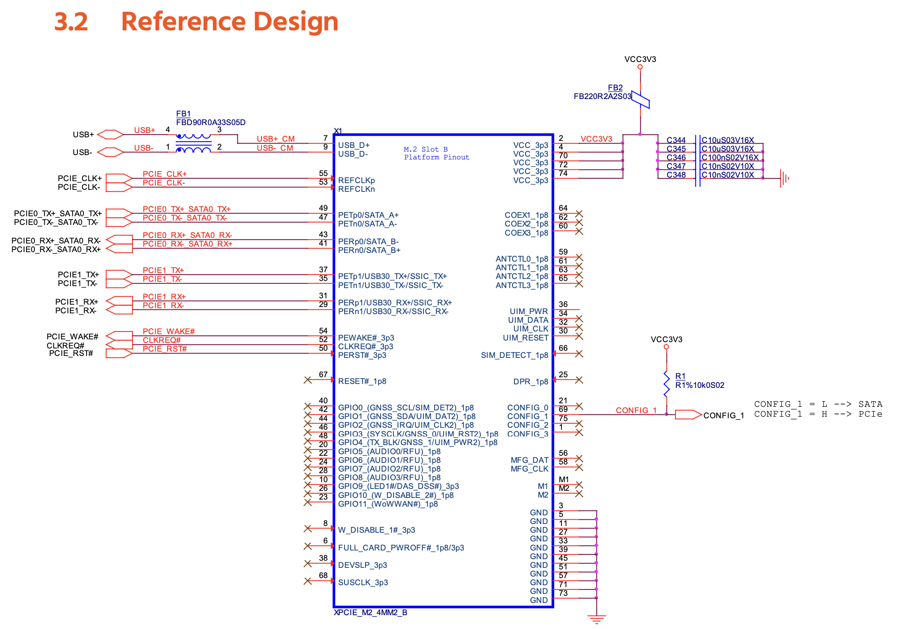

# M.2 Key B Expansion Module

Features:

- 1 Lane PCIe (PExx0)
- USB 3.0 data multiplexed (USB2/Host, PExx1)
- USB 2.0 data multiplexed (USB2/Host)
- GNSS / Stem I2C (I2C3)
- MFG I2C (SYS I2C)
- AUDIO I2S MIC SAI5 4 channels (GPIO5..8 and COEX*)
- SPI (ANTCTL*)
- DAS/DSS broken out with activity LED + expander bit
- Additional signals via 16 bit I/O Expander
- Some are broken out with pads near connector (CONFIG 0/2/3, DPR)
- SIM pins are not connected, reserved for now
- 4 channel I2S stereo input
- 4 channel I2S stereo output

The USB2 data from the Systems Module is connected through the multiplexer to T-USB on boot. The multiplexer 
can switch it to the M.2 expansion USB pins. This is important as the USB 3.0 data pairs are connected to
what can also be used for a second PCIe lane.
The USB data signals from SoM are multiplexed between T-USB Host (USB2) and M.2 Key B based on MUX_USB2_SEL & MUX_USB3_SEL.

Be aware the current pin plan is not final. Input/Ouput such as DIN/DOUT RXD/TXD may be the wrong way around.
It must be verified with reference hardware design/testing.

According to documentation: Type refers to the signal direction:
• Type O means signal is an output from the MPU/MCU to the adapter. 
• Type I means signals is an input to the MPU/MCU from the adapter.

### Control pins mapped by I/O Expander

Some extra M.2 pins are connected to I/O Expanders 4 and 6 to allow controlling the state of the inserted module.
Muxing the USB2 signals between m.2 Key B and the T-USB Module is controlled by I/O Expander 0.
Also, there will be no fastening screw for the m.2 board.

The system I/O expander controls mPCIe_PERST which resets PCIe.
PCIE_CLKREQ_B is a direct pin on the SoM.
PCIE_WAKE_B is a direct pin on the SoM. 

(?) Consider bootup default state of I/O Expanders. USB must not connect M.2 by default

(?) A future revision may connect unallocated/GPIO pins from chipsets to M.2 module

#### Expander 4

:[SYS I2C GPIO Expander 4](../pinouts/I2C_EXPANDER_4.md)
I/O Expander to cover m.2 Expander (Stem I2C).
Some sensor pins not connected.

#### Expander 6

:[SYS I2C GPIO Expander 6](../pinouts/I2C_EXPANDER_6.md)
I/O Expander to cover m.2 Expander (SYS I2C)

### Key B - pinouts

:[Key B Pinouts](../pinouts/M2_KEY_B_CONNECTOR.md)

## Key B - Reference Design

Congatec reference design
