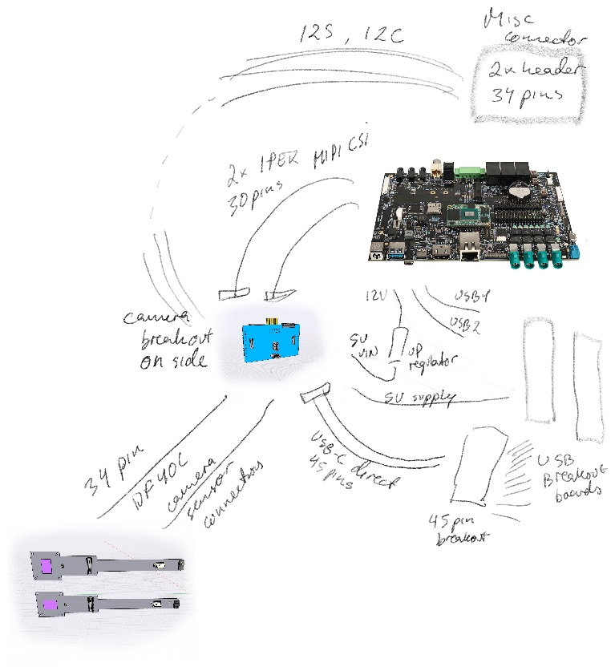

# Upwork task

The 909c has several different systems coming together. 
It receives power and data over USB from the T-USB power/data module. 
It receives sensor inputs over camera module connectors.
The camera modules are custom multi-sensor modules based on OV2735.
It connects to a powerful [i.MX 8 SoM](https://www.compulab.com/products/computer-on-modules/ucm-imx8m-plus-nxp-i-mx-8m-plus-som-system-on-module-computer/) and it allows extension using an m.2 modules.

The 909c is made for experimentation. It will be used to,

- Connecting dual 201 Camera Modules to the Bridge Board
- Connecting a Raspberry Pi 15/22 pin Camera module to the Bridge Board
- Accessing the 201 Camera Modules from a i.MX8 Plus development boards like [Compulab](https://www.compulab.com/products/carrier-boards/sb-ucmimx8plus-carrier-board/), [I-Pi](https://www.ipi.wiki/products/i-pi-smarcplus-imx8mp) or [Varscite](https://www.variscite.com/product/system-on-module-som/cortex-a53-krait/dart-mx8m-plus-nxp-i-mx-8m-plus/#evaluation-kit).
- Booting [i.MX8 Plus SoM]() with Linux Application for Machine Vision via Flash, USB, SSD
- Testing m.2 SSD boards

The 909c essentially joins connected modules,

1) 4 camera connectors for stereo cameras
2) Dual USB-C submodule that provides power and data connectivity.
3) Connectors for i.MX8 SoM
4) Connector for m.2 Key B (no screw)
5) SD Card, Board-To-Board sound bus connectors, HDMI, Debug Connector and debug/testing pads

The essential BOM of the 909c Bridge Board is,

- 1 * Compulab SB-UCM-iMX8PLUS SoM
- 1 * T-USB Module
- 1 * [CBTL04083 Multiplexer Switch ICs 3.3V CH 2:1](https://www.nxp.com/part/CBTL04083ABS#/) - [Mouser](https://www.mouser.ch/ProductDetail/NXP-Semiconductors/CBTL04083ABS518?qs=sGAEpiMZZMtRgJo%2FZ%2FMF7P%2Fv50GZnMfoakbaY6SsrwU%3D)
- 1 * [Molex 22PIN 0.5mm pitch 54548-2271](https://www.molex.com/molex/products/part-detail/ffc_fpc_connectors/0545482271)
- 1 * [I-PEX 30PIN 0.4mm pitch 20525-030E-02](https://www.i-pex.com/product/cabline-ca)
- 1 * [TE Connectivity 45PIN 0.3MM 571-4-2328724-5 FPC 3-2328724-5](https://www.te.com/usa-en/product-4-2328724-5.html) $0.41
- 2 * [Hirose DF40C-34DS-0.4V](https://www.hirose.com/en/product/p/CL0684-4023-0-51) ([Mouser](https://www.mouser.ch/ProductDetail/Hirose-Connector/DF40C-34DS-04V51?qs=vcbW%252B4%252BSTIpg26DsEbj1iQ%3D%3D))
- 2 * [Hirose DF40HC(3.0)-100DS-0.4V](https://www.hirose.com/en/product/p/CL0684-4151-0-51) mated height 3.0mm
- 1 * m.2 connector

## Milestones:

The project is broken down in milestones to ensure a correct design.

### Overall system diagram and component layout

Do an initial board diagram and layout and order the Development board from compulab.com
 with Eagle or Altium.

- Confirmation of BoM
- T-USB module connection
- Coonection of [i.MX 8 SoM](https://www.compulab.com/products/computer-on-modules/ucm-imx8m-plus-nxp-i-mx-8m-plus-som-system-on-module-computer/)
- Soldering Pads
- 30 pin CSI connector
- 34 pin CSI connectors
- 22 pin CSI connector
- CSI to SoM lanes
- Debug breakout connector
- Sound connection (20 pins)
- Multi-directional power between CSI connectors
- m.2 module connector
- Level shifters

Deliverables:

- Diagrams(.sch) + Board layout design files
- Confirmation of BoM
- Collect PCB price estimates from 
- Get production quotes with JLCPCB etc. for 10pc, 100pcs, 1000pcs (assembled and basic)

### Diagram and Draft Board Layout - $250

Do a board diagram and layout of components with Eagle or Altium.

- A full set of diagrams for the board
- Placement of main components on the board
- Draft layout of important components
- Adherance to the design layouts I provide
- Plan signal levels for connectors

Deliverables:

- Diagrams + Board layout design files
- Confirmation of BoM

### Design and Produce - $1000

Design the board and produce a test batch

- Lay out the board
- Produce a batch of populated boards with PCBWay or JLCPCB
- Send me a populated board from the batch

Deliverables:

- Diagrams + Board layout design files
- Send me a populated board from the batch

### Test initial Batch $750

Once the initial batch of PCBs have been produced do some basic tests.
You should have the development board and 201 camera modules
You will have to power the board with a bench power supply directly for VSOM,
as I cannot provide you with a T-USB module.

- Test CSI connectors route signals and power
- Test USB connectors can power the board
- Test SoM can boot with HDMI, Mouse and Keyboard
- Test that the development board can be connected via 30 pin CSI connectors
- Test dual Rpi 22 pins camera connections -> 909b -> development board 
- Verify boot to USB/SD/eMMC
- Verify that small m.2 modules can be fitted
- Verify power delivery from USB chargers with the listed levels
- Document test process and findings
- Revise designs as needed

Deliverables:

- Report results and send the hardware(incl. Compulab dev board) back to me.
- All design files & send the hardware including test setup
- Revised design files
- Alternate component BoM
