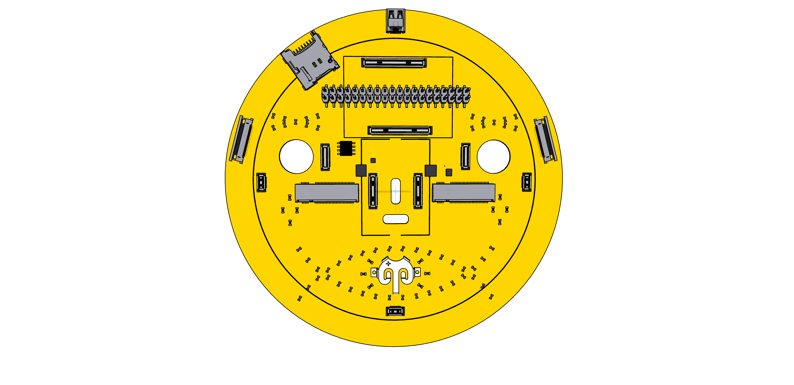

# 919 Expansion slots (m.2)

On the way to the 701 board two m.2 connectors must be added to 919. A Key B and a Key E connector.

## Core Components

- M.2 key B connector H4.20mm [Amphenol ICC 10128793001RLF](https://www.amphenol-icc.com/pci-express-10128793001rlf.html)
- M.2 key E connector H4.20mm [Amphenol ICC 10128794001RLF](https://www.amphenol-icc.com/pci-express-10128794001rlf.html)
- 3 * PCA9555 I/O Expander
- 6 * [TS5USBC410 Dual 2:1 USB 2.0 Mux/DeMux Switch](../datasheets/USB/ts5usbc41.pdf). [Mouser](https://www.mouser.ch/ProductDetail/Texas-Instruments/TS5USBC410IYFFR?qs=sGAEpiMZZMutXGli8Ay4kPB6XEQFysSpdNErqZgdEYs%3D)

Alternative components

- 1 * USB2513B USB 2.0 hub controller
- 
- 

# Adding m.2

This is how it looks with the modules mounted:

## I/O Expander 5

Expander #5 combines control signals for the m.2 connectors. It is driven by SYS I2C. 

:[I/O Expander 5](../pinouts/I2C_EXPANDER_5.md)

# USB Data and m.2 Module Wiring

:[Wiring up USB and m.2](../refs/USB_M2_BOARD_WIRING.md)

