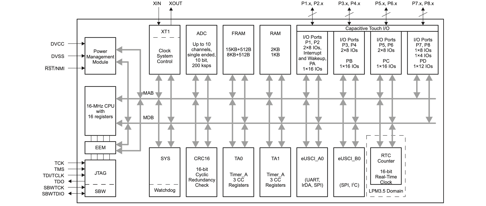

# 919 Expansion slots (m.2)

On the way to the 701 board two m.2 connectors must be added to 919. A Key B and a Key E connector.

## Core Components

- M.2 key B connector H4.20mm [Amphenol ICC 10128793001RLF](https://www.amphenol-icc.com/pci-express-10128793001rlf.html)
- M.2 key E connector H4.20mm [Amphenol ICC 10128794001RLF](https://www.amphenol-icc.com/pci-express-10128794001rlf.html)
- 1 * PCA9555 I/O Expander (for legacy)
- 1 * [MSP430 FR2032 IG56 TSSOP DGG56](https://www.ti.com/product/MSP430FR2032#tech-docs). Inventory 4870 at TO. @1000 $0.766. 52 IO pins, 1 UART/I2C, 1 UART/SPI.
- 2 * [74HC595 PW,118 shift register TSSOP-16](https://www.mouser.ch/ProductDetail/Nexperia/74HC595PW118?qs=P62ublwmbi8GOYhe4PjE9Q%3D%3D). @1000 $0.15, 15k in 
- 1 * [CBTL04083 Multiplexer Switch ICs 3.3V CH 2:1](https://www.nxp.com/part/CBTL04083ABS#/) - [Mouser](https://www.mouser.ch/ProductDetail/NXP-Semiconductors/CBTL04083ABS518?qs=sGAEpiMZZMtRgJo%2FZ%2FMF7P%2Fv50GZnMfoakbaY6SsrwU%3D)
- 1 * [TS5USBC410 Dual 2:1 USB 2.0 Mux/DeMux Switch](../datasheets/USB/ts5usbc41.pdf). [Mouser](https://www.mouser.ch/ProductDetail/Texas-Instruments/TS5USBC410IYFFR?qs=sGAEpiMZZMutXGli8Ay4kPB6XEQFysSpdNErqZgdEYs%3D)

Alternative components

- 1 * USB2513B USB 2.0 hub controller
- 
- 

# Adding m.2

This is how it looks with the modules mounted:

## USB Data and m.2 Module Wiring

:[Wiring up USB and m.2](../refs/m.2/USB_M2_BOARD_WIRING.md)

## M.2 Slot Features and Pins

:[M.2 Connection](../refs/m.2/M2_CONNECTION.md)

## Connector Pinouts

### Key B

:[Key B](../pinouts/M2_KEY_B_CONNECTOR.md)

### Key E

:[Key E](../pinouts/M2_KEY_E_CONNECTOR.md)

