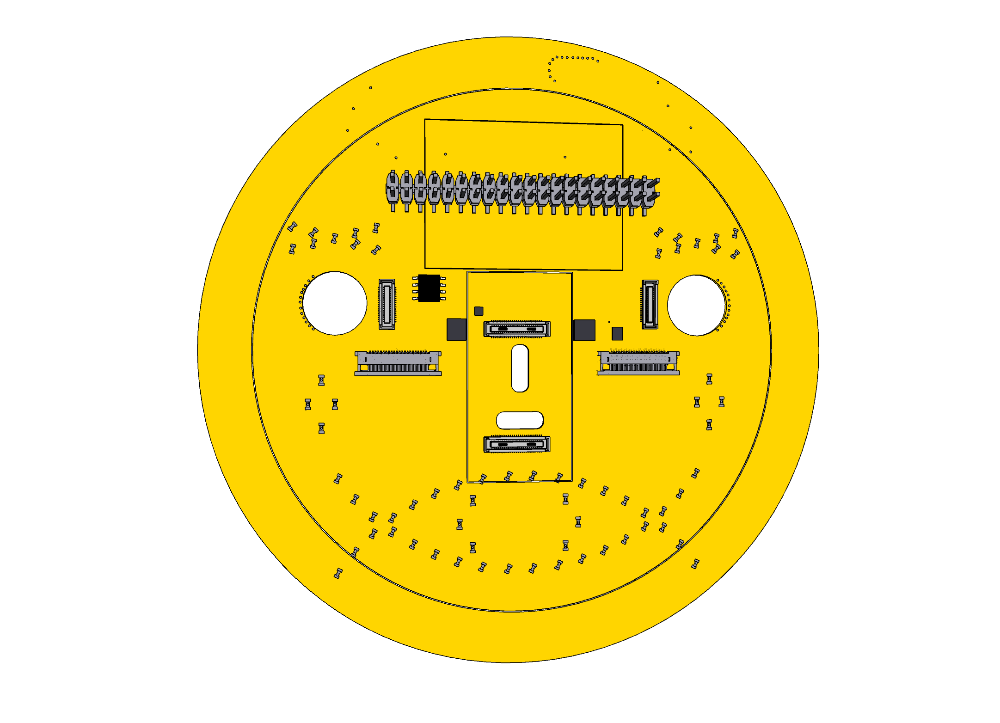

# 919 Smiley

Face board used to face the user and bridge daughterboards.

It contains a Bosch Sensortech 32 bit RISC processor that monitors 3D movement using a gyroscope and accelerometer.
It communicates with the Host MCU via the Stem I2C bus (I2C3 for the MCU daughterboard). 
It exposes system control signals via the SYS I2C GPIO Expander 0.
Sensors on camera modules are available via Master 2 & 3.
A second chip is optional BMM150 to provide a magnetometer to get richer movement data.

Connectors are present to support attachement of two camera modules.

A LED matrix driver controls 120 LEDs producing expressions on the front of the board.
The LEDs are 1mm long and embedded in the board in order to create a diffused light.

To support using the 919 module without an attached power module terminals for a battery is supported that
powers the always on part such as the Bosch Sensortech.

Components

- 1 * [Bosch Sensortech BHI260AP](https://www.bosch-sensortec.com/products/smart-sensors/bhi260ap/) - [Mouser](https://www.mouser.ch/ProductDetail/Bosch-Sensortec/BHI260AP)
- 1 * [NOR Flash 8M QSPI IS25WP080D-JNLE ISSI SOIC-8]() - [Mouser](https://www.mouser.ch/ProductDetail/ISSI/IS25WP080D-JNLE?qs=pif5%252B9MYt0UdCheWbE26RA%3D%3D)
- 1 * [IS31FL3730 8x8 matrix output](https://www.mouser.ch/ProductDetail/Lumissil/IS31FL3730-QFLS2-TR)
- 1 * [PCA9555 I/O Expander HVQFN24 package](https://www.nxp.com/part/PCA9555D)
- 1 * [TXB0108YZPR2 8-Bit Bidirectional Voltage-Level Shifter with Auto Direction Sensing and +/-15-kV ESD Protect 20-DSBGA -40 to 85](https://www.ti.com/store/ti/en/p/product/?p=TXB0108YZPR2) - [Mouser](https://www.mouser.ch/ProductDetail/Texas-Instruments/TXB0108YZPR2?qs=PqoDHHvF64977Sea9xf4wg%3D%3D)
- ? * [Kingbright APHHS1005SYCK 1mm x 0.5mm yellow](https://www.mouser.ch/ProductDetail/Kingbright/APHHS1005SYCK)
- [Würth 150040YS73220 1mm x 0.5mm yellow](https://www.mouser.ch/ProductDetail/Wurth-Elektronik/150040YS73220)

Connectors placed on the board are,

- 2 * [Molex 22PIN 0.5mm pitch 54548-2271](https://www.molex.com/molex/products/part-detail/ffc_fpc_connectors/0545482271)
- 2 * [Hirose DF40C-34DS-0.4V](https://www.hirose.com/en/product/p/CL0684-4023-0-51) ([Mouser](https://www.mouser.ch/ProductDetail/Hirose-Connector/DF40C-34DS-04V51?qs=vcbW%252B4%252BSTIpg26DsEbj1iQ%3D%3D))
- 1 * [TE Connectivity 45PIN 0.3MM 571-4-2328724-5 FPC 3-2328724-5](https://www.te.com/usa-en/product-4-2328724-5.html) $0.41
- 1 * [Battery clip 2894TR](https://www.keyelco.com/product.cfm/product_id/14479/stepAccess/4610033) - [Mouser](https://www.mouser.ch/ProductDetail/Keystone-Electronics/2894?qs=u16ybLDytRb94n%2F3dXyVLQ%3D%3D) - [Alibaba](https://www.alibaba.com/product-detail/Custom-AAA-Lithium-Coin-Cell-Battery_62567779532.html?spm=a2700.galleryofferlist.normal_offer.d_title.634038883OQveK&s=p)
- 1 * Renata CR1220 cell battery - [Alibaba CR1220](https://www.alibaba.com/product-detail/Cr1220-Cr1220-3V-Lithium-Battery-CR1220_1600201663177.html)
- 3 * [Hirose DF40-20DS-0.4V](https://www.hirose.com/product/p/CL0684-4005-9-51) mated height 1.5mm [Mouser](https://www.mouser.ch/ProductDetail/Hirose-Connector/DF40HC35-20DS-04V51) - [JLCPCB socket](https://jlcpcb.com/parts/componentSearch)

Alt Components

- [LP5036 36 LED driver](https://www.ti.com/product/LP5036?keyMatch=LP5036) - [Mouser](https://www.mouser.ch/ProductDetail/Texas-Instruments/LP5036RJVR)
- Optional [BMM150 Magnotometer](https://www.bosch-sensortec.com/products/motion-sensors/magnetometers-bmm150/)
- [Bosch Sensortech BHI160B]() - [Mouser](https://www.mouser.ch/ProductDetail/Bosch-Sensortec/BHI160B?qs=qSfuJ%252Bfl%2Fd4gguUCihLWmA%3D%3D)
- [Würth 710-150040RS73220 1mm x 0.5mm red](https://www.mouser.ch/ProductDetail/710-150040RS73220)
- [Würth 710-150040VS73220 1mm x 0.5mm green](https://www.mouser.ch/ProductDetail/710-150040VS73220)
- [Würth 150040YS73240 1mm x 0.5mm yellow](https://www.mouser.ch/ProductDetail/Wurth-Elektronik/150040YS73240)
- [Bivar SM0402YC 1mm x 0.5mm yellow](https://www.mouser.ch/ProductDetail/Bivar/SM0402YC)
- [Lumex SML-LX0402SYC-TR 1mm x 0.5m yellow](https://www.mouser.ch/ProductDetail/Lumex/SML-LX0402SYC-TR)
- [ROHM SML-P12YTT86R 1mm x 0.6nn yellow](https://www.mouser.ch/ProductDetail/ROHM-Semiconductor/SML-P12YTT86R)
- [Alternate Cell Holder S8411-45R](https://www.harwin.com/products/S8411-45R/) - [Mouser](https://www.mouser.ch/ProductDetail/Harwin/S8411-45R?qs=Qom7kyPojXY6B0JhnWxDgQ%3D%3D)
-  1 * [EEMB / Hillflower LIR1220 Li-ion 3.6V battery rechargeable](https://eemb.com/model/LIR1220.html) - [Alibaba](https://www.alibaba.com/product-detail/3-6V-Lithium-Ion-Rechargeable-Button_545419255.html) [.. or](https://www.alibaba.com/product-detail/Lir1220-3-6V-LIR1220-LIR2016-LIR2025_1600318842115.html)
- 1 * [ML1220 3V rechargable battery](https://www.alibaba.com/product-detail/ML1220-3V-18mAh-lithium-aluminum-alloy_1600259520266.html)
 
Articles

- [Led PCB Circuit Board](https://www.raypcb.com/led-pcb-board/)
- [Uncovering PCB Embedded Components](https://resources.pcb.cadence.com/blog/2022-uncovering-pcb-embedded-components)
- [Practical steps for creating embedded components with side-emitting LEDs](https://resources.altium.com/p/practical-steps-for-creating-embedded-components-with-side-emitting-leds)
- [Efficient LED Blinking for Embedded Systems](https://www.electronicsforu.com/electronics-projects/efficient-led-blinking-for-embedded-systems)
- [Embedding of Passive Components into Flex PCB](https://www.pcbway.com/blog/PCB_Basic_Information/Embedding_of_Passive_Components_into_Flex_PCB.html)
- [LED module design considerations for an aluminium board](https://electronics.stackexchange.com/questions/153513/led-module-design-considerations-for-an-aluminium-board)
- [Led Bar array with stm32f103 microcontroller](https://www.engineersgarage.com/led-bar-with-stm32-microcontroller/)
- [APA102 2020 RGB LED source](http://addressable-led.com/Products/APA102-2020-LED.html)
- [Novel control strategy for synchronous PWM on a matrix converter](https://www.researchgate.net/publication/224077571_Novel_control_strategy_for_synchronous_PWM_on_a_matrix_converter)
- [Adafruit 16x9 Charlieplexed PWM LED Matrix Driver - IS31FL3731](https://www.adafruit.com/product/2946)
- https://community.bosch-sensortec.com/t5/MEMS-sensors-forum/BNO055-vs-BHI260AB-fusion-accuracy/td-p/24263

## Camera connectors

Two sets of camera connectors are on the board for left and right sides respectively.
The 22 pin connector allows a Development board to be connected with a Raspberry Pi Zero compatible flex cable.
The 34 pin connector allows attachment of a 201 Camera Module made for it.
Signals will be transferred directly between the two connectors using voltage shifters

The power supplied to the 34 pins connector can be driven by the 22 pin connector or the T-USB Power Module or the Power Module.
These are down-regulated to 3V3, 2V8 and 1V8 from 3.7V - 5V. This downregulation can be shared between Left and Right.

The 1.8V driving the Sensor I/O of the 201 modules will also be supplied via the Self powered direct battery input.

## Board Power

The board can be powered by 3V+ via a directly attached battery, or a pin on back GPIO header, which is down regulated. 
The self power input will power the Motion Engine and camera sensors with 1.8V. 
This can be used to run the board in an always on mode that records movement while disconnected.
The SELF_PWR input will be used to supply VCC_RTC.

When the Power module is connected it supplies VSOM, which powers the MotionEngine, LED Matrix driver and camera modules.
VSOM is down regulated from around 4V to 1V8, 2V8 and 3V3. When connected, no power is drawn from the battery on the bridge board.

Voltage pins are

* Self powered 2V+ input
* Always on 1V8 output VCC_RTC
* Powered 1V8 output
* Powered 2V8 output
* Powered 3V3 output
* Powered 5V output
* VSOM output

[?] Is it possible to support both 5V in and out on the GPIO pins? 5V input would be downregulated to 4V if power module isn't connected.
5V output would be upregulated VSOM.

SELF_PWR
Optional battery power input for driving the boards always on components while a power module isn't connected.
Power might be supplied by a CR2032 or LIR1220 battery.
This can be supplied by connecting to the pin on the backplane GPIO header or the RTC battery slot.

VSOM
Supplied by power module over multiple pins. When all pins are connected it is passed on to full-on mode components as VCC_FULL.

VCC_RTC
This powers always-on components on attached modules. It is sourced from any of the power module VCC_RTC or VSOM pins and downregulated.
If the power module isn't connected or doesn't provide any power the fallback is SELF_PWR.

Power module provides
- No power
- VCC_RTC only
- Some VSOM pins
- Full VSOM (all pins) 

The power provided will force the system state to be
- Off
- Detached
- Suspended (fully powered)
- Running (fully powered)

The battery connector may be change to use LIR1220(3.6V) or ML1220(3V), which are rechargable.
Additional circuitry will be added to charge the battery from VCC_FULL(VSOM).

### Electrical Characteristics

| Parameter                         |  Symbol   |  Min   | Typ    | Max   | Unit   |
|-----------------------------------|-----------|--------|--------|-------|--------|
| Supply Voltage IMU Analog Domain  | IMU_VDD   | 1.71   | 1.8    | 3.6   | V      |
| Supply Voltage IMU I/O Domain     | IMU_VDDIO | 1.71   | 1.8    | 1.89  | V      | 
| MotionEngine running CPU/Sensing  |           | 0.5    | 1      | 2.8   | mA     |
| LED Matrix chip                   | LED_VCC   | 2.7    |        | 5.5   | V      |
| LED Matrix chip                   | LED_IOUT  |        | 40     |       | mA     |

## T-USB Power connectors

:[Power Module Connection](../refs/POWER_MODULE_CONNECT.md)

[?] Connector layout and pin orientation diagram.
[?] Full power logic

 
 
## LED layout

LEDs are laid out as eyebrows and a mouth. They are connected to the multiplexer as 7 sets of 9 LEDs (7x9 mode).
1) Brow x 2
1) Eye sides x 2 (reverse of brow signal)
3) Smile x 2
5) Sad x 2 (reverse of smile signal)
7) Cheeks, split 4 left 4 right.
7) O x 6 (reverse of cheeks)

Numbering of individual LEDs are from top-left to right.
The eyebrow sets are doubled up with the eye side using reverse polarity. The eye sides get signals from VIAs close to the eye hole.

The smile if formed by a left side and a right. LED numbering starts in the middle.
A sad smile uses the same multiplexer banks but with reverse polarity.

LEDs are marked with identifiers on the connector side, but not on the front side.

Leds should be oriented perpendicular to the line they are arranged on. The orientation on the 3D model doesn't reflect what is intended.

### LED Matrix driver

The LEDs are controlled via a IS31FL3730 chip connected to SOM(I2C3) and MotionEngine(Host I2C) if Host IF connected to I2C3.
Note that I2C3 is also broken out over the 20 pin Sound module connectors.

It can be driven by 2.7V - 5.5V
I/O can be up to Vcc+0.3V

### LED mounting

Most LEDs are mounted by embedding them into the board. The PCB being 1mm thick a recess is made to fit the LED of 0.4mm. In the center a 0.4mm hole is drilled to let through light.

## MotionEngine I2C Sensor

The BOSCH sensor includes an embedded processor communicating via I2C. It boots from a 1MB flash chip. It runs and communicates on is 1.8V.

https://www.mouser.ch/ProductDetail/Bosch-Sensortec/BHI260AP?qs=T94vaHKWudTEPTnGI%252BTy9w%3D%3D

BHI260AB I2C modes support 3.4 Mbit/s. Put on SYS or 3 ? HSCX + HSDX. i.MX 8 can only do 400KHz.

Power comes from any of the SOM lines via the two 50 pins connectors. Isolate them and down regulate to 3.3V.

Host I2C is I2C3 on the CPU side.
Master I2C 2 is I2C6 on the CPU side, Right CAM CSI2 SCCB & Ambient Light.
Master I2C 3 is I2C5 on the CPU side, Left CAM CSI1 SCCB & Laser Scan.
Master is is free for SPI communication.

Sensor linux driver source - https://github.com/BoschSensortec/BHY2-Sensor-API

:[BHI260 pins](./BHI260_PINS.md)

Address

HSDO is LSB selecting 0x28 or 0x29 = LOW by default (can be overridden)

### QSPI Flash

Pads are reserved on the board for a 1MByte flash chip connected vis QSPI

* CLK
* CSN
* D0..D3

It supports,
* Quad SPI / QPI modes
* 0.5 - 8 MBytes supported

I assume the voltage is 1.8V. Winbond is apparently a tested example.

## I/O Expander 0

Expander #0 combines control signals. It is drived by SYS I2C.

:[I/O Expander 0](../pinouts/I2C_EXPANDER_0.md)

## Edge Expansion connectors

One the edge there are three 20 pin connectors that allow connecting expansion modules
providing Sound/Sensor support.

1.8V signals are needed for suspended state. Should it be 3.3V for audio?

## 3D Model libraries

https://kicad.github.io/packages3d/

## Wiring

Use this table to ensure correct board wiring.

:[Wiring chips and connectors](./WIRING.md)

# 919 Connector Pinouts

## Front facing GPIO header

The GPIO header is made to be compatible with RPi expansion hardware. It has fewer GND pins which are mapped to GPIO or receiving pins.

Features:

- Spare GPIOs
- SPI Image Boot
- Power 5V / 3V3 / 1V8 / RTC
- SPI / SAI7 I2S Out
- Stem and System I2C
- UART1 / UART3
- PWM1..3

:[40 pins GPIO Expansion](../pinouts/GPIO_HEADER.md)

## Back facing GPIO header

:[40 pins GPIO Expansion](../pinouts/BACK_GPIO_HEADER.md)

## 50 pin B2B connectors

:[DF40 50 pin connectors](../pinouts/T-USB_50_PINS_CONNECTORS.md)

## RPI FPC 22 pins

:[22 pins RPi CSI connector](../pinouts/RPI_22_CONNECTOR.md)

## Ziloo Camera Module 34 pin connector

**Just to be clear**: All CSI lanes are laid out on one side of the connector with GND between.

:[Camera Module 201 connector](../pinouts/CAMERA_MODULE_CONNECTOR_PINOUT.md)

