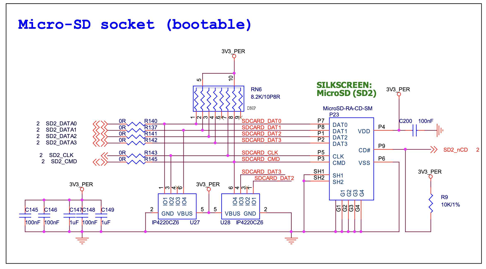
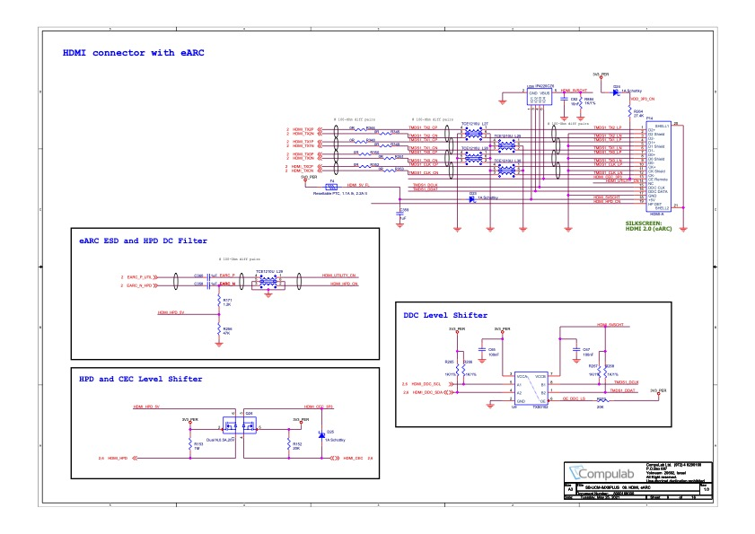

# 919 SoM slot (m.2)

On the way to the 701 board the two 100 pin connectors for i.MX 8M Plus SoM are added to the board. 

## Core Components

- [SB-UCM-iMX8PLUS](https://www.compulab.com/products/computer-on-modules/ucm-imx8m-plus-nxp-i-mx-8m-plus-som-system-on-module-computer/) System-on-Module
- 2 * [Hirose DF40HC(3.0)-100DS-0.4V](https://www.hirose.com/en/product/p/CL0684-4151-0-51) mated height 3.0mm
- 1 * microSD card slot (suggested Molex 5031821852) push-push, compact. [Mouser](https://www.mouser.ch/ProductDetail/Molex/503182-1852?qs=s7UCm7gO1bZmpyAhCKZ26g%3D%3D), [Molex](https://www.molex.com/molex/products/part-detail/memory_card_socket/5031821852)

- 1 * USB2513B USB 2.0 hub controller
- 
- 
- 3 * PCA9555 I/O Expander (#0, #4, #5)
- 6 * [TS5USBC410 Dual 2:1 USB 2.0 Mux/DeMux Switch](../datasheets/USB/ts5usbc41.pdf). [Mouser](https://www.mouser.ch/ProductDetail/Texas-Instruments/TS5USBC410IYFFR?qs=sGAEpiMZZMutXGli8Ay4kPB6XEQFysSpdNErqZgdEYs%3D)

# Adding on SoM

After the SoM is on the board it is time to make a version with m.2 module connectors.

This is how it looks with the modules mounted:

## I/O Expander 4

Expander #4 combines sensor and m.2 control. It is driven by Stem I2C. 

:[I/O Expander 4](../pinouts/I2C_EXPANDER_4.md)

## Wiring

Use this table to ensure correct board wiring.

:[Wiring chips and connectors](./WIRING.md)

### MicroSD

The MicroSD connector is connected to SD2_DATA*, SD2_CLK, SD2_CMD, SD2_nCD on the i.MX8 module.

### Booting 

The board can boot from eMMC / SD or USB.
Boot / Reset buttons are optionally on the T-USB Module.

The board has a power LED driven by VSOM.

### MicroHDMI

The MicroHDMI connector is connected to the HTMI_TX*, HDMI_DDC_*, HDMI_CEC, HDMI_HPD pins from the i.MX8 module.

### Connecting the SB-UCM-iMX8PLUS SoM

The daughter board clicks into the two Hirose 100pin board-to-board connectors.

For further details see [Product Page](https://www.compulab.com/products/computer-on-modules/ucm-imx8m-plus-nxp-i-mx-8m-plus-som-system-on-module-computer/).

The CSI1 & CSI2 are wired from the 100pin connectors to relevant CSI connectors.
The CSI1 lanes are connected to Left CSI.
The CSI2 lanes are connected to Right CSI.
The USB1 and USB2 data will be connected to multiplexers
The 45 pins Debug connector will break out many additional signal lines

- 2 * Hirose 100 pin connectors are used to connect the SoM daughter board

This allows control of IMU and camera module state.

