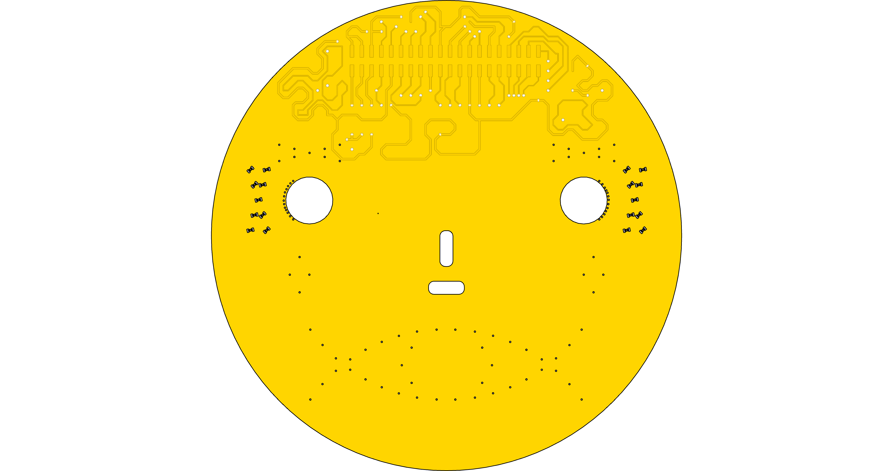
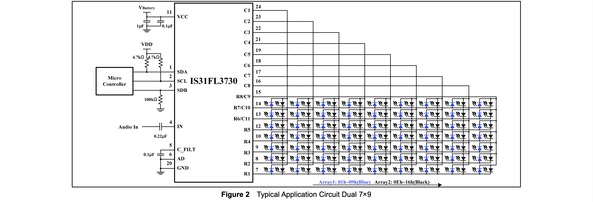

LEDs are laid out as eyebrows and a mouth. They are connected to the multiplexer as 7 sets of 9 LEDs (7x9 mode).
1) Brow x 2
1) Eye sides x 2 (reverse of brow signal)
3) Smile x 2
5) Sad x 2 (reverse of smile signal)
7) Cheeks, split 4 left 4 right.
7) O x 6 (reverse of cheeks)

Numbering of individual LEDs are from top-left to right.
The eyebrow sets are doubled up with the eye side using reverse polarity. The eye sides get signals from VIAs close to the eye hole.

The smile if formed by a left side and a right. LED numbering starts in the middle.
A sad smile uses the same multiplexer banks but with reverse polarity.

LEDs are marked with identifiers on the connector side, but not on the front side.

Leds should be oriented perpendicular to the line they are arranged on. The orientation on the 3D model doesn't reflect what is intended.

### LED Matrix driver

The LEDs are controlled via a IS31FL3730 chip connected to the Stem via STEM I2C.

It can be driven by 2.7V - 5.5V
I/O can be up to Vcc+0.3V

### LED mounting

Most LEDs are mounted by embedding them into the board. The PCB being 1mm thick a recess is made to fit the LED of 0.4mm. In the center a 0.4mm hole is drilled to let through light. We must determine the best way to produce accurate holes for a good fit.
It is essential that the LEDs are placed accurately to have an equal distance between them.

While making the inital prototypes it will be very valuable to create boards that use a variation of LEDs such as yellow vs white.
Variations in the embedding would also be great to test such as how deeply they are recessed or the thickness of the PCB.
Pinhole or not is another variation to test.
