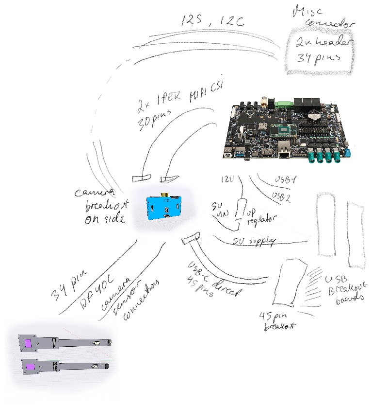

# Upwork task

The 919 is a board facing the user holding daughter boards on the back side.
It contains a Bosch Sensortech 32 bit RISC processor that monitors 3D movement using a gyroscope and accelerometer.
It communicates with the Host MCU via the Stem I2C bus (I2C3 for the MCU daughterboard). 
It connects to a [i.MX 8 SoM](https://www.compulab.com/products/computer-on-modules/ucm-imx8m-plus-nxp-i-mx-8m-plus-som-system-on-module-computer/) main board via various cables. Power is primarily received via the T-USB sub-module.
It has sockets and holes for two camera modules that are also routed to the SoM main board.

A second chip is optional BMM150 to provide a magnetometer.

The 919 is made for experimentation. It will be used to join connected modules,

1) 4 camera connectors for stereo cameras
2) Dual USB-C submodule that provides power and data connectivity.
3) Connectors for i.MX8 SoM
4) Sound modules

## Milestones:

The project is broken down in milestones to ensure a correct design.

### Board diagram and component placement $400

Prove the design by creating a schema, component placement and simple routing with Eagle or Altium.

- Connectors for Cameras, Sound extensions, Power Module, GPIO headers, RTC batt.
- LEDs + Controller
- IMU

Deliverables:

- Diagrams(.sch) + Board layout design files
- Confirmation of BoM
- Collect PCB price estimates from 
- Get production quotes with JLCPCB etc. for 10pc, 100pcs, 1000pcs (assembled and basic)

### Work out embedding of LEDs $300

The LEDs must be recessed in the PCB. Should this be part of the board design for production,
or is it a postprocessing step to CNC the holes?

### Design and Produce - $800

Design the board and produce a test batch based on the specs. Further refinement expected after initial batch.

- Lay out the board
- Ensure the LEDs are recessed
- Produce a batch of populated boards with PCBWay or JLCPCB
- Send me a populated board from the batch
- Do initial testing to find issues

Deliverables:

- Diagrams + Board layout design files
- Send me a populated board from the batch

