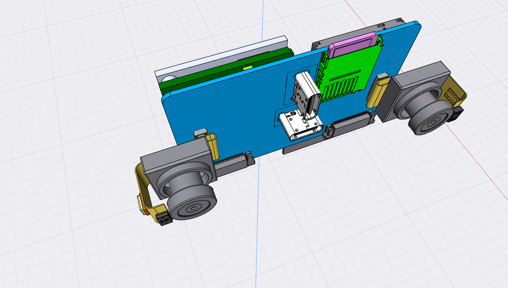

# Dual camera module

The bridge board connects two camera modules that can be run in sync. The modules are largely identical, but do differ.
To support stereo vision as an option the two cameras use the same type of lens in order to capture two images with
the same physical translations.
The plan is to use a fixed lens. Testing so far has not shown auto-focus to be needed.

I assume that all 4 sensors will be on the same SCCB/I2S bus with unique addresses.

Make sure that the module FFC is long enough in the bends so that the lens can be moved forward up to 3mm.
The FoV/Ambient sensor should also have good flex in bends to make it easy to assemble.

### Manufacturer RFQ - OV2735

We are seeking a test batch of 2 * 15pcs custom camera modules with Omnivision OV2735 and additional sensors.
There is a single FFC design and two combinations of sensors to mount.
I'm looking for factory to complete the FFC designs, make the FFCs and mount the components.
We have a camera engineer capable of designing the full camera module, but are open to you doing part of the
design work. We do however want to have a copy of design files for future revisions.

In the supplied material you find

1) Bill of Materials
2) Design Drawing for Camera Module FFC
3) DF40 34pin connector pinout

All the information should be in the attached zip file. The only thing missing is the actual PCB layout. I can ask my engineer to do it, or you can do it. 

- Do you have access to OV2735 datasheets?
- Can you give me a price of producing the test batch with/without me supplying gerber files?

- [OV2735 module details](./OV2735-module/OV2735_CAMERA_MODULE.md) [Module Spec Zip](./OV2735-module.zip)

P.S. This isn't the final design, but only minor tweaks remain.

### Synchronised Dual Image Sensors Diagram (Current Job)

Your task is to help prepare a plan for the module of dual camera modules before sending instructions to Chinese factory
to produce a small batch of 25 - 50 pc.

I am currently looking at OV2732/35, but am open to other suggestions.

The aim of this job is to produce,

- A diagram with two image sensors on their modules and connected to and via the bridge board
- Review the suggestion of [OV2732](./datasheets/OmniVision_OV2732.pdf) or [OV2732](./datasheets/OmniVision_OV2735.pdf)
- Suggestion for sensors with 1080p low light video capture capability. Comment on reasoning.
- Describe what information the factory must supply us such as details from the datasheets or production material details.
- details on which pins to expose to the receiving/controlling MCU
- details on clocks to connect
- suggestion on assembly plan

The output should be of this should be placed in [RGB_CAMERA_MODULE](./RGB_CAMERA_MODULE.md) and 
[IR_CAMERA_MODULE](./IR_CAMERA_MODULE.md) to the extent possible.

Questions to answer:

- It seems viable to have the factory make the FFC with components, but leave the Base+Lens off, 
  and glue this on ourselves. Does this make sense? Would we miss out on factory Lens mounting QA ?
- How much advantage does 1/3" sensor give over 1/4" ?
- If picking two different sensors what qualities would we want to differ ? The two sensors can be 
  different as one is focused on daytime and the other on nighttime.
- By what logic do the two sensors sync the capture ?
  The diagram must connect the two sensors to capture video in sync.
- It might be possible to lay out an FFC design that can be used for both variations of the module by mounting alternate 
  components on each and leaving others unconnected. Is this a good idea as it would require sealing it?
- Do you have suggestions for how to vet and select a factory to make the modules?
- Recucing the number of voltages supplied: Does it save pins? Does it cost more power?
- Should the connector be revised to DF30 / DF37 ?

### Milestone 2

- List of possible places to produce small batches (10 - 100)
- Review the connector pins
- Do full diagram of Sensor module with ToF/Ambient sensors and microphone
- BOM
- Layout and physical design for FFC with connectors
- Requests for info / Instructions for the factory
- Other technical specs needed by factory

### Open points / further tasks

- Testing/QA with/without bridge board
- Check any modifications made by factory and test what they deliver.
- Should we support switching camera frequency in software?
- Microphone LR clock and select. Can we put logic on bridge board to reduce pins?
- Ensure no clash of I2C addresses
- Design for Lens-base alignment holes & backplate
- 

## Flex

The FFC mounts all components on one side. It is folded around to fit the sensors correctly.
Three important slack/flex lengths are added.
1) Parts not used as sensors are not added there
2) 5mm to allow the camera lens to be shorter
3) 3mm slack in both ends allow eye to be pulled forward a bit.

## Sensor

The sensor chosen for the first batch is OV2735, due to the better low light performance of a big sensor. 
In case there are supply constraints [Sony IMX307](./datasheets/IMX307LQD_LQR_Flyer02.pdf) is a 1/2.8" 1080p alternative.

Notable options,

- Omnivision OV2735
- Sony IMX307
- ONsemi AR0239
- Omnivision OV2732

Benefit of OV2732 is ultra low level power mode and FSIN pin for sync.
Benefit of OV2735 is 1/3" size over 1/4".

## Daytime camera (RGB)

The daytime camera sits at the left side and uses a lens with a filter(only letting through visible light).
The sensor is oriented in portrait orientiation to capture people and activity looking down or up at the device.
The lens will capture 120°.
The sensor is connected to CSI1.

On the outside edge(left) of the lens a Time-of-Flight(VL53L1) sensor is attached to scan and capture the depth straight ahead.

The module also contains a MEMS microphone.

## Nighttime camera (IR)

The nighttime camera sits in the right side and uses a lens without a filter(or one that lets through IR).
The sensor is oriented in landscape orientation to capture the widest FoV horizontally. The lens will capture 120°.
The sensor is connected to CSI2.

On the outside edge(right) of the lens an Ambient light(APDS-9960) sensor is attached to sens general level and color of light.

The module also contains a MEMS microphone.

## Modes

The cameras will typically be used one at a time. By default the daytime camera is used, and in low light the nighttime camera.
It must be possible to switch both cameras on and capture in sync(FSIN).
It must be possible to switch off both cameras to save power while still using the Ambient light sensor via I2S.

## Image qualities

The device captures images and low speed video to be consumed by machines. This means that while the captures must be sharp, the color
must not be true. Not for human estethics, but rather for machine interpretation.

Since the images must be processed on device with many algorithms the resolution will never be high. A maximum of 1080p seems to be a good tradeoff.

## Connectors

The module is connected to the bridge board using a Hirose DF40 single eye connector 34/40 pins.

For debugging a separate appendage should be added following the RPi 15 pin 1mm FFC connector, which can be scissored off.

## Components

* OV2732 or similar
* APDS-9960 sensor above IR camera
* VL53L1 sensor above RGB camera [VL53L1CXV0FY/1](https://www.mouser.ch/ProductDetail/STMicroelectronics/VL53L1CXV0FY-1?qs=sGAEpiMZZMv0NwlthflBi2OkhFuYXTGqqSduuKTyV2Y%3D) / in future [VL53L5CXV0GC/1](https://www.mouser.ch/ProductDetail/STMicroelectronics/VL53L5CXV0GC-1?qs=QNEnbhJQKvZPmRJw6ASPyw%3D%3D)
* [CMM-4030D-261-I2S-TR microphone](https://www.cuidevices.com/product/audio/microphones/mems-microphones/cmm-4030d-261-i2s-tr) 
* DF40C-34DP-0.4V(51) Plug (fits into DF40C-34DS-0.4V(51) Receptacle)
* Small battery clip [12BH028-GR](https://eu.mouser.com/ProductDetail/Eagle-Plastic-Devices/12BH028-GR?qs=AQlKX63v8RvfEOo0C5jS5Q%3D%3D)

Alternative

* [Panasonic AXT534124 socket/receptacle]() - [Mouser](https://www.mouser.ch/ProductDetail/Panasonic-Industrial-Devices/AXT534124/?qs=2rFUEsTwVNxdSFw7IuWdSA==)

### SCCB / I2C addresses

- Left Image Sensor
- Right Image Sensor
- APDS-9960
- VL53L1 / VL53L5CXV0GC/1

Omnivision SCCB ID select
0: 0x20 - RGB daytime
1: 0x6C - IR nighttime

Since the image sensors are oriented on the FFC board they can be hardcoded to their ID

## Hirose DF40 single eye connector 34 pins

Toward thin part with microphone and other sensors

1  AF_VDD     Power    Autofocus             3.3V ?
3  AVDD_2V8   Power    Analog 2.8V OUTPUT, Max 500mA
5  AVDD_2V8   Power    Analog 2.8V OUTPUT, Max 500mA
7  DOVDD      Power    Power for I/O circuit, Max 300mA        1.8V
9  Reserved
11 DVDD_1V2   Power    1.2V  ,MAX 300mA                   For OV2718/32/40 Camera            1.2V
13 VCC_1V8    Power    1.8V ,MAX 200mA                                       1.8V
15 I2C_SCL    I/O      I2C1_SCL(pullup resistor 2.2K)                    1.8V         UP
17 I2C_SDA    I/O      I2C1_SDA(pullup resistor 2.2K)                    1.8V         UP
19 MIC SEL               Mic. Left/Right Select             Microphone I2S        1.8V
21 BCLK / SCK            Bit clock line                     Microphone I2S        1.8V
23 WS / LRCLK            Word clock line                    Microphone I2S        1.8V
25 SDATA1                Input data 1                       Microphone I2S        1.8V
27 SDATA2                Input data 2 (NC)                  Microphone I2S        1.8V
29 ATT_INT    Output   Interrupt Attached Sensor, Active L    Interrupts        1.8V?
31 ATT_XSHUT  Input    Attached Sensor XSHUTDOWN                                    1.8V
33 Reserved (NC)         PWM Motor control

Towards image sensors

2  XSHUTDOWN  Input    Camera Reset, Active Low   
4  PWRDN      Input    Camera Power Down
6  CAM_SID    Input    Sensor slave address selection input   (tentative)
8  CAM_FSIN   I/IO     Frame sync input
10 EXTCLK      Input   External Clock Input
12 -                                                                      GND
14 MIPI_CSI_RX_CLKP      MIPI_CSI_RX_CLK+                For Camera     1.8V
16 MIPI_CSI_RX_CLKN      MIPI_CSI_RX_CLK-                For Camera      1.8V
18 -                                                                       GND
20 MIPI_CSI_RX0_D0P      MIPI_CSI_RX_D0+                  For Camera        1.8V
22 MIPI_CSI_RX_D0N       MIPI_CSI_RX_D0-                  For Camera         1.8V
24 -                                                                       GND
26 MIPI_CSI_RX_D1P       MIPI_CSI_RX_D1+                  For Camera            1.8V
28 MIPI_CSI_RX_D1N       MIPI_CSI_RX_D1-                  For Camera            1.8V
30 -                                                                      GND
32 MIPI_CSI_RX_D2P       MIPI_CSI_RX_D2+                  For Camera            1.8V
34 MIPI_CSI_RX_D2N       MIPI_CSI_RX_D2-                  For Camera            1.8V

# OLD NOTES disregard ....

* [Samsung Camera Module Guide](https://www.samsungsem.com/global/product/module/camera-module.do)
* [Tele Camera Module - Vertical 13MP]()
* [M8 Stereo 3D OV4689 USB](http://www.camera-module.com/product/duallenscameramodule/smallest-dual-lens-stereo-3d-camera-module-ov4689.html)
* [Lumia 925 Lens Assembly](http://mynokiablog.com/2013/07/04/pics-detailed-lumia-925-lens-assembly-high-resolution-images/)

* [ArduCam multi-camera solutions](https://www.arducam.com/raspberry-pi-multiple-cameras/)
* [RPi Camera Scheduler](https://www.waveshare.com/wiki/Camera_Scheduler) on [pi Shop](https://www.pi-shop.ch/raspberry-pi-camera-scheduler-one-cable-for-two-cameras)
* [Mira130 1.3MP sensor](https://ams.com/mira130) $11 for sensor

## Sources

- [CMOS Sensor AR0239SRSC15SUEA0-DR AR0239SR AR0239](https://www.alibaba.com/product-detail/CMOS-Sensor-AR0239SRSC15SUEA0-DR-AR0239SR-AR0239_60841576803.html?spm=a2700.galleryofferlist.normal_offer.d_title.32b96131ze8EV2)
- 
- 

**Supplier: Alibaba/britechcam**
we can support OEM service without customization cost by FPC

OV2735 CSI MIPI Auto focus camera module 2mp 1080P HD 

**Supplier: Alibaba/www.sz**
belle@ems-pcba.com
www.szpcbassembly.com
Belle You   Skype: graceyou8  
Whatsapp/wechat/Mobile:+86-15818627443
Tel:86-0755-23146369   Fax:86-0755-23495990
Custom-made PCBA,Hua Xing is more professional.
Address:#4,9 Building,Xiaweiyuan Industrial Park,Gushu Xixiang town, Bao'an district, Shenzhen China. 

This is Belle from Huaxing.
Huaxing focuses on pcb making, components sourcing, pcb assembly for 21years.we are interested in your project,could you please send us your Gerber file and Bom for quotation by mail?my mail is belle@ems-pcba.com

**Supplier: Alibaba/..**
Penny zhang
We are a manufacturer for camera module for 14 years. OEM &ODM are available. More product information, please contact me.

**Supplier: Alibaba/FILM SOURCE ELECTRONICS**
Nancy Meng

FILM SOURCE ELECTRONICS(GUANGDONG)CO.,LTD was founded in 2010 in Shenzhen, Guangzhou, and has been focusing on the camera module industry for more than 10 years. Our company has established long-term cooperation with Gree, Midea, DJI and so on. We can also customize 30w-20w megapixel cameras according to customer requirements. There are currently more than 40 sets of automatic production equipment, 2500 square meters of workshop. Besides, the monthly output reaches more than 800K and the annual tens of millions. Spot issued on the same day, 7 days out of the sample, 12-15 days to deliver large goods. Our company strives for the survival by the quality, strives for the development by the innovation, strives for the prestige by the good faith, aims to provide the low cost, the high-quality camera module products for the customer!

active array size:1920*1080 operating temperature:-30℃-85℃ stable temperature:0℃-60℃ output interface:MIPI sensor type:OV2735 pixel size:3um*3um image area:5808um*3288um maximum image transfer rate:60fps for720p;30fps for 1080p lens size:1/2.7inch Certification:RoHS Additional Function:Video CD production / animation email (MPEG-1 video capture) Screen Size:1.44" Place of Origin:CN Brand Name:Hongjia

**Supplier: Alibaba/SHENZHEN RONGHUA TECHNOLOGY CO.**
Crystal Chen
, LTD YXF INTERNATIONAL (HK) CO., LIMITED Mobile:086-18814131426 We chat:Crystalblingblink Whatsapp:18814131426 QQ:2434908963 Tel: 0755-23816381        Fax: 0755-23984355  Skype / Email : crystal.yxf@outlook.com http://www.yxfic.com

We're manufacturer for camera module and we professional produce 0.3MP~18MP modules. The main application areas: MP4, mobile phone, laptop, tablet pc,the board, visual doorbell, industrial image recognition system, fingerprint identification system ... We could do according to customer's specific requirements. custom products are delivered fast, quality assurance, reasonable price now super-low supply: GC0308,GC2035,GC2145,OV7251,OV7670,OV7675,OV7725,OV7740,OV9281,OV9712,OV9732,OV9655,OV9650,OV9653,OV9734 OV9750,OV2710,OV2715,OV2640,OV2643,OV2655,OV3640,OV4689,OV5640,OV5645,OV5648,OV8865,OV10633, OV13850,IMX135,IMX219,IMX214,AR0103,AR0237,AR0238,AR0330,ASX340CS,MT9V034,NT99141 IMX385 IMX226 IMX482 OV5647 IMX316 OV5675 IMX316 IMX230 OV6946 cameras. Please contact and look forward to cooperating with you. We provide high quality and compatible CMOS Camera Module products for different requests

**Supplier: Alibaba/HJ**
Daisy Dai
FOB Yantian

Dear client,this is HJ, source factory established in 2010.Our products have been successfully exported to Europe, America, South America, Southeast Asia and so on. All of these enable us to provide first-class products and services to meet the requirements of different customers. 
Choose us for better products!

OV2735 1/2.7" color CMOS Camera Module 1080p (1920x1080) HD image sensor automobile data recorder customized Camera Module
Model no. OV2735
Unit price
USD 15.0 /Piece/Pieces
Order quantity
2.0
Product details
sensor:OV2735 FPC Length:53MM size:17*17MM Height:16MM Descriptin:MIPI camera module Lens size:1/2.8" Lens view:100° Payment:Wire Transfer Lead time:Within 7 Working Days FET Type:Not Applicable Type:integrated circuit Place of Origin:CN;GUA Brand Name:HJ D/C:OV2735 Description:OV2735 - camera module Frequency - Switching:/ Power (Watts):/ Operating Temperature:-30°-85° Mounting Type:FPC connector Voltage - Supply (Min):/ Voltage - Supply (Max):/ Voltage - Output:/ Current - Output / Channel:MIPI Frequency:/ Current - Output (Max):/ Current - Supply:/ Voltage - Supply:/ Frequency - Max:/ Power - Max:/ Tolerance:/ Function:DV Voltage Supply - Internal:/ Frequency - Cutoff or Center:/ Current - Leakage (IS(off)) (Max):/ Isolated Power:/ Voltage - Isolation:/ Current - Output High, Low:/ Current - Peak Output:/ Voltage - Forward (Vf) (Typ):/ Current - DC Forward (If) (Max):/ Current Transfer Ratio (Min):/ Current Transfer Ratio (Max):/ Voltage - Output (Max):/ Voltage - Off State:/ Static dV/dt (Min):/ Current - LED Trigger (Ift) (Max):/ Current - On State (It (RMS)) (Max):/ Impedance:/ Impedance - Unbalanced/Balanced:/ LO Frequency:/ RF Frequency:/ Input Range:/ Output Power:/ Frequency Bands (Low / High):/ Size / Dimension:17*17MM Modulation or Protocol:/ Interface:MIPI Power - Output:/ Memory Size:/ Protocol:/ Modulation:/ Serial Interfaces:MIPI GPIO:/ Utilized IC / Part:/ Writable Memory:/ Resistance (Ohms):/ Cross Reference:/

**Supplier: Alibaba/Five Trees**
Lynn Xu
Component distributor Shenzen
https://www.fivetreesic.com
OV2735 sensors

**Supplier: camera-module.com**

Camera Module Technology Limited 
(Shenzhen ChuangMu Technology Co., Ltd)
Address: #2 Floor, Zaimao Industrial Park, Baoji Road, Bantian Street, LongGang District, Shenzhen, 518129, China
Tel: 86-755-8958 3007 
Fax: 86-755-8958 3008
Email: info@camera-module.com
Website: www.camera-module.com

