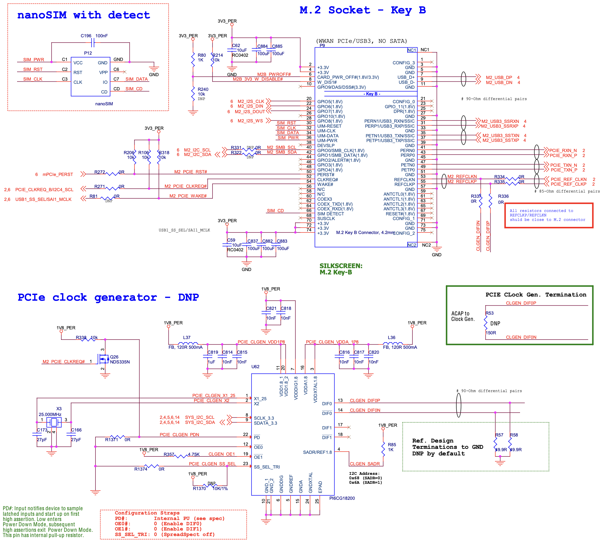

## M.2 Key B Expansion Module

Ziloo has an M.2 type B expansion port for SSD utility cards.

Features:

- 1 Lane PCIe (PExx0)
- USB 3.0 data multiplexed (USB2/Host, PExx1)
- USB 2.0 data multiplexed (USB2/Host)
- GNSS I2C (I2C3)
- MFG I2C (SYS I2C)
- AUDIO I2S MIC SAI5 4 channels (GPIO5..8 and COEX*)
- SPI (ANTCTL*)
- DAS/DSS broken out with activity LED + expander bit
- Additional signals via 16 bit I/O Expander
- Some are broken out with pads near connector (CONFIG 0/2/3, DPR)
- SIM pins are not connected, reserved for now

The USB is connected to T-USB (not the M.2 expansions) on boot to support NVMe SSD expansions by default.
The USB data signals are multiplexed between T-USB Host (USB2) and M.2 Key B based on MUX_USB2_SEL & MUX_USB3_SEL.

Be aware the current pin plan is not final. Input/Ouput such as DIN/DOUT RXD/TXD may be the wrong way around.
It must be verified with reference hardware design/testing.

According to documentation: Type refers to the signal direction:
• Type O means signal is an output from the MPU/MCU to the adapter. 
• Type I means signals is an input to the MPU/MCU from the adapter.

### Control pins mapped by I/O Expander

The system I/O expander controls mPCIe_PERST which resets PCIe.
PCIE_CLKREQ_B is a direct pin on the SoM.
USB1_SS_SEL is a direct pin on the SoM.

TODO consider bootup default state of I/O Expanders. USB must not connect M.2 by default

TODO unallocated/GPIO pins from chipsets

A dedicated I/O Expander controls addition pins on Key B.

:[Expansion I/O Expander #3](./pinouts/I2C_EXPANDER_2.md)

:[M.2 Key B Pin allocations](./pinouts/M2_KEY_B_CONNECTOR.md)

### Reference designs

Congatec reference design

Compulab reference design

## M.2 Key E Expansion Module

Ziloo has an M.2 type E expansion port for Wireless/Bluetooth/GSM utility cards.

Features:

- UART2, UART4
- USB2/USB3 OTG data 
- SD1 SDIO 4bit
- PCIe single lane reserved pins
- JTAG + debugging pins reserved (lay out pads)
- Speaker I2S

### Control pins mapped by I/O Expander

USB2_SS_SEL is a direct pin on the SoM.

TODO consider bootup default state of I/O Expanders. USB must not connect M.2 by default

TODO unallocated/GPIO pins from chipsets

A dedicated I/O Expander controls addition pins on Key E.

:[Expansion I/O Expander #3](./pinouts/I2C_EXPANDER_1.md)

:[M.2 Key E Pin allocations](./pinouts/M2_KEY_E_CONNECTOR.md)

### Reference designs

Congatec reference design

## Future Expansion connection

#### UIM / SIM / eSIM

M.2 Connectors have pins reserved for SIM (UIM) cards. A connector or eSIM may be added in the future.

i.MX 8 only provides PCIe x1 so Key M is not relevant. This leaves A, B and E.

- B is good for USB3, Audio, SATA
- E is good for SDIO, UART and PCM

- [ATP M.2 key info page](https://www.atpinc.com/blog/what-is-m.2-M-B-BM-key-socket-3)
- [Congatec AN43](https://www.congatec.com/fileadmin/user_upload/Documents/Application_Notes/AN43_M.2_Pinout_Descriptions_and_Reference_Designs.pdf)
 
