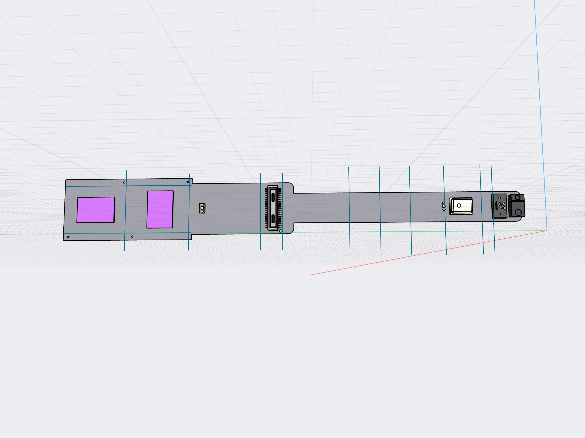
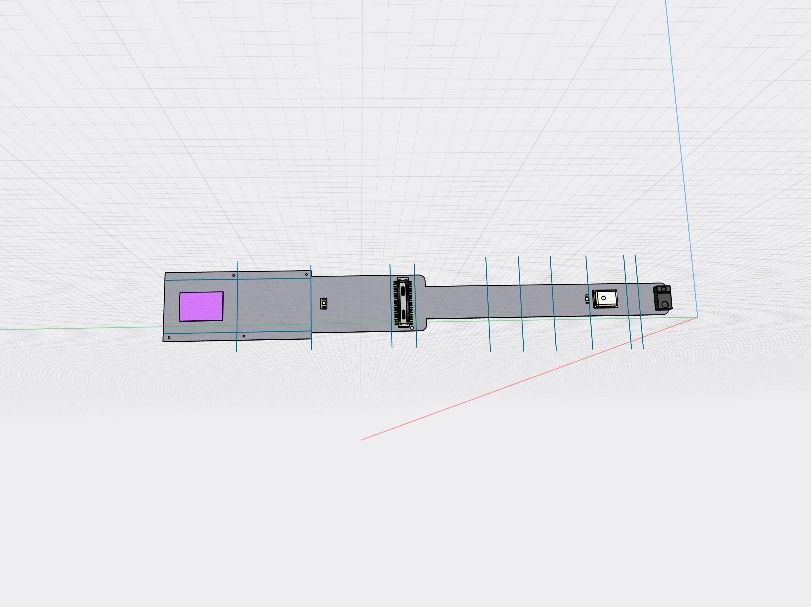
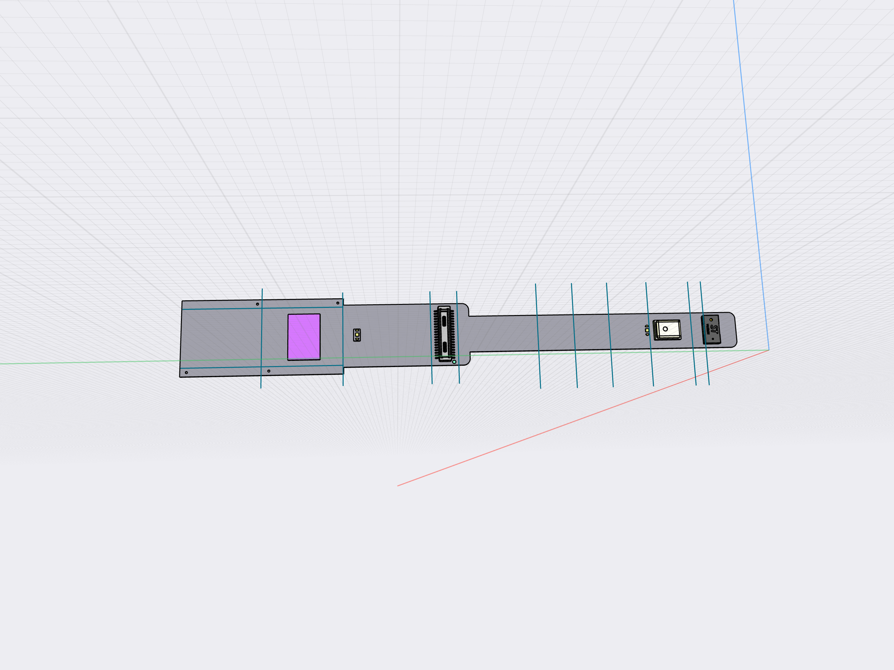

# Camera Module with OV2735

This first production batch will be:

15 pcs of Camera Module ver RGB
15 pcs of Camera Module ver IR

The two version uses the same FPC design with different components mounted.

Version RGB components:

- OV2735 in Portrait slot
- DF40C-34DP-0.4V
- VL53L1
- CMM-4030D-261-I2S-TR

Version IR components:

- OV2735 in Landscape slot
- DF40C-34DP-0.4V
- APDS-9960
- CMM-4030D-261-I2S-TR

A precise drawing of the module is provided. It is essential that the module is shaped and laid out according to the drawing.
A 3D Model is also provided. This should be used for precise reference for placing the components.

## Bill of Materials

- Omnivision OV2735
- Hirose DF40C-34DP-0.4V B2B Plug (header, standard, non-shielded)
- Broadcom APDS-9960 Proximity Light and Gesture Sensors
- ToF sensor VL53L1
- CUI MEMS microphone CMM-4030D-261-I2S-TR
- Additional resistors and capacitors

## Dual camera setup (only one fitted)

The layout include two ways to mount the image sensor. Only one will be mounted at a time.
The pins on both image sensor slots connect directly to eachother and on to the connector.
The current version has mounting holes for one type of M7 base over each of the two sensors.

Ideally the FFC produced should support different sizes of M7/M8/M12 lens bases. This implies more holes.
For this reason the FFC edges in the Image Sensor section must not conduct signal, see drawing.

Module version IR with components

Module version RGB with components

## Time-of-Flight + Ambient sensor

The layout include two additional sensors. Only one will be used at a time

VL53L1 will be combined with image sensor oriented in portrait mode going across the FFC in the RGB version.
APDS-9960 will be combined with image sensor oriented in landscape mode going along the FFC in the IR version.

3a. On the RGB version only VL53L1 is mounted, hence connections are: 2.8V, GND, I2C_SDA, I2C_SCL, ATT_INT, ATT_XSHUT. 
I'm assuming that The OV2735 and VL53L1 can be on the same I2C bus.

3b. On the IR version only APDS-9960 is mounted, hence connections are 2.8V, GND, I2C_SDA, I2C_SCL, ATT_INT. I understand LDR, LED A, LED K as for external IR LED. This sensor is just intended for ambient light measurement. 
If additional functionality is needed I would introduce it through revisions to this sensor module.
I'm assuming that The OV2735 and APDS-9960 can be on the same I2C bus.

## Diagram

Drawing & 3D Model bundled with this spec

- Drawing
- Mounting intructions RGB vs IR (in drawing)
- Portrait/Landscape slots pointed out (drawing)
- 3D rendering

Notations printed on the FFC

- Pin 1 Dot by the connector
- Text: "OV2735" between the two image sensor locations
- Text: "Ziloo 201" in empty area between microphone and connector
- Text: "CAM ID" by the I2CID isles
- Text: "MIC SEL" by the MIC SEL isles
- 

## Layout Schematic

- All sensors are connected to either I2S or I2S bus
- ATT_XSHUT connected to VL53L1
- ATT_INT connected to VL53L1 GPIO1 & APDS-9960 INT
- VL53L1 and APDS-9960 uses 2.8V
- Isles added to allow Mic. Select to be soldered to HIGH(1.8V) or LOW(GND)
- Isles added to allow I2CID. Select to be soldered to HIGH(1.8V) or LOW(GND)
- All connector pins(except NC / Reserved) are connected to components
- The edges around image sensors must not carry signal to allow punching extra holes for lens alignment

## Pinouts: Hirose DF40 single eye connector 34 pins

Toward thin part with microphone and other sensors

| Pin | Code       | Type     | Details                              | Voltage |
|-----|------------|----------|--------------------------------------|---------|
| 1   | AF_VDD     | Power    | Reserved for Autofocus               | 3.3V |
| 2   | AVDD_2V8   | Power    | Analog, Max 500mA                    | 2.8V |
| 3   | DOVDD      | Power    | Power for I/O circuit, Max 500mA     | 1.8V |
| 4   | VCC_1V8    | Power    | 1.8V ,MAX 200mA                      | 1.8V |
| 5   | GND        | Power    | GND                                  |      |
| 6   | CAM_FSIN   | I/O      | Frame sync input                     |      |
| 7   | CAM_STROBE | I/O      | Frame sync output                    |      |
| 8   | EXTCLK     | Input    | External Clock Input (MCLK)          |      |
| 9  | ATT_INT    | Output   | Interrupt Attached Sensor, Active L  | 1.8V? |
| 10  | ATT_XSHUT  | Input    | Attached Sensor XSHUTDOWN            | 1.8V |
| 11  | Reserved   | AF/PWM   | PWM Motor control (NC)               |      |
| 12  | I2C_SCL    | I/O      | I2C1_SCL(pullup resistor 2.2K)       | 1.8V |       
| 13  | I2C_SDA    | I/O      | I2C1_SDA(pullup resistor 2.2K)       | 1.8V |        
| 14  | BCLK / SCK | I2S      | Bit clock line                       | 1.8V |
| 15  | WS / LRCLK | I2S      | Word clock line                      | 1.8V |
| 16  | SDATA1     | I2S      | Input data 1                         | 1.8V |
| 17  | SDATA2     | I2S      | Input data 2 (NC)                    | 1.8V |

Towards image sensors

| Pin | Code       | Type     | Details                              | Voltage |
|-----|------------|----------|--------------------------------------|---------|
| 34  | AGND       |  Power   | Analog ground                        |         |
| 33  | RESET      | Input    | Camera Reset, Active Low (RSTB)      |         |
| 32  | PWRDN      | Input    | Camera Power Down                    |         |
| 31  | Reserved   |          |                                      |         |
| 30  | Reserved   |          |                                      |         |
| 29  | -          |          | GND                                  |         |
| 28  | CSI_RX_D0P | Camera   | MIPI_CSI_RX_D0+                      | 1.8V    |
| 27  | CSI_RX_D0N | Camera   | MIPI_CSI_RX_D0-                      | 1.8V    |
| 26  | -          |          | GND                                  |         |
| 25  | CSI_RX_D1P | Camera   | MIPI_CSI_RX_D1+                      | 1.8V    |
| 24  | CSI_RX_D1N | Camera   | MIPI_CSI_RX_D1-                      | 1.8V    |
| 23  | -          |          | GND                                  |         |
| 22  | CSI_RX_D2P | Camera   | MIPI_CSI_RX_D2+                      | 1.8V    |
| 21  | CSI_RX_D2N | Camera   | MIPI_CSI_RX_D2-                      | 1.8V    |
| 20  | -          |          | GND                                  |         |
| 19  | CSI_RX_CLKP| Camera   | MIPI_CSI_RX_CLK+                     | 1.8V    |
| 18  | CSI_RX_CLKN| Camera   | MIPI_CSI_RX_CLK-                     | 1.8V    |

### Recent changes

I realised that the misunderstanding on connector layout was the numbering scheme.

* Extra ground pins added
* The pin numbers corrected to make connector layout clear
* I2S is 1.8V, the microphone must connect to 1.8V
* No need to use 3.3V in the design

## THIS IS NOT THE LAYOUT !!!

Toward thin part with microphone and other sensors

| Pin | Code       | Type     | Details                              | Voltage |
|-----|------------|----------|--------------------------------------|---------|
| 1   | AF_VDD     | Power    | Reserved for Autofocus               | 3.3V    |
| 2   | AGND       |  Power   | Analog ground                        |         |
| 3   | AVDD_2V8   | Power    | Analog, Max 500mA                    | 2.8V    |
| 4   | RESET      | Input    | Camera Reset, Active Low (RSTB)      |         |
| 5   | DOVDD      | Power    | Power for I/O circuit, Max 500mA     | 1.8V    |
| 6   | CAM_PWRDN  | Input    | Camera Power Down                    |         |
| 7   | VCC_1V8    | Power    | 1.8V ,MAX 200mA                      | 1.8V    |
| 8   | Reserved   |          |                                      |         |
| 9   | Reserved   |          |                                      |         |
| 10  | Reserved   |          |                                      |         |
| 11  | CAM_FSIN   | I/O      | Frame sync input                     |         |
| 12  | Reserved   | AF/PWM   | PWM Motor control (NC)               |         |
| 13  | CAM_STROBE | I/O      | Frame sync output                    |         |
| 14  | CSI_RX_D0P | Camera   | MIPI_CSI_RX_D0+                      | 1.8V    |
| 15  | EXTCLK     | Input    | External Clock Input (MCLK)          |         |
| 16  | CSI_RX_D0N | Camera   | MIPI_CSI_RX_D0-                      | 1.8V    |
| 17  | ATT_INT    | Output   | Interrupt Attached Sensor, Active L  | 1.8V?   |

Towards image sensors

| Pin | Code       | Type     | Details                              | Voltage |
|-----|------------|----------|--------------------------------------|---------|
| 18  | -          |          | GND                                  |         |
| 19  | ATT_XSHUT  | Input    | Attached Sensor XSHUTDOWN            | 1.8V    |
| 20  | CSI_RX_D1P | Camera   | MIPI_CSI_RX_D1+                      | 1.8V    |
| 21  | Reserved   | Power    |                                      |         |
| 22  | CSI_RX_D1N | Camera   | MIPI_CSI_RX_D1-                      | 1.8V    |
| 23  | I2C_SCL    | I/O      | I2C1_SCL(pullup resistor 2.2K)       | 1.8V    |       
| 24  | -          |          | GND                                  |         |
| 25  | I2C_SDA    | I/O      | I2C1_SDA(pullup resistor 2.2K)       | 1.8V    |        
| 26  | CSI_RX_D2P | Camera   | MIPI_CSI_RX_D2+                      | 1.8V    |
| 27  | BCLK / SCK | I2S      | Bit clock line                       | 1.8V    |
| 28  | CSI_RX_D2N | Camera   | MIPI_CSI_RX_D2-                      | 1.8V    |
| 29  | WS / LRCLK | I2S      | Word clock line                      | 1.8V    |
| 30  | -          |          | GND                                  |         |
| 31  | SDATA1     | I2S      | Input data 1                         | 1.8V    |
| 32  | CSI_RX_CLKP| Camera   | MIPI_CSI_RX_CLK+                     | 1.8V    |
| 33  | SDATA2     | I2S      | Input data 2 (NC)                    | 1.8V    |
| 34  | CSI_RX_CLKN| Camera   | MIPI_CSI_RX_CLK-                     | 1.8V    |
