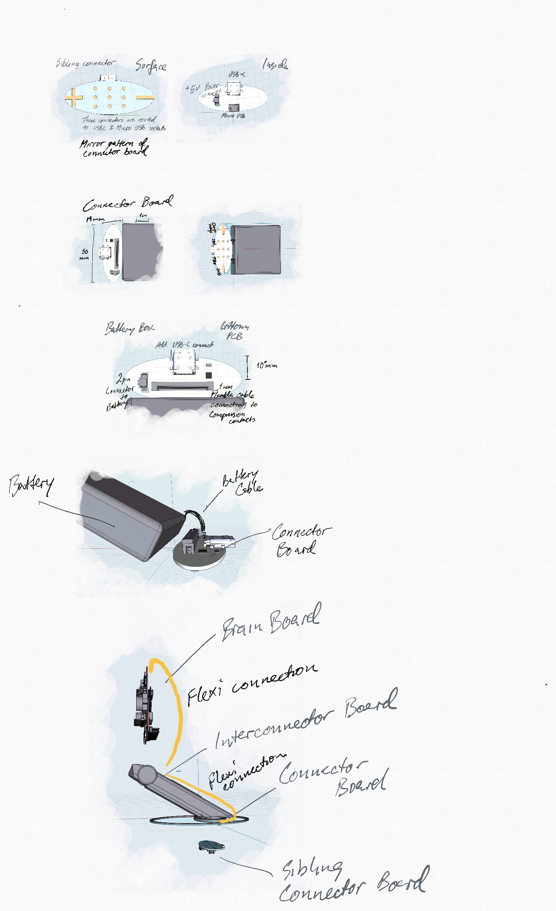

## Power Module

The power module is a battery pack that is made to stand on top of a charging stand.

The board has USB connections for surface connection. A USB-C connector is a development time alternative.

- [Upwork job](./Upwork.md)
- [Type of Battery](./BATTERY.md)
- [Bottom Board](./BOTTOM_BOARD.md)
- [Sibling Board](./SIBLING_BOARD.md)
- [Slide-in Board](./SLIDE-IN_BOARD.md)
- [Connectors](./CONNECTORS.md)

