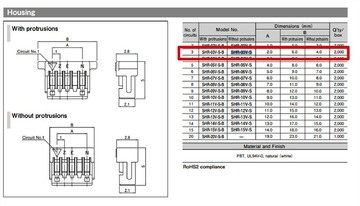

We have an issue with the manufacturing price.
Right now I have quotations from a couple of companies and the price is approximate 800$ - 1100$ it is a cost for the PCB and assembly. We will have 10 PCB boards with 3 assembled.

I am wondering if this is the price that is normal for you?

I was trying to make it cheaper, but the package that has MAX77860 doesn't allow me to do this. Design requires "via in pad" and "blind via" which increases the price significantly.

I need your opinion to decide what to do next, trying to lower costs of the PCB(but I can't predict how much time it make take) or order it and test?

I thinking one time more and realize that switching to another chip will only cause the losing more time and money so I think we need to order. Because money and time which we save on manufacturing we will spend on developing.

Yes I will send 2 PCB to you, one I will left for me if we will need to figure out any issue, after you check it and they will work proper I may send it also to you but later.

For this moment I did the aditional wires and fixture for testing the PCB works, you may see them on the photo. I will sent 1 set to you, but for the first testing of the PCB you will need to buy 2 things:
1. MAX77860EVKIT https://eu.mouser.com/ProductDetail/Maxim-Integrated/MAX77860EVKIT?qs=%2Fha2pyFadugu5ENo7u8%252Bdppd4Gve%2FW8UUp7YZHVw1aMOk8bUTI3KwQ%3D%3D - this one you need to have access to the MAX77860 registers for configuration it.
2. Battery with 3 wires - i can't send you the battery, the post companny doeasn't allow me to do this. You may buy it here: I will prepare wires to connect it. https://www.ebay.com/itm/184854611075?hash=item2b0a318483:g:NuoAAOSw2QxcmEug - you may buy anywhere, but then please share link with me I will prepare wires for easily connect the battery.

For this moment, charger work and USB2.0, I need to check the USB3.0 and the max load current capabilities.

I will add the manufacturing cost(804$) offline in the Upwork.

Alex Sarnok:

Hello Henrik,
I found out that link in amazon has wrong information about battery's connector.
That is SH connector, not PH connector.
Here is link and datasheet for this connector(https://www.jst.com/products/crimp-style-connectors-wire-to-board-type/sh-connector/)
But, I recommend you to use connector, that I sent you and solder it with battery.

