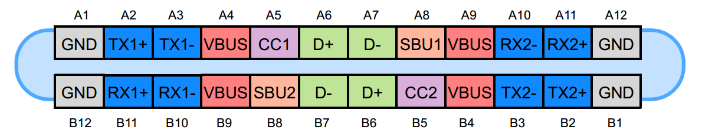
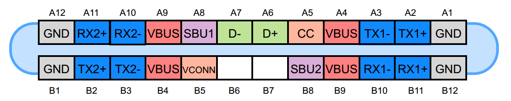

Only **one side** of the connectors are connected to the matching USB connector that leads to the Dev Board.

The following pins are connected to the extras connector: TX2+, TX2-, SBU1, SBU2, RX-, RX1+, DX+, DX-

The following pins are treated as normally USB-C connection pins: A1-A7, A9-A12, B5.

The GND/VBUS pins are connected to the power charging circuit as normal. The system should accept
charging power from either connector.

No.  Pin   Description

1	 A1	   GND
2	 A2	   TX1+
3	 A3	   TX1-
4	 A4	   VBUS
5	 A5	   CC1
6	 A6	   D+
7	 A7	   D-
8	 A8	   SBU1 (extras)
9	 A9	   VBUS
10	 A10   RX2-
11	 A11   RX2+
12	 A12   GND

13	 B1	   GND
14	 B2	   TX2+ (extras)
15	 B3	   TX2- (extras)
16	 B4	   VBUS
17	 B5	   CC2
18	 B6	   DX+ (extras)
19	 B7	   DX- (extras)
20	 B8	   SBU2 (extras)
21	 B9	   VBUS
22	 B10   RX1- (extras)
23	 B11   RX1+ (extras)
24	 B12   GND

The USB Type-C connector has 24 pins. Figures 1 and 2, respectively, show the pins for the USB Type-C receptacle and plug.

Figure 1. The USB Type-C receptacle. Image courtesy of [Microchip](http://ww1.microchip.com/downloads/en/appnotes/00001953a.pdf).

Figure 1. The USB Type-C plug. Image courtesy of [Microchip](http://ww1.microchip.com/downloads/en/appnotes/00001953a.pdf).
