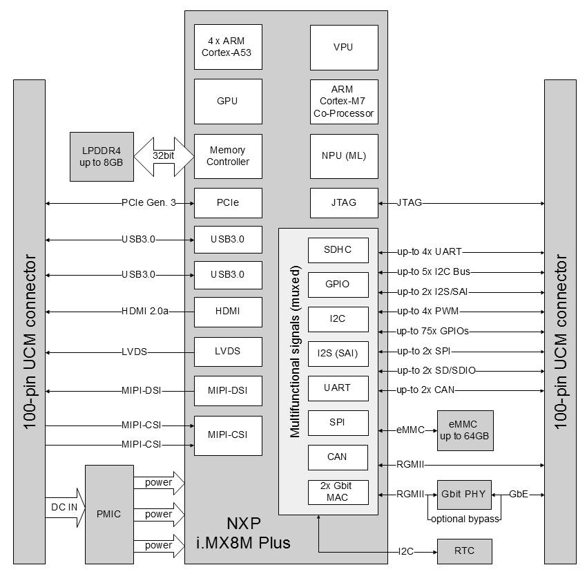

# Pin Allocations

The Misc connectors are used to route additional busses to the bridge board.
To enable this FLEXCAN and ENET1 are re-mapped to other ports. LVDS isn't used, but only I2C3 can be mapped.

The mapping is also captured in [Hookups](./datasheets/i.MX8/ucm-imx8plus_p1_p2_hookups.pdf)

Misc connector P20

| no | PX pin  | Pad connected       | Functionality     | Mode
|----|---------|---------------------|-------------------|------
| 1  | P1.74   | UART2_TXD           |                   |
| 3  | P1.76   | UART2_RXD           |                   |
| 5  | P1.77   | PWM1_OUT            |                   |
| 7  |         | 3V3_PER             |                   |
| 9  | P1.72   | UART1_TXD           |                   |
| 11 | P1.19   | UART1_RXD           |                   |
| 13 | P2.62   | SD1_RESET_B         |                   |
| 15 | P2.68   | ~~ENET1_MDC~~       | SD1_CLK / GPIO2_0 |
| 17 | P2.70   | ~~ENET1_MDIO~~      | SD1_CMD / GPIO2_1 |
| 19 | P2.53   | ~~ENET1_RX_CTL~~    | SAI5_TXFS         |
| 21 | P2.41   | ~~ENET1_RD0~~       | I2C4_SCL          |
| 23 | P2.43   | ~~ENET1_RD1~~       | I2C4_SDA          |
| 25 | P2.45   | ~~ENET1_RD2~~       | GPIO4_8           |
| 27 | P2.47   | ~~ENET1_RD3~~       | GPIO4_9           |
| 29 | P2.55   | ~~ENET1_RXC~~       | SAI5_TXC          |
| 31 |         | GND                 |                   |
| 33 | P1.94   | I2C3_SCL            | GPIO, I2C, PWM    |

| no | PX pin  | Pad connected       | Functionality     | Mode
|----|---------|---------------------|-------------------|------
| 2  | P1.61   | UART3_TXD           |                   |
| 4  | P1.21   | UART3_RXD           |                   |
| 6  |         | 5V0_PER             |                   |
| 8  | P1.86   | UART4_TXD           |                   |
| 10 | P1.84   | UART4_RXD           |                   |
| 12 | P1.59   | GPIO1_00            |                   |
| 14 | P1.98   | GPIO1_01            |                   |
| 16 | P2.76 ? | ~~ENET1_nRST~~      |                   |
| 18 | P2.88 ? | ~~ENET1_INT~~       |                   |
| 20 | P2.67   | ~~ENET1_TX_CTL~~    | GPIO4_16          |
| 22 | P2.59   | ~~ENET1_TD0~~       | SD1_D1 / GPIO2_3  |
| 24 | P2.61   | ~~ENET1_TD1~~       | SD1_D0 / GPIO2_2  |
| 26 | P2.63   | ~~ENET1_TD2~~       | SAI5_TXD2         |
| 28 | P2.65   | ~~ENET1_TD3~~       | SAI5_TXD3         |
| 30 | P2.69   | ~~ENET1_TXC~~       | GPIO4_17          |
| 32 |         | GND                 |                   |
| 34 |         | I2C3_SDA            | GPIO, I2C, PWM    |

Misc connector P21

| no | PX pin  | Pad connected       | Functionality     | Mode
|----|---------|---------------------|-------------------|------
| 1  | P1.96   | I2C5_SDA            |                   |
| 3  | P1.100  |  I2C5_SCL           |                   |
| 5  | P1.99   |  SYS_I2C_SDA        |                   |
| 7  | P1.97   |  SYS_I2C_SCL        |                   |
| 9  |         |  GND                |                   |
| 11 | P1.26   |  SAI3_TXD           |  SAI5_RX_DATA3    | ALT2
| 13 | P1.36   |  SAI3_TXC           |  SAI5_RX_DATA2    | ALT2
| 15 | P1.30   |  SAI3_MCLK          |  SAI5_MCLK        | ALT2
| 17 | P1.28   |  SAI3_RXD           |  SAI5_RX_DATA0    | ALT2
| 19 | P1.32   |  SAI3_RXC           |  SAI5_RXC         | ALT2
| 21 | P1.38   |  SAI3_TXFS          |  SAI5_RX_DATA1    | ALT2
| 23 | P1.34   |  SAI3_RXFS          |  SAI5_RX_SYNC     | ALT2
| 25 | P1.92   |  HDMI_HPD           |                   |
| 27 | P2.77   |  ENET TD2_BYPASS    |                   |
| 29 | P1.70   |  HDMI_DDC_SCL       |                   |
| 31 | P1.63   |  HDMI_DDC_SDA       |                   |
| 33 | P1.85   |  HDMI_CEC           |                   |

| no | PX pin  | Pad connected       | Functionality     | Mode
|----|---------|---------------------|-------------------|------
| 2  | P1.87   |   I2C6_SCL          |                   |
| 4  | P1.89   |   I2C6_SDA          |                   |
| 6  |         |   GND               |                   |
| 8  | P1.33   |  ~~CAN2_TX~~        | SAI5_TXD3         |
| 10 | P1.49   |  ~~CAN2_RX~~        |                   |
| 12 | P1.51   |  ~~CAN1_RX~~        | SAI5_TXD2         |
| 14 | P1.53   |  ~~CAN1_TX~~        | SAI5_TXC          |
| 16 | P2.51   |  SD2_nRST           |                   |
| 18 | P1.95   |  QSPI_BOOT_EN_3P3   |                   |
| 20 | P2.90   |  PCIE_CLKREQ_B      |                   |
| 22 | P2.89   |  ECSPI2_MISO        |                   |
| 24 | P2.91   |  ECSPI2_SS0         |                   |
| 26 | P2.93   |  ECSPI2_SCLK        |                   |
| 28 | P2.95   |  ECSPI2_MOSI        |                   |
| 30 | P2.60   |  USB1_TCPC_nINT     |                   |
| 32 | P2.52   |  USB1_SS_SEL        |                   |
| 34 | P2.60   |GPIO4_12 / SAI5_TXD0 | SAI5_TXD0        |

## I2C

- SYS I2C (aka I2C2) for RTC and EEPROM
- CSI1 I2C5
- CSI2 I2C6
- DSI LCD I2C2
- I2C3 free (Default used by LVDS), but also for M.2 connector.
- I2C4 taken up by PCIe CLKREQ_B

## UART

- UART1 can be used for GPIO, but left at default UART mapping.
- UART2 is reserved for A53 core debug
- UART3 can be used for GPIO, but left at default UART mapping.
- UART4 is reserved for M7 core debug

## PWM

PWM2 can be routed to SPDIF_RX (ALT1)
PWM3 can be routed to SPDIF_TX (ALT1)

I2C3 could be remapped to PWM3_OUT and PWM4_OUT, or to GPIOs. (note: Mapped to M.2)

## Serial Audio Interface 5 / I2S

SAI 5 is used for microphone inputs. Up to 8 microphones can be connected
as 4 lane stereo. DATA0 is connected to microphones in camera modules
via the SAI3_RXD pad on Misc connector.

SAI 5 outputs are also reserved taking up CAN & ENET1 pads. This give 4 lane stereo out.

Remapping SAI5 to Misc. connector  pin pads

- TXC, TXFS,
- TX0..3
- RXC, RXFS, MCLK
- RXD0..3

