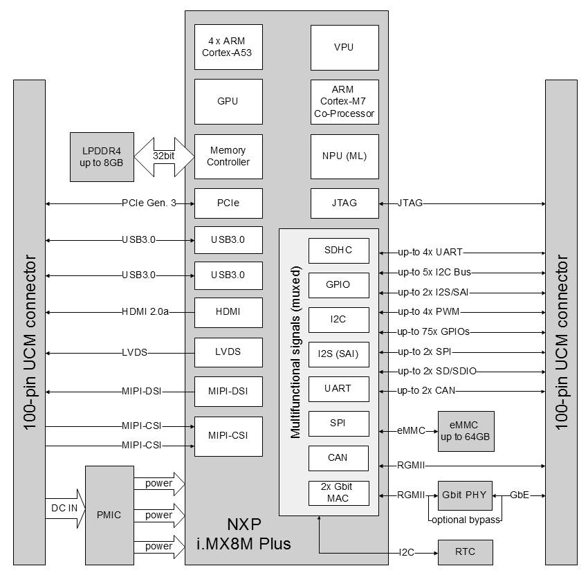

# UCM iMX8M Pin Allocations

The model of SoM used isn't the E version. This means that the ethernet port only support 100Mbit.

The Misc connectors are used to route additional busses to the bridge board.
To enable this FLEXCAN and ENET1 are re-mapped to other ports. LVDS isn't used, but only I2C3 can be mapped.

The mapping is also captured in [Hookups](./datasheets/i.MX8/ucm-imx8plus_p1_p2_hookups.pdf)

### M7 system mastering

The M7 core can interface and upgrade parts of the system

- USB 2.0 to M.2 modules for BLE/WiFi access
- UART1/UART3 for uploading firmware to MSP430 Expanders
- Using picoprobe debugging the MSP430 Expanders
- UART2 for accessing LPWAN/BLE on M.2 modules
-  

### P1 function allocation

| Misc   | PX pin  | Pad connected       | Functionality     |
|--------|---------|---------------------|-------------------|
| P20.11 | P1.19   | UART1_RXD           |                   |
| P20.4  | P1.21   | UART3_RXD           |                   |
| P21.11 | P1.26   |  SAI3_TXD           |  SAI5_RX_DATA3    |       
| P21.17 | P1.28   |  SAI3_RXD           |  SAI5_RX_DATA0    |       
| P21.15 | P1.30   |  SAI3_MCLK          |  SAI5_MCLK        |       
| P21.19 | P1.32   |  SAI3_RXC           |  SAI5_RXC         |       
| P21.8  | P1.33   |  CAN2_TX            |  CAN2_TX          |      
| P21.23 | P1.34   |  SAI3_RXFS          |  SAI5_RX_SYNC     |       
| P21.13 | P1.36   |  SAI3_TXC           |  SAI5_RX_DATA2    |        
| P21.21 | P1.38   |  SAI3_TXFS          |  SAI5_RX_DATA1    |        
| P21.10 | P1.49   |  CAN2_RX            | CAN2_RX           |       
| P21.12 | P1.51   |  CAN1_RX            | CAN1_RX           |       
| P21.14 | P1.53   |  CAN1_TX            | CAN1_TX           |       
| P20.12 | P1.59   | GPIO1_IO00          | SOUND_INT        |
|        | P1.60   | GPIO4_IO19          | SYS_EX_nINT       |
| P20.2  | P1.61   | UART3_TXD           |                   |
| P21.31 | P1.63   |  HDMI_DDC_SDA       |                   |      
| P21.29 | P1.70   |  HDMI_DDC_SCL       |                   |      
| P20.9  | P1.72   | UART1_TXD           |                   |
| P20.1  | P1.74   | UART2_TXD           |                   |
| P20.3  | P1.76   | UART2_RXD           |                   |
| P20.5  | P1.77   | PWM1_OUT            |                   |
|        | P1.79   | PWM2_OUT            |                   |
|        | P1.81   | PWM3_OUT            |                   |
| P20.10 | P1.84   | UART4_RXD           |                   |
|        | P1.85   | HDMI_CEC            |                   |
| P20.8  | P1.86   | UART4_TXD           |                   |
| P21.2  | P1.87   |   I2C6_SCL          |                   |       
| P21.4  | P1.89   |   I2C6_SDA          |                   |      
|        | P1.91   | I2C3_SDA            |                   |
|        | P1.85   | HDMI_HPD            |                   |
| P20.33 | P1.94   | I2C3_SCL            |                   |
| P21.1  | P1.96   | I2C5_SDA            |                   |       
| P20.14 | P1.98   | GPIO1_01            | STEM_INT          |
| P21.3  | P1.100  |  I2C5_SCL           |                   |      

### P2 function allocation

| Misc   | PX pin  | Pad connected       | Functionality     | 
|--------|---------|---------------------|-------------------|
| P20.21 | P2.41   | ~~ENET1_RD0~~       | SD1_DATA2         |
| P20.23 | P2.43   | ~~ENET1_RD1~~       | SD1_DATA3         |
| P20.25 | P2.45   | ~~ENET1_RD2~~       | OE_SOUND          |
| P20.27 | P2.47   | ~~ENET1_RD3~~       | OE_CAM            |
|        | P2.49   |  GPIO2_IO20         | TOUCH_nINT        |       
| P21.16 | P2.51   | GPIO2_IO19          | SD2_nRST          |       
| P21.32 | P2.52   | GPIO4_IO20          | PCIE_WAKE_B       |      
| P20.19 | P2.53   | ~~ENET1_RX_CTL~~    | SAI5_TXFS         |
| P20.29 | P2.55   | ~~ENET1_RXC~~       | SAI5_TXC          |
| P20.22 | P2.59   | ~~ENET1_TD0~~       | SD1_DATA1         |
| P21.34 | P2.60   | GPIO4_12            | SAI5_TXD0         |      
| P20.24 | P2.61   | ~~ENET1_TD1~~       | SD1_DATA0         |
| P20.13 | P2.62   | GPIO2_IO10          | SD1_RESET_B       |
| P20.26 | P2.63   | ~~ENET1_TD2~~       | SAI5_TXD2         |
| P20.28 | P2.65   | ~~ENET1_TD3~~       | SAI5_TXD3         |
| P20.20 | P2.67   | ~~ENET1_TX_CTL~~    | MCU_SYS_INT       |
| P20.15 | P2.68   | ~~ENET1_MDC~~       | SD1_CLK           |
| P20.30 | P2.69   | ~~ENET1_TXC~~       | SYS_PRG#          |
| P20.17 | P2.70   | ~~ENET1_MDIO~~      | SD1_CMD           |
| P20.16 | P2.76   | ~~ENET1_nRST~~      | SAI5_TXD1         |
| P21.27 | P2.77   |  ENET TD2_BYPASS    |                   |       
| P20.18 | P2.88   | ~~ENET1_INT~~       | COEX (Key B)      |
| P21.22 | P2.89   |  ECSPI2_MISO        |                   |       
| P21.20 | P2.90   |  PCIE_CLKREQ_B      |                   |       
| P21.24 | P2.91   |  ECSPI2_SS0         |                   |       
|        | P2.92   | SD2_nCD             |                   |       
| P21.26 | P2.93   |  ECSPI2_SCLK        |                   |       
|        | P2.94   | SD2_DATA2           |                   |
| P21.28 | P2.95   |  ECSPI2_MOSI        |                   |       
|        | P2.96   | SD2_CLK             |                   |
|        | P2.97   | SD2_DATA0           |                   |
|        | P2.98   | SD2_DATA3           |                   |
|        | P2.99   | SD2_DATA1           |                   |
|        | P2.100  | SD2_CMD             |                   |

## Switching to non-E version without ENET0

The following pins would become available

## I2C

- SYS I2C (aka I2C2) for RTC and EEPROM
- CSI1 I2C5
- CSI2 I2C6
- I2C3 free (Default used by LVDS), but also for M.2 connector.

## UART

- UART1 can be used for GPIO, but left at default UART mapping.
- UART2 is reserved for A53 core debug
- UART3 can be used for GPIO, but left at default UART mapping.
- UART4 is reserved for M7 core debug

## PWM

- PWM2 can be routed to SPDIF_RX (ALT1)
- PWM3 can be routed to SPDIF_TX (ALT1)

## Serial Audio Interface 5 / I2S

SAI 5 is used for microphone inputs. Up to 8 microphones can be connected
as 4 lane stereo. DATA0 is connected to microphones in camera modules
via the SAI3_RXD pad on Misc connector.

SAI 5 outputs are also reserved taking up ENET1 pads. This give 4 lane stereo out.

Remapping SAI5 to Misc. connector  pin pads

- TXC, TXFS,
- TX0..3
- RXC, RXFS, MCLK
- RXD0..3

