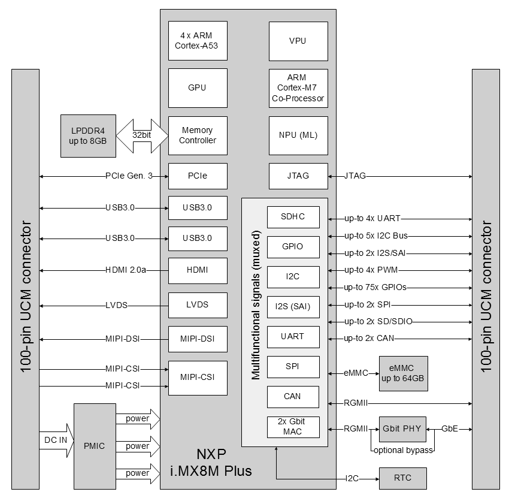

# UCM iMX8M Pin Allocations

The model of SoM used isn't the E version. This means that the ethernet port only support 100Mbit.

The Misc connectors are used to route additional busses to the bridge board.
To enable this FLEXCAN and ENET1 are re-mapped to other ports. LVDS isn't used, but only I2C3 can be mapped.

The mapping is also captured in [Hookups](./datasheets/i.MX8/ucm-imx8plus_p1_p2_hookups.pdf)

### M7 system mastering

The M7 core can interface and upgrade parts of the system

- USB 2.0 to M.2 modules for BLE/WiFi access
- UART1/UART3 for uploading firmware to MSP430 Expanders
- Using picoprobe debugging the MSP430 Expanders
- UART2 for accessing LPWAN/BLE on M.2 modules
-  

### P1 function allocation

| Misc   | PX pin  | Pad connected       | Functionality     |
|--------|---------|---------------------|-------------------|
| P20.11 | P1.19   | UART1_RXD           |                   |
| P20.4  | P1.21   | UART3_RXD           |                   |
| P21.11 | P1.26   |  SAI3_TXD           |  SAI5_RX_DATA3    |       
| P21.17 | P1.28   |  SAI3_RXD           |  SAI5_RX_DATA0    |       
| P21.15 | P1.30   |  SAI3_MCLK          |  SAI5_MCLK        |       
| P21.19 | P1.32   |  SAI3_RXC           |  SAI5_RXC         |       
| P21.8  | P1.33   |  CAN2_TX            |  CAN2_TX          |      
| P21.23 | P1.34   |  SAI3_RXFS          |  SAI5_RX_SYNC     |       
| P21.13 | P1.36   |  SAI3_TXC           |  SAI5_RX_DATA2    |        
| P21.21 | P1.38   |  SAI3_TXFS          |  SAI5_RX_DATA1    |        
| P21.10 | P1.49   |  CAN2_RX            | CAN2_RX           |       
| P21.12 | P1.51   |  CAN1_RX            | CAN1_RX           |       
| P21.14 | P1.53   |  CAN1_TX            | CAN1_TX           |       
| P20.12 | P1.59   | GPIO1_IO00          | SOUND_INT        |
|        | P1.60   | GPIO4_IO19          | SYS_EX_nINT       |
| P20.2  | P1.61   | UART3_TXD           |                   |
| P21.31 | P1.63   |  HDMI_DDC_SDA       |                   |      
| P21.29 | P1.70   |  HDMI_DDC_SCL       |                   |      
| P20.9  | P1.72   | UART1_TXD           |                   |
| P20.1  | P1.74   | UART2_TXD           |                   |
| P20.3  | P1.76   | UART2_RXD           |                   |
| P20.5  | P1.77   | PWM1_OUT            |                   |
|        | P1.79   | PWM2_OUT            |                   |
|        | P1.81   | PWM3_OUT            |                   |
| P20.10 | P1.84   | UART4_RXD           |                   |
|        | P1.85   | HDMI_CEC            |                   |
| P20.8  | P1.86   | UART4_TXD           |                   |
| P21.2  | P1.87   |   I2C6_SCL          |                   |       
| P21.4  | P1.89   |   I2C6_SDA          |                   |      
|        | P1.91   | I2C3_SDA            |                   |
|        | P1.85   | HDMI_HPD            |                   |
| P20.33 | P1.94   | I2C3_SCL            |                   |
| P21.1  | P1.96   | I2C5_SDA            |                   |       
| P20.14 | P1.98   | GPIO1_01            | STEM_INT          |
| P21.3  | P1.100  |  I2C5_SCL           |                   |      

### P2 function allocation

| Misc   | PX pin  | Pad connected       | Functionality     | 
|--------|---------|---------------------|-------------------|
| P20.21 | P2.41   | ~~ENET1_RD0~~       | SD1_DATA2         |
| P20.23 | P2.43   | ~~ENET1_RD1~~       | SD1_DATA3         |
| P20.25 | P2.45   | ~~ENET1_RD2~~       | OE_SOUND          |
| P20.27 | P2.47   | ~~ENET1_RD3~~       | OE_CAM            |
|        | P2.49   |  GPIO2_IO20         | TOUCH_nINT        |       
| P21.16 | P2.51   | GPIO2_IO19          | SD2_nRST          |       
| P21.32 | P2.52   | GPIO4_IO20          | PCIE_WAKE_B       |      
| P20.19 | P2.53   | ~~ENET1_RX_CTL~~    | SAI5_TXFS         |
| P20.29 | P2.55   | ~~ENET1_RXC~~       | SAI5_TXC          |
| P20.22 | P2.59   | ~~ENET1_TD0~~       | SD1_DATA1         |
| P21.34 | P2.60   | GPIO4_12            | SAI5_TXD0         |      
| P20.24 | P2.61   | ~~ENET1_TD1~~       | SD1_DATA0         |
| P20.13 | P2.62   | GPIO2_IO10          | SD1_RESET_B       |
| P20.26 | P2.63   | ~~ENET1_TD2~~       | SAI5_TXD2         |
| P20.28 | P2.65   | ~~ENET1_TD3~~       | SAI5_TXD3         |
| P20.20 | P2.67   | ~~ENET1_TX_CTL~~    | MCU_SYS_INT       |
| P20.15 | P2.68   | ~~ENET1_MDC~~       | SD1_CLK           |
| P20.30 | P2.69   | ~~ENET1_TXC~~       | SYS_PRG#          |
| P20.17 | P2.70   | ~~ENET1_MDIO~~      | SD1_CMD           |
| P20.16 | P2.76   | ~~ENET1_nRST~~      | SAI5_TXD1         |
| P21.27 | P2.77   |  ENET TD2_BYPASS    |                   |       
| P20.18 | P2.88   | ~~ENET1_INT~~       | COEX (Key B)      |
| P21.22 | P2.89   |  ECSPI2_MISO        |                   |       
| P21.20 | P2.90   |  PCIE_CLKREQ_B      |                   |       
| P21.24 | P2.91   |  ECSPI2_SS0         |                   |       
|        | P2.92   | SD2_nCD             |                   |       
| P21.26 | P2.93   |  ECSPI2_SCLK        |                   |       
|        | P2.94   | SD2_DATA2           |                   |
| P21.28 | P2.95   |  ECSPI2_MOSI        |                   |       
|        | P2.96   | SD2_CLK             |                   |
|        | P2.97   | SD2_DATA0           |                   |
|        | P2.98   | SD2_DATA3           |                   |
|        | P2.99   | SD2_DATA1           |                   |
|        | P2.100  | SD2_CMD             |                   |

## Switching to non-E version without ENET0

The non-'E' module has no GbE PHY, so the **16 ENET1 pads are freed** (all route to **P20**,
pins P20.15–30) and are reused below:

| SoM | ENET1 pad | Reused as | Header |
|---|---|---|---|
| P2.41 | ENET1_RD0 | SD1_DATA2 | P20.21 |
| P2.43 | ENET1_RD1 | SD1_DATA3 | P20.23 |
| P2.45 | ENET1_RD2 | OE_SOUND | P20.25 |
| P2.47 | ENET1_RD3 | OE_CAM | P20.27 |
| P2.53 | ENET1_RX_CTL | SAI5_TXFS *(RM: SAI7_TX_SYNC)* | P20.19 |
| P2.55 | ENET1_RXC | SAI5_TXC *(RM: SAI7_TX_BCLK)* | P20.29 |
| P2.59 | ENET1_TD0 | SD1_DATA1 | P20.22 |
| P2.61 | ENET1_TD1 | SD1_DATA0 | P20.24 |
| P2.63 | ENET1_TD2 | SAI5_TXD2 *(RM: SAI6_RX_DATA0)* | P20.26 |
| P2.65 | ENET1_TD3 | SAI5_TXD3 *(RM: SAI6_TX_BCLK)* | P20.28 |
| P2.67 | ENET1_TX_CTL | MCU_SYS_INT | P20.20 |
| P2.68 | ENET1_MDC | SD1_CLK | P20.15 |
| P2.69 | ENET1_TXC | SYS_PRG# *(RM: SAI7_TX_DATA0)* | P20.30 |
| P2.70 | ENET1_MDIO | SD1_CMD | P20.17 |
| P2.76 | ENET1_nRST | SAI5_TXD1 | P20.16 |
| P2.88 | ENET1_INT | COEX (M.2 Key B) | P20.18 |

Note: these 16 pads are **over-subscribed** in the assignments above — SD1 (7), SAI-TX (6) and
control GPIOs can't all coexist (one IOMUX function per pad). See *Contention & open items*.

## I2C

- SYS I2C (aka I2C2) for RTC and EEPROM
- CSI1 I2C5
- CSI2 I2C6
- I2C3 free (Default used by LVDS), but also for M.2 connector.

## UART

- UART1 can be used for GPIO, but left at default UART mapping.
- UART2 is reserved for A53 core debug
- UART3 can be used for GPIO, but left at default UART mapping.
- UART4 is reserved for M7 core debug

## PWM

- PWM2 can be routed to SPDIF_RX (ALT1)
- PWM3 can be routed to SPDIF_TX (ALT1)

## Serial Audio Interface 5 / I2S

SAI 5 is used for microphone inputs. Up to 8 microphones can be connected
as 4 lane stereo. DATA0 is connected to microphones in camera modules
via the SAI3_RXD pad on Misc connector.

SAI 5 outputs are also reserved taking up ENET1 pads. This give 4 lane stereo out.

Remapping SAI5 to Misc. connector  pin pads

- TXC, TXFS,
- TX0..3
- RXC, RXFS, MCLK
- RXD0..3

## Subsystem rollup (every interface on P20/P21)

| Interface | Header pins | Purpose |
|---|---|---|
| UART1 | RXD P20.11, TXD P20.9 | MSP430 firmware upload / GPIO |
| UART2 | TXD P20.1, RXD P20.3 | A53 debug console (= CP2104 bench console UART) |
| UART3 | RXD P20.4, TXD P20.2 | MSP430 firmware upload / GPIO |
| UART4 | RXD P20.10, TXD P20.8 | M7 core debug |
| PWM1 | P20.5 | PWM (PWM2/3 on-SoM only → SPDIF alt) |
| **I²C2 (SYS)** | on-SoM P1-99/97 | RTC 0xD2/D3 + EEPROM — reserved |
| **I²C3** | SCL P20.33; SDA P1-91/ P21.28 | free → **sensors** |
| **I²C4** | SCL P21.20 or P20.21; SDA P21.24 or P20.23 | free → **MCUs / supervisor** |
| **I²C5** | SDA P21.1, SCL P21.3 | CSI1 camera |
| **I²C6** | SCL P21.2, SDA P21.4 | CSI2 camera + sound-module codec |
| SAI5 RX (mic) | P21.11/.13/.15/.17/.19/.21/.23 | 4-lane mic in (SAI3-region pads) |
| SAI5 TX (speaker) | P20.16/.19/.26/.28/.29 + P21.34 | 4-lane speaker out (ENET pads) — see contention |
| CAN1 | RX P21.12, TX P21.14 | CAN bus 1 |
| CAN2 | TX P21.8, RX P21.10 | CAN bus 2 |
| ECSPI2 | MISO P21.22, SS0 P21.24, SCLK P21.26, MOSI P21.28 | SPI2 |
| SD1 (2nd card) | P20.13/.15/.17/.21/.22/.23/.24 | second SD/eMMC |
| SD2 | P21.16 (nRST) + P2.92–100 (mostly on-SoM) | third SD |
| PCIe sideband | WAKE P21.32, CLKREQ P21.20 | PCIe |
| HDMI-DDC | SDA P21.31, SCL P21.29 | HDMI DDC |
| Control GPIOs | SOUND_INT P20.12, STEM_INT P20.14, OE_SOUND P20.25, OE_CAM P20.27, MCU_SYS_INT P20.20, SYS_PRG# P20.30, COEX P20.18 | system control |

On-SoM (not on a Misc header): SYS_EX_nINT (P1.60), PWM2/3 (P1.79/81), HDMI_CEC/HPD (P1.85),
I2C3_SDA (P1.91), TOUCH_nINT (P2.49), SD2 bus (P2.92–100).

## Allocation indexed by header pin

**Generated from [`pinmux/pins.yaml`](pinmux/pins.yaml)** (the canonical source) — do not hand-edit
tables here. Rebuild with `make -C pinmux render`; cross-validate with `make -C pinmux check`. Views:

- [P20 by-pin](pinmux/generated/P20.md) · [P21 by-pin](pinmux/generated/P21.md) · [P10 power/reset](pinmux/generated/P10.md)
- [by destination](pinmux/generated/by_destination.md) · [sound-connector cable (DF40 -> header)](pinmux/generated/sound_connector_cable.md)
- [connector registry](pinmux/generated/connectors.md) — M.2 (carrier P9 *given*, 929 Key B *placed*, product *draft*) and other first-class connectors

### P10 — power / reset / system-control (2x5, DR10SM)
Table: generated [P10](pinmux/generated/P10.md). Design notes that don't belong in the table:
- P10 exposes **1V8_PER** — the 1.8 V rail the SPH0645 mic needs (P20 has only 5V/3V3), so the mic
  can tap P10 instead of an LDO (confirm it's an output rail with headroom).
- P10 also gives external **reset** (`SYS_RST_PMIC`/`POR_B`) + PMIC on/standby — a bench power+reset
  cable, complementary to the A4 options in `console-access.md`.
- ⚠ P10 pin order is tentative — verify against carrier schematic sheet 6.

## Contention & open items

> Structured evaluation of these tradeoffs (morphological design-space + adversarial challenges +
> Pugh/Pareto scoring) lives in [`pinmux/`](pinmux/README.md) — model, candidate configs, and the
> challenge log. Method: the `pin-allocation-eval` skill.

1. **ENET1 block over-subscribed** — the 16 freed pads (all P20) are mapped to **SD1** (7) *and*
   **SAI-TX** (6) *and* control GPIOs; only one function per pad. Decide whether SD1 (a second card)
   is needed — dropping it frees P20 for audio + I²C4.
2. **Speaker SAI instance — product plan stays SAI5 (decision 2026-09-14).** SAI5 gives **4 discrete
   TX lanes on one SAI** (TXD0–3) + 4 RX lanes; SAI6/SAI7 expose only **1 TX lane each** on the ENET
   pads (4-ch out would need two SAIs + TDM), so there is **no real loss to SAI5** — *provided* its TX
   can mux onto the ENET pads. That is the **one open verification**: CompuLab Ref-Guide Table 15 says
   SAI5_TX is on P2-53/55/60/63/65/76; the NXP RM suggests those balls carry SAI6/SAI7. Confirm via
   the CompuLab question or a BCLK scope; fall back to SAI6/7 **only if** SAI5 can't mux there.
   Hardware so far: **P20.19 = 1.8 V, P2.53↔P20.19 routing confirmed.** **Early bench testing may use
   SAI6** — its TX lands on P20 (BCLK P20.28, LRCLK P20.17, DATA0 P20.15), easy MAX98357A wiring.
3. **I²C allocation (decided 2026-09-14):** **MCUs/supervisor → I²C4**, **sensors → I²C3**, cameras
   keep **I²C5/I²C6**, SYS stays **I²C2**. Rationale: the MSP430 supervisor (reset/power/watchdog)
   must stay reachable even if a sensor wedges its own bus — so it gets a dedicated controller.
   Multiple MSP430s sit at distinct addresses on I²C4. Wiring gaps to resolve:
   - I²C4 native pins **P21.20/.24** collide with **PCIe-CLKREQ / ECSPI2-SS0**; the **P20.21/.23**
     pair collides with **SD1**. You get one clean I²C4 pair once SD1 *or* (ECSPI2+PCIe) is dropped.
   - I²C3 **SCL = P20.33** is on the header, but **SDA** must be routed out (native P1-91 isn't on a
     Misc pin; alt is P2-95 = P21.28).

