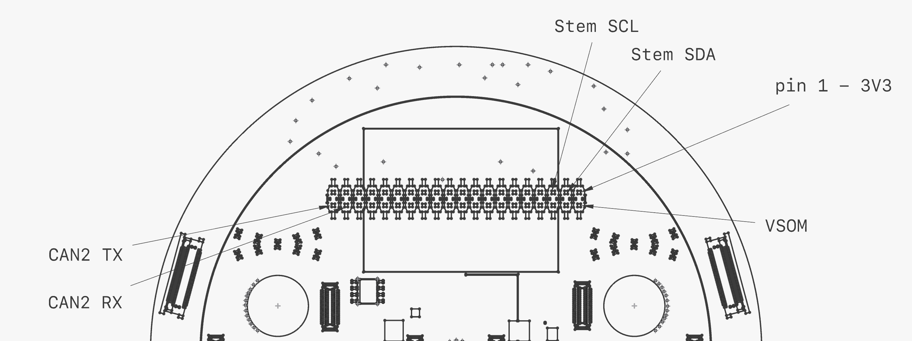

| Left side                  | Function  |Pin |Pin | Function  | Right side                |
|----------------------------|-----------|----|----|-----------|---------------------------|
|                            | 3V3       | 1  | 2  | VSOM      | VSOM when fully connected |
|     I2C3_SDA / GPIO5_IO19  | SDA 3     | 3  | 4  | VSOM      | VSOM when fully connected |
|     I2C3_SCL / GPIO5_IO18  | SCL 3     | 5  | 6  | GND       |                           |
|            STEM SDA / MOSI | HSDX      | 7  | 8  | JTAG_CLK  | IMU JTAG                  |
|                            | GND       | 9  | 10 | JTAG_DIO  | IMU JTAG                  |
|            STEM SCL / SCK  | HSCX      | 11 | 12 | SWD_CLK   | PD SWD                    |
|                   IMU nINT | GPIO4_IO19| 13 | 14 | SWD_DAT   | PD SWD                    |
|       IMU Host MISO / ADR0 | HSDO      | 15 | 16 | HCSB      | IMU Select I2C / SPI      |
|        Powering suspended  | VCC_RTC   | 17 | 18 | GPIO4_IO17|                           |
|                  STEM_MOSI | MOSI      | 19 | 20 | GND       |                           |
|                  STEM_MISO | MISO      | 21 | 22 | GPIO      | IMU MCSB2                 |
|                  STEM_CLK  | SCLK      | 23 | 24 | SPI CE0   | STEM_SPI_CS               |
|                            | GPIO2_IO9 | 25 | 26 | GPIO      | IMU MCSB3            |
|                    SYS I2C | SYS SDA   | 27 | 28 | SYS SCL   | SYS I2C              |
|           Self powered 2V+ | SELF_PWR  | 29 | 30 | GPIO5_IO26| IMU MCSB4            |
|                     LED IN | LED_AUDIO | 31 | 32 |           | GPIO5_IO3            |
|                 LED C_FILT | LED_FILTER| 33 | 34 | MIC_INT   |                 |
|          T-USB 50 pins LDO | BAT_LDO   | 35 | 36 |           | GPIO4_IO22           |
|              T-USB 50 pins | LDO_3V3   | 37 | 38 | MIC_DAT   |                 |
|              T-USB 50 pins | SPI_3V3   | 39 | 40 | MIC_CLK   |               |

I2C3 replaced with I2C6

7 available GPIO pins

EX_OH_nINT
STEM I2C

[?] Mapping of SOM GPIO to IMU GPIO ?