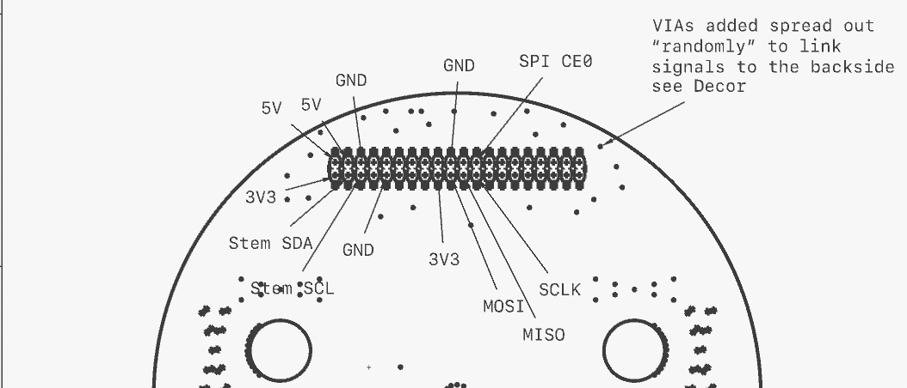

The front facing header is meant for adding sensors and satelite MCU like Pico/nRF53.
It represents the pins of the zimbus plus ECSPI2 from the SoM.

| Left side                  | Function  |Pin |Pin | Function  | Right side           |
|----------------------------|-----------|----|----|-----------|----------------------|
|  When VSOM fully connected | 3V3       | 1  | 2  | VCC_FULL  | When VSOM fully connected  |
|                  STEM_SDA  | SDA       | 3  | 4  | VCC_FULL  | When VSOM fully connected |
|                  STEM_SCL  | SCL       | 5  | 6  | GND       |                      |
|                   STEM_INT | INT       | 7  | 8  | TxD       | UART1 TxD            |
|                            | GND       | 9  | 10 | RxD       | UART1 RxD            |
|                            |           | 11 | 12 | SWD       | SWDCLK for attached  |
|     SDIO DAT3 / GPIO2_IO18 | SDIO      | 13 | 14 | SWD       | SWDIO for attached   |
|      SDIO CLK / GPIO2_IO13 | SDIO      | 15 | 16 | SDIO      | SDIO CMD / GPIO2_IO14  |
|    When any VSOM connected | 3V3       | 17 | 18 | SDIO      | SDIO DAT0 / GPIO2_IO15 |
| ECSPI2_MOSI / GPIO5_IO11   | MOSI      | 19 | 20 | GND       |                        |
| ECSPI2_MISO / GPIO5_IO12   | MISO      | 21 | 22 | SDIO      | SDIO DAT1 / GPIO2_IO16 |
| ECSPI2_SCLK / GPIO5_IO10   | SCLK      | 23 | 24 | SPI CE0   | ECSPI2_SS0/GPIO5_IO13  |
|                            | GND       | 25 | 26 | SCL       | NIGHT SCL            |
|                    SYS I2C | SYS SDA   | 27 | 28 | SCL       | SYS I2C              |
|                  NIGHT_INT | INT       | 29 | 30 | (GND)     |                      |
|                  NIGHT_SDA | SDA       | 31 | 32 | TxD       | UART3 TX             |
|                   UART3 RX | RxD       | 33 | 34 | CAN1      | CAN1 RX / GPIO4_IO25 (RPi GND) |
|                            |           | 35 | 36 | CAN1      | CAN1 TX / GPIO4_IO22   |
|     SDIO DAT2 / GPIO2_IO17 | SDIO      | 37 | 38 | CAN2      | CAN2 RX / GPIO4_IO27  |
|                            | (GND)     | 39 | 40 | CAN2      | CAN2 TX / GPIO4_IO26  |

The layout is kept mostly compatible with Raspberry 4 allowing emulation and easy comparison.

