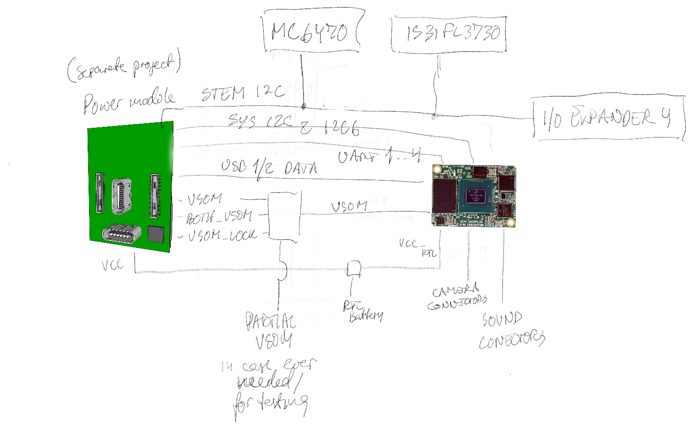

The system power is driven by the T-USB module via the two 50 pin connectors. 
There is no need to power the board from other connectors than USB-C.

According to the UCM-IMX8PLUS Referene Guide the Supply Voltage is 3.45V to 4.4V.
VSOM from the Power module provides this level. 
From it 5V0, 3V3, 2V8, and 1V8 are derived. 5V is stepped up from VSOM. These should not be mixed with
the VIN_5V and VIN_3V3 on the T-USB module connector, which are for experimenting with power source role.

- m.2 connectors are based on 3V3 and 1V8
- Sound is based on 3V3 or 1V8
- Cameras are 1V8, 2V8 and 3V3
- HDMI can supply 5V / 50 mA
- HDMI signal level is 5V
- LED matrix may need 5V
- Debug connector has 5V

So there are in total three(four) uses of 5V

1. HDMI supply and signal (50 mA) from upregulated VSOM
2. LED matrix(not on 801/909 board) may need 5V
3. 5V supply (100 mA) to T-USB module which is externally supplied (VIN_5V).
4. Debug connector for measuring/testing (directly connected with VIN_5V soldering pad)

VIN_5V is optional and separate from the power on the board. It is supplied from the soldering pad/point.

### Physical T-USB Connection Establishment

When connecting the T-USB module to the Bridge Board VSOM is provided over multiple pins on both connectors.
The bridge board can draw a limited current from individual pins, but must only drive the System Module with power when all
VSOM pins are connected. This allows for avoiding damage or strange behavior, if the power module is partially inserted.

Stages of insertion are,
- No VSOM pins connected
- At least one VSOM pin is connected
- VSOM Pins from both connectors connected
- All VSOM pins connected (including VSOM_LOCK)

When at least one pin is connected the Bridge Board can power components that are low power and always-on.
It should provide VCC_RTC to the System Module from the T-USB module whenever it is plugged in or from a VCC_RTC pad/connector.

When pins from both connectors are supplying VSOM the Bridge Board should raise BOTH_VSOM. 
The Power Module may restrict VSOM to some pins dependent on BOTH_VSOM.

The locking mechanism of the backplate is also used to drive one of the VSOM connectors, named VSOM_LOCK.
This prevents the system activating until modules are locked in place

As the first step in the detachment of the power module the physical unlock button must be pressed which raises PMIC_STBY_REQ.
The next step is to turn the back plate which will disconnect the conditional VSOM_LOCK pin.

This requires logic on the 701/801/909/919 boards. 

### Powering Sensors and Camera modules

- Camera modules should receive power regardless of VSOM_LOCK supplying.
- Sensors (MC6470, VM3011) should receive power regardless of VSOM_LOCK supplying.
- EEPROM 24C08 should receive power regardless of VSOM_LOCK supplying.
- PCA9555 EX4 should receive power regardless of VSOM_LOCK supplying.
- USB Multiplexers should not receive power unsless all 10 VSOM are connected.

### Power Logic on Bridge board 

The T-USB module is inserted onto the bridge board. As this gets inserted the bridge board must detect it and enable power as connection is established. This relates to when to provide the System Module and m.2 module with VSOM

a) If at least one VSOM pin on both connectors is high, BOTH_VSOM is raised high by the bridge board.
b) Directly connect VCC_RTC on T-USB connectors, soldering pad and System Module.
c) If all 9 VSOM pins are supplying power, use it to power the System Module 
d) If all 10 VSOM and VSOM_LOCK pins are supplying power, deliver upregulated 5V
e) If all 10 VSOM and VSOM_LOCK pins are supplying power, deliver 2.8V to camera modules
f) If all 10 VSOM and VSOM_LOCK pins are supplying power, deliver power to m.2 modules
g) If some VSOM pins are powered deliver it to always running circuits(like IMU) on bridge board(not on 909c).
