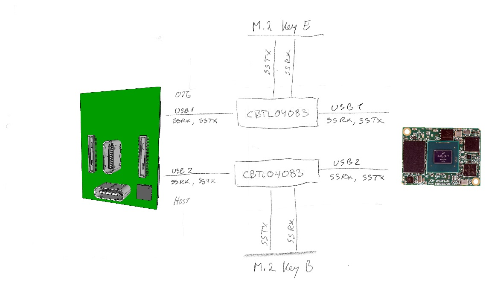
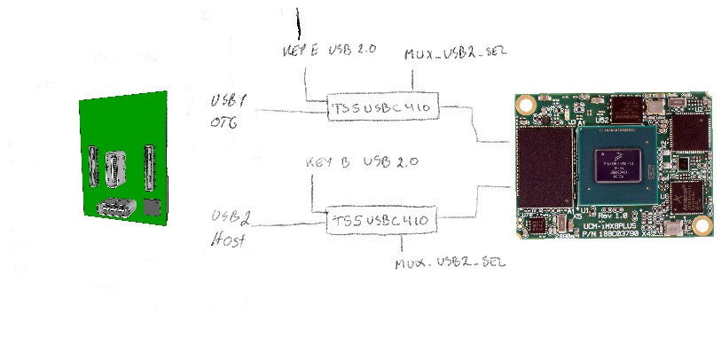

### M.2 Key B

See EXPANSION document for more information.

Note that some pins are connected to I/O Expander 2 meant for USB2 and Key B.

### T-USB Data and M.2 Key E Expansion

Data is routed primarily over the two USB-C connectors via the Power Module, but it is also available over the two M.2 Expansion connectors.

### T-USB connector 3.0 data mapping

Two USB-C connectors are arranged in a T shape and the normal way to use it is with a combined connector
attached. This means that the wires will normally be connected in a particular orientation. The system
takes advantage of this by detecting when both USBs are connected in the normal arrangement.

The USB-C signal lines from the T-USB connector is managed by the Multiplexing chipsets around the PD Controller.
The USB-C signal lines for the OTG connector in T-USB come from USB1(OTG cabable 2.0 & 3.0).
The SBU1/SBU2 are connected to AUX-/AUX+ pins on the T-USB OTG alt connector. 
The USB 3.0 superspeed data pairs and SBU1/SBU2 are passed from USB-C connectors to HD3SS460.

The Host USB-C connector is similarily connected.
The HD3SS460 chips are controlled over I2C by the MCU using SYS I2C.

One side of the RX/TX pins are carried to  the T-USB alt connector, and not connected to USB1 signals.
(Should the side be muxed?)

### Multiplexing USB

The i.MX8 has two USB busses. USB1(supports OTG) and USB2(Host mode only).

The USB 3.0 superspeed USB1/USB2 from the SoM are multiplexed using CBTL04083 and controlled by MUX_USB3_SEL pins.
The USB-C connector Alt. mode is managed by HD3SS460.
<mark>The default(SEL = low?) state is to connect USB2 to USB-C plug via HD3SS460.</mark>

The USB 2.0 USB1/USB2 from the SoM are multiplexed using TS5USBC41 and controlled by MUX_USB2_SEL pins.
The USB-C connector USB 2.0 signals(A/B 6/7) are managed separately and multiplexed using TS5USBC41. This allows
routing an Extra USB 2.0 signal selectively via the Debug Breakout connector.

| SEL  | Connect to         |
|------|--------------------|
| High | m.2                |
| Low  | USB-C via HD3SS460 |

### Key E

See EXPANSION document for more information.

