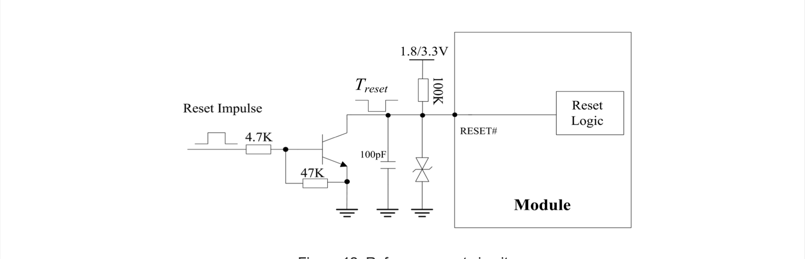

Standard SSD modules on Key B would be M.2 B+M modules. This would use a single PCIe lane.
SATA modules are not supported. While generic SSD module is present USB3.1 lanes are not enabled.

Incompatible cards

- KingSpec SSDs, they just offer SATA
- Modern NVMe as they are 4 lane, which is pointless
- [Intel 530 B+M SATA technical](https://www.intel.com/content/dam/www/public/us/en/documents/product-specifications/ssd-530-m2-specification.pdf)
- [SK Hynix Client SSD overview](https://product.skhynix.com/products/ssd/cssd.go), are they going high end?

SATA pins A+ A- B+ B- GND

- Device Activity Signal / Disable Staggered Spin-Up DA/DSS
- Presence detection. GND on the card inserted.
- pin 56/58 uses Two Wire Interface on Intel Card
- DEVSLP Device Sleep, input. If driven high the host is informing the SSD to enter a low power state. ([Serial ATA Specification Rev 3.2 DEVSLP](https://sata-io.org/sites/default/files/TP_038_SATA31_TPR_C108_DEVSLP_V1.0a.pdf))

### Detecting the type of module inserted

Ziloo Supervisor Module sets CONFIG_1 to GND while not registered as a Stem MCU.
SSD cards sets CONFIG_2 and CONFIG_3 to GND.
WWAN cards either set CONFIG_2 or CONFIG_3 to GND.
If CONFIG_1/CONFIG_2/CONFIG_3 are floating no card is inserted.
Unsupported configs are: GND GND GND, GND GND nc, GND nc GND.
The MSP430 expander must do internal pull up of the CONFIG inputs.

On our own card we use CONFIG_0 to 3 for dynamic state and low speed communication.

Config pins on Key B (Limited WWAN configs, no SATA)

| 0 | 1 | 2 | 3 |  Host Interface  |
|---|---|---|---|-----------------|
| 0 | nc| 0 | 0 | SSD-PCIe |
| 0 | nc| nc| 0 | WWAN – PCIe (Port Configuration 1) |
| 0 | nc| 0 | nc| WWAN – PCIe, USB3.1 Gen1 (Port Configuration 1) |
| nc| 0 | nc| nc| WWAN – PCIe, USB3.1 (Ziloo Supervisor) |
| nc| nc| nc| nc| No Add-in card present               |

If Supervisor is inserted (CONFIG_1 = low) the following pins should be enabled. This is done with 8 bit switch.

- SDIO 59..65, 66, 68
- MFG 56, 58

### Bluetooth over USB or UART

Traditionally UART is used for BLE.
Newer modules use USB, presumably for faster transfers.

## Key B

The Key B socket can support standard modules and a supervisor module. 

Notes on the pins:

#### RESET#

The RESET# need a pull up with a resistor to 1.8V or 3.3V, it is strongly recommended to put a100pF capacitor and an ESD protection diode close to the RESET# pin. Please refer to the following figure for the recommended reference circuit.

### Ziloo Specific Submodule Key B

An SSD could be combined with remote monitoring, supervision and remote control.
It would extend the features available to the SoM and.

## Key M ? cards

- [KBG40ZNS128G Kioxia/Toshiba 128GB on Amazon](https://www.amazon.de/-/en/KIOXIA-Toshiba-128GB-KBG40ZNS128G-Package/dp/B09CR818J2/ref=psdc_430168031_t4_B0866BPJPG)
- [KBG40ZNS256G datasheet](https://4donline.ihs.com/images/VipMasterIC/IC/TOSC/TOSC-S-A0008380911/TOSC-S-A0008384454-1.pdf?hkey=6D3A4C79FDBF58556ACFDE234799DDF0)
- [Kioxia/Toshiba BG4 Series](https://business.kioxia.com/content/dam/kioxia/shared/business/ssd/doc/cSSD-BG4-product-brief.pdf)

Kioxia seems to have made(still making) B+M 2 lane NVMe SSDs that work fine.

## Key E cards

m.2 1620 are embeddable SSD modules

Testing with UCM/Yocto

USB Cameras

> lsusb

Enumerate PCI devices (NVMe SSD)

> lspci

Installing dev support

https://opensource.com/article/21/9/nvme-cli

