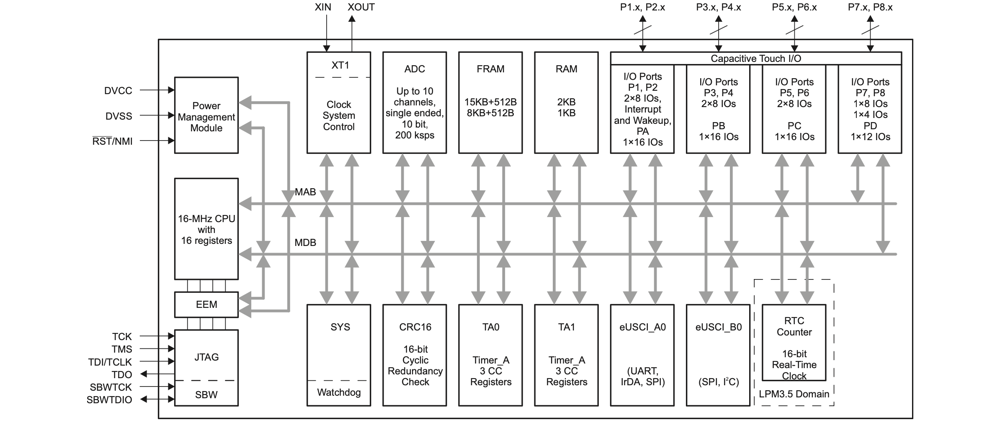
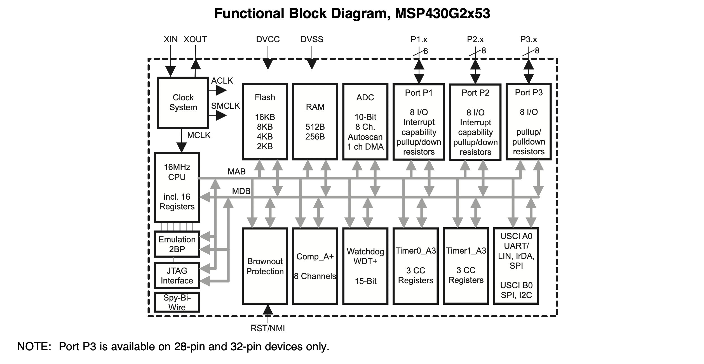
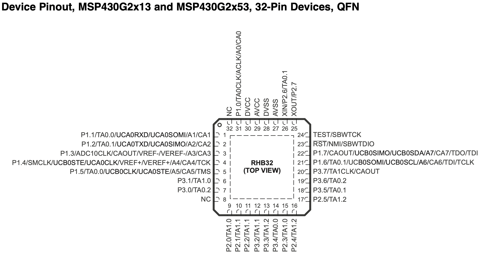
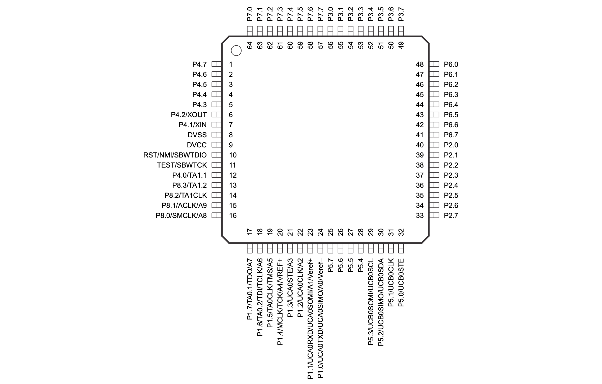

# Stembus Expander

The Stembus Expander is a standard module similar to an I/O Expander. It accesses local control pins and state to provide remote control capability over the 
Stem I2C bus. It rules over a distinct domain and will raise Stem INT events(1-Wire) when the domain is affected.

It can,

- Reset components
- Power on/off/suspend components
- Change component state and mode selection
- Raise relevant event flags

Ziloo has three expanders with distinct domains;

- T-USB Expander monitors and controls Module runtime, Battery charging, USB Power Delivery, and USB Alt. Mode.
- Faceboard Expander monitors IMU, m.2 modules
- The Smart Ambient Night Eye also monitors and controls sensors to determine change in ambient state. Sound, light and vision a monitored.

Available actions,

- Set T-USB 2.0 Alt. modes state (byte)
- Set T-USB 3.0 Alt. modes state (byte)
- Request

### Open Points

- 2 * UART for programming MSP with SoM
- 

### Components

- 1 * [MSP430 FR2032 IG56 TSSOP DGG56](https://www.ti.com/product/MSP430FR2032#tech-docs). Inventory 4870 at TO. @1000 $0.766. 52 IO pins, 1 UART/I2C, 1 UART/SPI.
- Optionally 2 * [74HC595 PW,118 shift register TSSOP-16](https://www.mouser.ch/ProductDetail/Nexperia/74HC595PW118?qs=P62ublwmbi8GOYhe4PjE9Q%3D%3D). @1000 $0.15, 15k in 

### Alt. Components

stock.
- 3 * [compact 74HC595BQ,115 DHVQFN-16](https://www.mouser.ch/ProductDetail/Nexperia/74HC595BQ115?qs=P62ublwmbi8j5S0PfJaZ3g%3D%3D) that are not available until 2023.
- 3 * [771-74HC595D-Q100 SOIC-16](https://www.mouser.ch/ProductDetail/Nexperia/74HC595D-Q100118?qs=1sbE9T7hb3auqb4IeRpHgw%3D%3D)
- 1 * [MSP430FR4131IPMR low mem, 60 IO, in stock](https://www.ti.com/product/MSP430FR4131/part-details/MSP430FR4131IPMR?keyMatch=MSP430FR4131IPMR&tisearch=search-everything&usecase=GPN)
- 1 * [MSP430 FR2032 IPMR - Available Aug 2023](https://www.mouser.ch/ProductDetail/Texas-Instruments/MSP430FR2032IPMR?qs=beZBGHSk9c1MvO1WxYF%252B5Q%3D%3D). $1.2 @1000. 60 IO pins, P1 .. P8. Fast permanent storage. (Only UART bootloader). LQFP (64). Direct JTAG and sbw pins pins.
- 1 * [MSP430 G2553 IRHB32R - 2300 in stock](https://www.mouser.ch/ProductDetail/Texas-Instruments/MSP430G2553IRHB32R?qs=cBe3DO7yhR4oWYgkcQqYQA%3D%3D). @1000  $1.7. Large app 16KB. (Only UART bootloader) 
- 1 * [MSP430 G2433 IRHB32R VQFN-32 5mm x 5mm](https://www.mouser.ch/ProductDetail/Texas-Instruments/MSP430G2433IRHB32R?qs=L4ss%2FyqpMWTk9GTGs5Acbg%3D%3D). Inventory 1238 at mouser. @1000 $1.45. 24 IO pins, 1 UART/I2C, 1 UART/SPI. (Only UART bootloader)

There seem to be no [74HC595 alternatives](https://www.apogeeweb.net/circuitry/74HC595-comparisons.html).

The [G2553](./datasheets/msp430g2553.pdf) routes debugging and programming over RST/TEST (even if not shown in diagram).

### Programming

The MSP430 is programmed using the Bootloader. See bootloader section in the specific datasheet for pins.

Bootloader mode is triggered by a specific timing signal over the RST/DTR and TEST/RTS pins. 
Once in bootloader mode the UART_EX_TXD and UART_EX_RXD are used to upload the new firmware. 
These pins are exposed on the 50 pin connector and available to the i.MX SoM and Picoprobe socket. 
The SoM will use this to update firmware without opening the case. One the Expander has been flash a unique password is set on future writing. 
Future updates must use this password to be applied.

One way to program the MSP430 is via the Picoprobe running [pico-uart-brige](https://github.com/Noltari/pico-uart-bridge/tree/uart-hw-flow).
This make it available as a Comm port over USB to a Linux host on Raspberry Pi or other CI Runner.
See example code for implementation at [MSP430TM Bootloader With SitaraTM Embedded Linux Host](https://www.ti.com/lit/an/slaa760/slaa760.pdf?ts=1659387003455&ref_url=https%253A%252F%252Fwww.ti.com%252Ftool%252FMSPBSL).
Also consider [How to securely update firmware in the field](https://e2e.ti.com/blogs_/b/process/posts/how-to-securely-do-in-field-firmware-updates)
and [MSP430FRBoot – Main Memory Bootloader and Over-the-Air Updates for MSP430TM FRAM Large Memory Model Devices](https://www.ti.com/lit/an/slaa721e/slaa721e.pdf?ts=1659387279772&ref_url=https%253A%252F%252Fwww.ti.com%252Ftool%252FMSPBSL).

Simple sample video [Programming MSP430G2553 through BSL | MSP430 on a breadboard | UART bridge programmer](https://www.youtube.com/watch?v=Zg41y4pgCIA)

The BSL Scripter is a PC application that allows to easily communicate with the BSL on MSP430 and MSP432 devices to modify the device's memory via UART, I2C, SPI or USB. Download [MSPBSL_Scripter  3_04_00_02](https://software-dl.ti.com/msp430/msp430_public_sw/mcu/msp430/MSPBSL_Scripter/latest/index_FDS.html).
[Bootloader (BSL) Scripter (SLAU655) documentation](https://www.ti.com/lit/ug/slau655g/slau655g.pdf?ts=1659421871029&ref_url=https%253A%252F%252Fsoftware-dl.ti.com%252Fmsp430%252Fmsp430_public_sw%252Fmcu%252Fmsp430%252FMSPBSL_Scripter%252Flatest%252Findex_FDS.html).

### I2C access

The primary I2C bus, where the Expander exposes its connected gpio output and input, is the Stem I2C.
The Stem I2C is mastered by one of the MCUs connected such as RT core in SoM or the RP2040 in the Smart Camera Module.
The expander can also provide its service on the SYS I2C.

#### Interrupt events

It is important to consider the overall system interrupt events

- T-USB PD state change -> T-USB module raises STEM INT with a 1 wire origin signal.
- T-USB Charging state change -> T-USB module raises STEM INT with a 1 wire origin signal.
- Faceboard sensor event -> Faceboard module raises STEM INT with a 1 wire origin signal and MOTION_INT
- Faceboard m.2 event -> Faceboard module raises STEM INT with a 1 wire origin signal

After an MCU has raised a Stem INT it may not do so for again for 10ms. This allows other MCUs to raise their events.

## I2C Interface (read/write)

## T-USB Expander pin allocations for MSP430 G2553/G2x33/FR2032

TSSOP56: 14mm x 6.1mm x 1.2mm

Programming pins

| Expander           | VQFN32| LQFP | G56 | Connected to    |
|--------------------|-------|------|-----|-----------------|
| RST / NMI / T_SBWTDIO | 23 | 10   | 16  | Reset. Nunmaskable interrupte input. T_SWBTDIO on 50 pins, DTR on Comms   |
| TEST / SBWTCK      | 24    | 11   | 17  | T_SWBTCK on 50 pins, RTS on Comms. Sel. test mode for JTAG pins on Port 1. Device protection fuse cnnctd to TEST |
| UART_T_TXD         |  1    | 24   | 28  | Firmware transmit (see Bootloader section in datasheet)     |
| UART_T_RXD         |  5    | 23   | 27  | Firmware receive (see Bootloader section in datasheet)     |

The programming UART pins are not consistent across models. This matches FR2032(G56), FR413x(LQFP), G2433/G2553(VQFN32 P1.1 and P1.5).

### MSP430 pin allocations

The intended FR2032 chip uses a TSSOP-56 (G56) package.

These pins are used in a special role

:[Combined T-USB bus I/O Expander](../pinouts/T-USB_BUS_EXPANDER.md)

Pins used as GPIO

:[Combined T-USB control I/O Expander](../pinouts/T-USB_GPIO_EXPANDER.md)

## Alt. Design using Shift registers (output only)

If a 48+ IO MSP430 chip is not available a setup is used with 24 IO.
In this setup shift registers are used.

Three shift registers are chained off the 7 shift pins.
Individual pins triggers the update of output for 8 bytes.
A fourth output trigger pin is reserved for a future bank.
This lessens the requirement to remember existing state.
For the 64 pin package shift registers are not used.

| Function     | VQFN32 | LQFP | G56 | Connected to    |
|--------------|--------|------|-----|-----------------|
| SH1_DS       | 6      | 55   | 55  | P3.1. 74HC595 DS    |
| SH1_SHCP     | 12     | 54   | 54  | P3.2. 74HC595 SHCP  |
| SH1_MR       | 13     | 53   | 53  | P3.3. 74HC595 MR |
| SH1_STCP     | 14     | 52   | 52  | P3.4. 74HC595 STCP |
| SH2_STCP     | 18     |      |     | P3.5. 74HC595 STCP |
| SH3_STCP     | 19     |      |     | P3.6. 74HC595 STCP |
| SH4_STCP     | 20     |      |     | P3.7. 74HC595 STCP |

The output pins on the shift registers are grouped as,

- SH1 Alt mode bits,
- SH2 SoM Runtime control shift reg
- SH3 PD And Charging control shift reg
- SH4 unallocated shift register.

| Function     | VQFN32 |  Connected to             |
|--------------|--------|--------------------------|
| STEM INT     | 31     | P1.0. 1-Wire event raising line between MCUs  |
| UART3 RX     | 1      | P1.1. USCI_A0. UCA0RXD.                        |
| UART3 TX     | 2      | P1.2. USCI_A0. UCA0TXD.                        |
| MCU SYS INT  | 3      | P1.3. 1-Wire event raising line between MCUs   |
| SYS SCL      | 4      | P1.4. 50 pin connector. TCK. JTAG test clock, input terminal for device programming and test    |
| SYS SDA      | 5      | P1.5. 50 pin connector. TMS. JTAG test clock, input terminal for device programming and test  |
| STEM SCL     | 21     | P1.6 USCI_B0. TDI/TCLK. JTAG test data input or test clock input during programming and test.   |
| STEM SDA     | 22     | P1.7 USCI_B0. TDO/TDI. JTAG test data output terminal or test data during programmign and test |

## Faceboard expander pin allocations

The faceboard expander runs on 1.8V signal level. It is in the 1V8 domain with camera modules and m.2 connectors.

Pins used as GPIO

:[Combined Faceboard control I/O Expander](../pinouts/FACE_GPIO_EXPANDER.md)

The system expander #0 is used by the SoM via SYS I2C.
The system expander input triggers interrupt via SYS_EX_nINT (GPIO4_IO19).
This expander deals with activity relevant during waking state.

This first expander, which is also on the dev. board maps,

| Expander  | Connected to    |
|-----------|-----------------|
| EX0.0     | mPCIe_PERST on M2 Key B    |
| EX0.1     | - reserved for second mPCIe -   |
| EX0.3     |       |

- LED Controller
- Motion Sensor
- Sound Sensor
- Nighttime camera attached sensors
- 

The EX4 expander input triggers interrupt via STEM_INT.

| Expander  | Pin   | Connected to                |
|-----------|-------|-----------------------------|
| EX4.0     |       |    |
| EX4.1     | O0.1  | SD Card Chip Select SPI     |
| EX4.2     | O0.2  | SD Card Chip Select SDIO    |
| EX4.8     | I1.0  | MIC VM3011 DOUT            |

Enable CS SD Card connector
LCD CS SPI
MMC CS 
m.2 WiFi CS SDIO

The EX6 expander input triggers interrupt via SYS_EX_nINT (GPIO4_IO19).

## Articles

- [1-Wire](https://en.wikipedia.org/wiki/1-Wire) - [OneWire implementation for MSP430](https://github.com/dsiroky/OneWire)
- [MSP430 CCS Code Examples](https://github.com/ticepd/msp430-examples)
- [MoaT owslave](https://github.com/smurfix/owslave)
- [Three-state logic](https://en.wikipedia.org/wiki/Three-state_logic)
- [MSP430 IO Expander Firmware](https://github.com/wendlers/msp430-ioexp)
- [MSP430 build on Raspberry Pi](https://github.com/jonathangjertsen/rpi-msp430)
- [Programming the MSP430 using docker](https://nishtahir.com/programming-the-msp430-using-docker/)
- [mspdebug](https://github.com/dlbeer/mspdebug)
- [A BETTER USI I2C LIBRARY FOR THE MSP430](https://hackaday.com/2014/02/02/a-better-usi-i2c-library-for-the-msp430/) - [Jan's blog post: I2C using USI on the MSP430](https://jan.rychter.com/enblog/msp430-i2c-usi-library-released)
- [msp430 USI I2C lib](https://github.com/jwr/msp430_usi_i2c)
- [TI MSP 430, UART, I2C & ADCs, 7-Segments....](https://www.linkedin.com/pulse/ti-msp-430-uart-i2c-adcs-rajiv-biswas/)
- [MSP430F5438A-EP: Writing and Reading MSP430 Flash using MSP-FET](https://e2e.ti.com/support/microcontrollers/msp-low-power-microcontrollers-group/msp430/f/msp-low-power-microcontroller-forum/991520/msp430f5438a-ep-writing-and-reading-msp430-flash-using-msp-fet)
- [MSP430Flasher compiled to run on ARM architecture](https://e2e.ti.com/support/microcontrollers/msp-low-power-microcontrollers-group/msp430/f/msp-low-power-microcontroller-forum/836999/msp430flasher-compiled-to-run-on-arm-architecture)
- [MSPDS — MSP Debug Stack Developers Package](https://www.ti.com/tool/MSPDS?keyMatch=MSPDS&tisearch=Search-EN-everything&usecase=part-number#downloads)
- [Guide and script to install mspdebug on Raspberry Pi in order to flash and debug MSP430 devices](https://github.com/jonathangjertsen/rpi-msp430)
- [UART with MSP430](http://www.simplyembedded.org/tutorials/msp430-uart/)
- [Rust Quickstart for MSP430](https://github.com/rust-embedded/msp430-quickstart)
- [Riot OS with MSP430](https://doc.riot-os.org/group__cpu__msp430__common.html)
- [Software UART example for MSP430 using mps430-gcc on Linux](https://github.com/wendlers/msp430-softuart)
- [74HC125 tri-state conversion of 4 signals](http://www.learningaboutelectronics.com/Articles/74HC125-tri-state-buffer-circuit.php)

## Other MSP430 options

[MSP430FR2033IPMR - inventory 893](https://www.mouser.ch/ProductDetail/Texas-Instruments/MSP430FR2033IPMR?qs=pqSajtDZXRW08JPhK1Mn9w%3D%3D)
@1000 $1.55
60 pins, 15KB / 2KB, 1 I2C, 1 SPI
alt SMD package LQFP-64

[MSP430 FR4132 - Available january](https://www.mouser.ch/ProductDetail/Texas-Instruments/MSP430FR4132IPMR?qs=beZBGHSk9c0mvhrDlLULJA%3D%3D)
$1.32.
60 IO.
